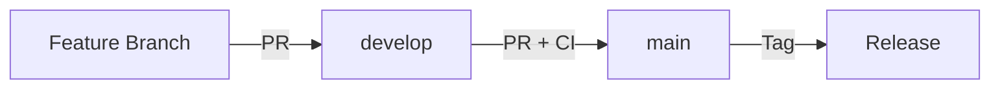

# Branch Protection Rules Setup Guide

## 📋 Descripción

Este documento describe cómo configurar las reglas de protección de ramas (Branch Protection Rules) para el repositorio MEMORY_P, garantizando la integridad del código y la estabilidad del proyecto.

---

## 🔐 Configuración de Protección de Ramas

### Rama Principal: `main`

La rama `main` es la rama de producción y requiere la máxima protección.

#### Pasos de Configuración

1. **Ir a Settings del repositorio**
   - Navegar a: `https://github.com/Rigohl/MEMORY_P/settings`

2. **Seleccionar "Branches" en el menú lateral**

3. **Click en "Add rule" o "Add branch protection rule"**

4. **Configurar Branch name pattern:** `main`

5. **Habilitar las siguientes opciones:**

#### ✅ Protecciones Requeridas

```yaml
Branch protection rule for: main

☑ Require a pull request before merging
  ☑ Require approvals: 1
  ☑ Dismiss stale pull request approvals when new commits are pushed
  ☑ Require review from Code Owners (if CODEOWNERS file exists)

☑ Require status checks to pass before merging
  ☑ Require branches to be up to date before merging
  
  Required status checks:
  - lint
  - build (ubuntu-latest)
  - build (macos-latest)
  - build (windows-latest)
  - coverage
  - docs
  - Security Audit / audit
  - Code Quality Analysis / quality-gate

☑ Require conversation resolution before merging

☑ Require signed commits (opcional pero recomendado)

☑ Require linear history
  (Fuerza squash merges o rebase, previene merge commits)

☑ Include administrators
  (Aplica las reglas incluso a administradores)

☑ Restrict who can push to matching branches
  (Opcional: solo maintainers pueden hacer push directo)

☑ Allow force pushes: Never

☑ Allow deletions: Never
```

#### 🤖 Configuración de Auto-Merge

```yaml
☑ Allow auto-merge
  (Permite que PRs se hagan merge automáticamente tras aprobación)

☑ Automatically delete head branches
  (Limpia ramas automáticamente después del merge)
```

---

### Rama de Desarrollo: `develop`

La rama `develop` es la rama de integración principal y requiere protección moderada.

#### Configuración

```yaml
Branch protection rule for: develop

☑ Require a pull request before merging
  ☑ Require approvals: 1
  ☑ Dismiss stale pull request approvals when new commits are pushed

☑ Require status checks to pass before merging
  ☑ Require branches to be up to date before merging
  
  Required status checks:
  - lint
  - build (ubuntu-latest)
  - Security Audit / audit

☑ Require conversation resolution before merging

☑ Require linear history

☑ Include administrators

☑ Allow force pushes: Never

☑ Allow deletions: Never

☑ Allow auto-merge

☑ Automatically delete head branches
```

---

### Ramas de Release: `release/*`

Protección para ramas de release que se crean durante el proceso de despliegue.

#### Configuración

```yaml
Branch protection rule for: release/*

☑ Require a pull request before merging
  ☑ Require approvals: 2
  ☑ Dismiss stale pull request approvals when new commits are pushed

☑ Require status checks to pass before merging
  ☑ Require branches to be up to date before merging
  
  Required status checks:
  - lint
  - build (ubuntu-latest)
  - build (macos-latest)
  - build (windows-latest)
  - coverage
  - docs
  - Security Audit / audit

☑ Require conversation resolution before merging

☑ Require linear history

☑ Include administrators

☑ Allow force pushes: Never

☑ Allow deletions: Never
```

---

## 🚀 Flujo de Trabajo con Protección de Ramas

### Proceso Normal de Desarrollo



### Pasos Detallados

1. **Crear Feature Branch**
   ```bash
   git checkout develop
   git pull origin develop
   git checkout -b feature/nueva-funcionalidad
   ```

2. **Desarrollar y Commit**
   ```bash
   git add .
   git commit -m "feat: nueva funcionalidad"
   git push origin feature/nueva-funcionalidad
   ```

3. **Crear Pull Request a `develop`**
   - Ir a GitHub y crear PR
   - Esperar a que pasen los checks de CI
   - Solicitar revisión de al menos 1 revisor
   - Resolver conversaciones
   - Una vez aprobado, merge automático (si tiene label `auto-merge`)

4. **Merge a `main` (Production)**
   - Crear PR de `develop` a `main`
   - Requiere que TODOS los checks pasen
   - Requiere 1 aprobación
   - Merge manual o automático tras validación

---

## 🤖 Integración con Auto-Merge Workflow

El workflow `auto-merge.yml` funciona con estas protecciones:

### Requisitos para Auto-Merge

Para que un PR se haga merge automáticamente:

1. ✅ **Label `auto-merge` presente**
2. ✅ **PR aprobado por al menos 1 revisor**
3. ✅ **Todos los status checks en verde**
4. ✅ **Conversaciones resueltas**
5. ✅ **Branch actualizada con base**

### Cómo Usar Auto-Merge

```bash
# Opción 1: Via GitHub UI
# 1. Crear PR
# 2. Añadir label "auto-merge"
# 3. Esperar aprobación y checks

# Opción 2: Via GitHub CLI
gh pr create --title "Mi cambio" --body "Descripción" --label "auto-merge"
```

---

## 🛡️ Status Checks Requeridos

### Checks Obligatorios para `main`

Estos checks DEBEN pasar antes de permitir merge:

| Check | Workflow | Descripción |
|-------|----------|-------------|
| `lint` | CI Pipeline | Formato y linting con rustfmt/clippy |
| `build (ubuntu-latest)` | CI Pipeline | Build en Ubuntu |
| `build (macos-latest)` | CI Pipeline | Build en macOS |
| `build (windows-latest)` | CI Pipeline | Build en Windows |
| `coverage` | CI Pipeline | Cobertura de tests |
| `docs` | CI Pipeline | Validación de documentación |
| `audit` | Security Audit | Auditoría de seguridad |
| `quality-gate` | Code Quality | Puerta de calidad |

### Checks Opcionales (Informativos)

Estos checks se ejecutan pero no bloquean el merge:

- `benchmark` - Benchmarks de rendimiento
- `complexity-analysis` - Análisis de complejidad
- `unused-dependencies` - Dependencias no usadas
- `duplicate-code` - Código duplicado

---

## 📝 CODEOWNERS (Opcional)

Para distribuir responsabilidades de revisión, crear archivo `.github/CODEOWNERS`:

```gitignore
# CODEOWNERS file for MEMORY_P

# Default owners for everything
* @Rigohl

# Rust core
*.rs @Rigohl
Cargo.toml @Rigohl

# GitHub workflows
/.github/ @Rigohl

# Documentation
*.md @Rigohl
/docs/ @Rigohl

# CI/CD and automation
/.github/workflows/ @Rigohl
/.github/scripts/ @Rigohl
```

Con CODEOWNERS:
- Los owners especificados son automáticamente solicitados como reviewers
- El merge requiere aprobación de al menos un CODEOWNER

---

## 🔧 Troubleshooting

### Problema: No puedo hacer push a `main`

**Causa:** La rama está protegida  
**Solución:** Crear un PR en lugar de push directo

### Problema: PR no se hace auto-merge

**Verificar:**
1. ✅ Label `auto-merge` presente
2. ✅ Todos los checks en verde
3. ✅ Al menos 1 aprobación
4. ✅ Conversaciones resueltas
5. ✅ Auto-merge habilitado en Settings

### Problema: Checks requeridos no aparecen

**Causa:** Los workflows no han corrido aún  
**Solución:** 
1. Hacer un push para disparar workflows
2. Esperar a que completen
3. Los checks aparecerán automáticamente

### Problema: Necesito bypass para emergencia

**Proceso:**
1. Como administrador, puedes temporalmente deshabilitar protecciones
2. Hacer el cambio urgente
3. Inmediatamente re-habilitar protecciones
4. Crear issue documentando el bypass

---

## 📊 Métricas de Protección

### KPIs a Monitorear

- **Merge Rate:** % de PRs mergeados exitosamente
- **Review Time:** Tiempo promedio de revisión
- **CI Success Rate:** % de checks que pasan
- **Auto-Merge Rate:** % de PRs con auto-merge

### Dashboards Recomendados

GitHub proporciona insights en:
- `Insights > Pulse` - Actividad general
- `Insights > Code frequency` - Commits y changes
- `Insights > Contributors` - Contribuidores activos

---

## 🎯 Best Practices

### Para Desarrolladores

1. ✅ Crear PRs pequeños y enfocados
2. ✅ Escribir tests para nuevas features
3. ✅ Resolver todos los comments antes de merge
4. ✅ Mantener PRs actualizados con base branch
5. ✅ Usar commits descriptivos

### Para Reviewers

1. ✅ Revisar dentro de 24 horas
2. ✅ Proporcionar feedback constructivo
3. ✅ Verificar tests y documentación
4. ✅ Aprobar solo cuando esté listo
5. ✅ Usar GitHub Suggestions para cambios menores

### Para Maintainers

1. ✅ Mantener protecciones actualizadas
2. ✅ Revisar métricas regularmente
3. ✅ Documentar excepciones
4. ✅ Actualizar CODEOWNERS según necesidad
5. ✅ Monitorear alertas de seguridad

---

## 🔗 Referencias

- [GitHub Branch Protection Docs](https://docs.github.com/en/repositories/configuring-branches-and-merges-in-your-repository/defining-the-mergeability-of-pull-requests/about-protected-branches)
- [GitHub CODEOWNERS](https://docs.github.com/en/repositories/managing-your-repositorys-settings-and-features/customizing-your-repository/about-code-owners)
- [GitHub Auto-merge](https://docs.github.com/en/pull-requests/collaborating-with-pull-requests/incorporating-changes-from-a-pull-request/automatically-merging-a-pull-request)

---

**Última actualización:** Febrero 2026  
**Versión:** 1.0.0  
**Proyecto:** MEMORY_P v2.0
