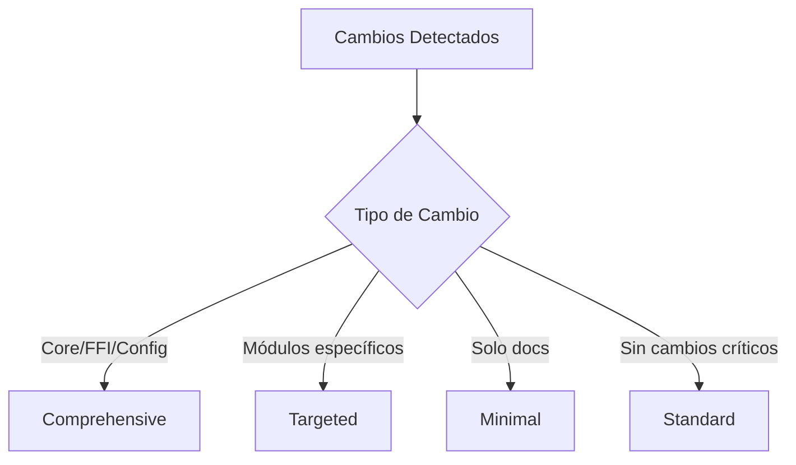

# GitHub Actions Workflows - MEMORY_P

## 📋 Overview

Este directorio contiene los workflows de GitHub Actions para el proyecto MEMORY_P, diseñados para automatización completa con capacidades de auto-push, auto-recovery y validación continua.

## 🔄 Workflows Implementados

### 1. Auto-Push Pipeline (`auto-push.yml`)

**Propósito**: Auto-push de cambios aprobados hacia ramas pre-autorizadas.

**Triggers**:
- Pull requests (opened, synchronize, reopened, labeled)
- Manual dispatch

**Ramas pre-autorizadas**:
- `develop`
- `staging`
- `hotfix/*`
- `feature/auto-*`
- `copilot/*`

**Características**:
- ✅ Validación pre-push automática
- ✅ Build y tests completos
- ✅ Security scan
- ✅ Auto-aprobación de PRs
- ✅ Auto-merge con squash
- ✅ Creación de issues en caso de fallo

**Uso**:
```bash
# Agregar label 'auto-push' a un PR en rama autorizada
# El workflow se ejecutará automáticamente
```

**Branch Protection Rules recomendadas**:
```yaml
- Require pull request reviews: 1
- Require status checks to pass: true
- Require branches to be up to date: true
- Include administrators: false
```

---

### 2. Auto-Recovery & Self-Healing (`auto-recovery.yml`)

**Propósito**: Sistema de auto-reparación para workflows con auto-ajuste inteligente.

**Triggers**:
- Workflow run completed (cualquier workflow)
- Push a main, develop, staging
- Schedule: cada 6 horas
- Manual dispatch

**Características**:
- 🔍 Análisis automático de fallos previos
- 🛠️ Estrategias de recuperación adaptativas:
  - Rebuild con cache limpio
  - Re-ejecución de tests aislados
  - Rollback y redeploy
  - Recuperación completa
- ⚙️ Auto-ajuste condicional de CI basado en logs
- 📊 Reportes detallados de recuperación
- 🔔 Notificaciones automáticas

**Estrategias de Recuperación**:

| Tipo de Fallo | Estrategia | Acciones |
|---------------|-----------|----------|
| Build | rebuild_with_cache_clear | Limpia cache, rebuild desde cero |
| Test | rerun_tests_isolated | Tests en paralelo con aislamiento |
| Deploy | rollback_and_redeploy | Rollback + redeploy limpio |
| Otros | full_recovery | Recuperación completa paso a paso |

**Uso**:
```bash
# Automático: Se ejecuta cuando detecta fallos
# Manual: Seleccionar modo de recuperación
gh workflow run auto-recovery.yml -f recovery_mode=aggressive
```

---

### 3. Nuclear Crawler Hybrid Validation (`nuclear-crawler-validation.yml`)

**Propósito**: Validación específica del subsistema Nuclear Crawler Hybrid.

**Triggers**:
- Push a archivos en: `src/**`, `FFI/**`, `src/motores/**`, `PAYLOAD_BANK/**`
- Pull requests
- Schedule: diariamente a las 2 AM UTC
- Manual dispatch

**Módulos Monitoreados**:
- `data_management` - Gestión de datos
- `jax_integration` - Integración con JAX
- `intelligent_storage` - Almacenamiento inteligente
- `parallel_engine` - Motor paralelo
- `auto_manager` - Gestor automático
- `workspace` - Workspace manager
- `analyzer` - Analizador de código
- `ffi/memory_bank` - MemoryBank FFI

**Características**:
- 🔍 Detección automática de módulos crawler
- ✅ Validación de integridad estructural
- 🧪 Tests específicos del crawler (unit, integration, stress)
- 📦 Validación individual de módulos
- 🔄 Monitoreo de sincronización con main
- 🚀 Auto-push de cambios validados

**Niveles de Validación**:
- `standard`: Validación estándar diaria
- `deep`: Validación profunda semanal
- `nuclear`: Validación exhaustiva completa

**Uso**:
```bash
# Manual con nivel específico
gh workflow run nuclear-crawler-validation.yml -f validation_level=deep
```

---

### 4. Dynamic Tests & Validation (`dynamic-tests.yml`)

**Propósito**: Tests dinámicos que se adaptan a los cambios en el código.

**Triggers**:
- Push a cualquier rama
- Pull requests a main, develop, staging
- Manual dispatch

**Características**:
- 🎯 Análisis de cambios para tests adaptativos
- 📊 Estrategias de testing dinámicas:
  - `comprehensive`: Tests completos
  - `targeted`: Tests enfocados en módulos modificados
  - `minimal`: Smoke tests únicamente
  - `standard`: Suite estándar
- ✅ Verificación post-push automática
- 📦 Validación de outputs y artifacts
- ⚡ Tests de performance condicionales

**Estrategias de Tests**:



**Uso**:
```bash
# Con alcance específico
gh workflow run dynamic-tests.yml -f test_scope=full
```

---

### 5. Recurring Repository Scan (`recurring-scan.yml`)

**Propósito**: Escaneo recurrente del repositorio para análisis continuo.

**Triggers**:
- Schedule: diariamente a las 3 AM UTC
- Schedule: semanalmente los domingos (análisis profundo)
- Manual dispatch

**Áreas de Escaneo**:
- 📝 **Código**: Clippy, formato, complejidad, code smells
- 🔐 **Seguridad**: Audit, secretos, código unsafe
- 📦 **Dependencias**: Análisis, actualizaciones, tamaño
- ⚡ **Performance**: Allocations, paralelismo, tamaño binario
- 🏗️ **Arquitectura**: Módulos, acoplamiento, tests

**Profundidades de Escaneo**:

| Nivel | Frecuencia | Áreas | Duración |
|-------|-----------|-------|----------|
| `quick` | On-demand | code, security | ~5 min |
| `standard` | Diaria | code, security, deps, quality | ~15 min |
| `deep` | Semanal | Todas excepto history | ~30 min |
| `forensic` | Manual | Todas incluidas history | ~60 min |

**Métricas Rastreadas**:
- Clippy warnings/errors
- TODOs/FIXMEs
- Unwraps
- Vulnerabilidades
- Bloques unsafe
- Clones excesivos
- Tamaño del binario

**Uso**:
```bash
# Escaneo profundo manual
gh workflow run recurring-scan.yml -f scan_type=deep

# Escaneo forense completo
gh workflow run recurring-scan.yml -f scan_type=forensic
```

---

## 🔧 Configuración

### Secrets Requeridos

Los workflows usan `GITHUB_TOKEN` automáticamente. Para funcionalidades extendidas, configurar:

```bash
# No se requieren secrets adicionales actualmente
# GITHUB_TOKEN tiene permisos suficientes
```

### Permisos de Workflows

Cada workflow tiene permisos específicos:

```yaml
permissions:
  contents: write        # Para auto-push
  pull-requests: write   # Para auto-aprobación
  checks: write          # Para status checks
  issues: write          # Para crear issues de tracking
  actions: write         # Para re-ejecutar workflows
  security-events: write # Para reportes de seguridad
```

### Variables de Entorno

Variables globales disponibles:

```yaml
env:
  CARGO_TERM_COLOR: always
  RUST_BACKTRACE: 1  # o 'full' para debug
  MAX_RETRY_ATTEMPTS: 3
```

---

## 📊 Monitoreo y Reportes

### Tracking Issues

Los workflows crean/actualizan issues automáticamente:

- **Label**: `auto-push-failed` - Fallos en auto-push
- **Label**: `auto-recovery` - Reportes de recuperación
- **Label**: `recurring-scan` - Reportes de escaneo
- **Label**: `automated` - Generado automáticamente

### Artifacts Generados

Los workflows guardan artifacts con retención de 7-30 días:

```
├── recovery-build-logs (7 días)
├── code-scan-results (30 días)
├── security-scan-results (30 días)
├── dependencies-scan-results (30 días)
└── build-outputs-{run_number} (7 días)
```

### Notificaciones

Los workflows notifican vía:
1. **Actions summary**: Resumen en la UI de GitHub Actions
2. **PR comments**: Comentarios en PRs relevantes
3. **Issues**: Creación/actualización de issues de tracking
4. **Status checks**: Estados de checks en commits/PRs

---

## 🚀 Best Practices

### Para Auto-Push

1. **Siempre usar label `auto-push`** en PRs que desees auto-merge
2. **Verificar que la rama sea autorizada** antes de crear el PR
3. **Asegurar que todos los tests pasen** antes del auto-push
4. **Revisar logs** si el auto-push falla

### Para Auto-Recovery

1. **Dejar que el sistema se recupere automáticamente** antes de intervenir manualmente
2. **Revisar reportes de recuperación** para entender fallos recurrentes
3. **Ajustar configuración** si hay fallos persistentes
4. **Usar modo `aggressive`** solo en emergencias

### Para Tests Dinámicos

1. **Usar commits descriptivos** para mejor análisis de cambios
2. **Incluir `[perf]` en mensaje** para ejecutar tests de performance
3. **Revisar artifacts** si hay fallos intermitentes
4. **Verificar outputs** después de cambios mayores

### Para Escaneo Recurrente

1. **Revisar reportes semanales** para tendencias
2. **Actuar sobre advertencias** antes que se conviertan en problemas
3. **Mantener métricas bajas**: warnings, unwraps, vulnerabilidades
4. **Usar escaneo `deep`** antes de releases

---

## 🔍 Troubleshooting

### Problema: Auto-push no se ejecuta

**Causas comunes**:
- Falta label `auto-push`
- Rama no autorizada
- Branch protection rules muy estrictas

**Solución**:
```bash
# Verificar label
gh pr view {PR_NUMBER} --json labels

# Verificar rama
git branch --show-current

# Agregar label si falta
gh pr edit {PR_NUMBER} --add-label "auto-push"
```

### Problema: Auto-recovery falla persistentemente

**Causas comunes**:
- Problema real en el código
- Dependencias corruptas
- Cache inconsistente

**Solución**:
```bash
# Limpiar cache manualmente
gh cache delete --all

# Forzar recovery agresivo
gh workflow run auto-recovery.yml -f recovery_mode=aggressive

# Si persiste, investigar logs
gh run view {RUN_ID} --log-failed
```

### Problema: Tests dinámicos toman mucho tiempo

**Causas comunes**:
- Estrategia `comprehensive` cuando no es necesaria
- Cache no funcionando
- Tests sin paralelización

**Solución**:
```bash
# Forzar estrategia minimal
gh workflow run dynamic-tests.yml -f test_scope=minimal

# Verificar que cache funcione
# Ver en logs: "Cache restored from key: ..."

# Optimizar tests para paralelización
cargo test -- --test-threads=8
```

---

## 📚 Referencias

### Documentación Oficial
- [GitHub Actions Docs](https://docs.github.com/en/actions)
- [Workflow Syntax](https://docs.github.com/en/actions/reference/workflow-syntax-for-github-actions)
- [GitHub Script Action](https://github.com/actions/github-script)

### Documentación del Proyecto
- [README.md](../../README.md) - Overview del proyecto
- [AGENTS.md](../../AGENTS.md) - GitHub Copilot Agents
- [BLUEPRINT.md](../../BLUEPRINT.md) - Arquitectura del proyecto

### Recursos Adicionales
- [Rust CI Best Practices](https://doc.rust-lang.org/cargo/guide/continuous-integration.html)
- [GitHub Actions Best Practices](https://docs.github.com/en/actions/guides/about-continuous-integration)

---

## 🤝 Contribuir

Para agregar o modificar workflows:

1. **Seguir estructura existente** de los workflows
2. **Incluir documentación** en comentarios YAML
3. **Agregar a este README** con descripción completa
4. **Testear localmente** con `act` si es posible
5. **Crear PR** con label `workflow-update`

### Template de Nuevo Workflow

```yaml
name: Nuevo Workflow

# Descripción clara del propósito

on:
  # Triggers apropiados

env:
  # Variables de entorno

permissions:
  # Permisos mínimos necesarios

jobs:
  job_name:
    name: Nombre Descriptivo
    runs-on: ubuntu-latest
    
    steps:
      - name: Checkout
        uses: actions/checkout@v4
      
      # ... resto de steps
```

---

**Última actualización**: Febrero 2026  
**Proyecto**: MEMORY_P v2.0 - Always-On MCP Toolkit  
**Mantenedor**: MEMORY_P Team

