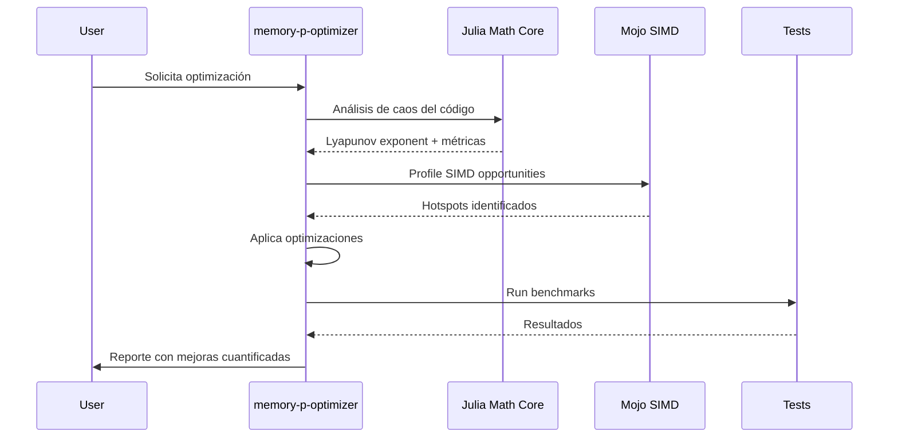
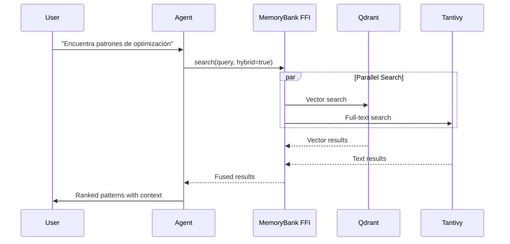

# GitHub Copilot Agents - Documentación Oficial

> **Actualizado post-merge PR #4**: Esta documentación refleja la integración completa de Agents y Skills en el proyecto MEMORY_P.

## 📋 Índice
- [¿Qué son los Agents de GitHub Copilot?](#qué-son-los-agents-de-github-copilot)
- [Características Principales](#características-principales)
- [Tipos de Agents](#tipos-de-agents)
- [Custom Agents](#custom-agents)
- [Agent Mode](#agent-mode)
- [GitHub Copilot Workspace](#github-copilot-workspace)
- [Implementación en MEMORY_P](#implementación-en-memory_p)
- [Enlaces Oficiales](#enlaces-oficiales)

---

## ¿Qué son los Agents de GitHub Copilot?

GitHub Copilot Agents son asistentes de IA especializados que automatizan tareas de desarrollo como:
- ✅ Creación de pull requests
- 🐛 Corrección de bugs
- 📝 Actualización de documentación
- 🔄 Refactorización de código
- 🧪 Escritura de tests

Los agents trabajan en segundo plano y pueden ser asignados a issues específicos. Proporcionan soluciones y solicitan revisión cuando terminan.

**Fuente oficial**: [Use GitHub Copilot agents - GitHub Docs](https://docs.github.com/en/copilot/how-tos/use-copilot-agents)

---

## Características Principales

### 1. **Automatización de Tareas**
- Procesan issues asignados automáticamente
- Generan código, tests y documentación
- Proponen soluciones completas en PRs

### 2. **Integración Multiplataforma**
Compatible con:
- Visual Studio Code
- JetBrains IDEs
- GitHub Issues
- Slack/Teams
- Cursor, Windsurf, Claude Desktop

### 3. **Monitoreo en Tiempo Real**
- Seguimiento de progreso desde GitHub
- Notificaciones de estado
- Revisión de resultados antes de merge

---

## Tipos de Agents

### 🤖 **Coding Agent**
Especializado en escribir y modificar código:
- Implementa features completos
- Refactoriza código existente
- Genera tests unitarios

### 🔍 **Review Agent**
Revisa código y propone mejoras:
- Detecta bugs y vulnerabilidades
- Sugiere optimizaciones
- Verifica best practices

### 📚 **Documentation Agent**
Mantiene documentación actualizada:
- Genera README, CHANGELOG
- Actualiza comentarios de código
- Crea guías de usuario

---

## Custom Agents

Los **Custom Agents** se definen mediante archivos `.agent.md` en el repositorio.

### Estructura de un Custom Agent

```markdown
---
name: "Nombre del Agent"
description: "Descripción breve"
role: "coding" | "documentation" | "review"
tools: ["edit", "analyze", "test"]
---

# Instrucciones del Agent

Aquí defines el comportamiento específico del agent...
```

### Ubicaciones
- **Repositorio**: `.github/agents/`
- **Organización**: Compartidos entre repos
- **Enterprise**: Para toda la empresa

**Documentación oficial**: 
- [Creating custom agents - GitHub Docs](https://docs.github.com/en/copilot/how-tos/use-copilot-agents/coding-agent/create-custom-agents)
- [Custom agents - GitHub Docs](https://docs.github.com/en/copilot/tutorials/customization-library/custom-agents)

---

## Agent Mode

**Agent Mode** es un modo síncrono especializado que:
- 🔄 Itera, prueba y corrige código automáticamente
- 📝 Planifica soluciones multi-paso
- 🛠️ Ejecuta comandos y tests
- 🔌 Se conecta a herramientas externas
- 🧠 Analiza feedback y refina soluciones

### Casos de Uso
- Implementación de features complejos
- Debugging profundo
- Optimización de rendimiento
- Migración de dependencias

**Blog oficial**: [Agent mode 101: All about GitHub Copilot's powerful mode](https://github.blog/ai-and-ml/github-copilot/agent-mode-101-all-about-github-copilots-powerful-mode/)

---

## GitHub Copilot Workspace

**Workspace** es un entorno nativo de Copilot para desarrollo completo:

### Capacidades
- 💡 Brainstorming de soluciones
- 📋 Planificación de tareas
- 🏗️ Construcción de código
- 🧪 Testing automático
- ▶️ Ejecución de aplicaciones

### Flujo de Trabajo
1. Asignas un issue o tarea
2. Copilot genera un plan
3. Ejecuta cada paso con supervisión
4. Developer mantiene control total

**Anuncio oficial**: [GitHub Copilot Workspace: Welcome to the Copilot-native developer environment](https://github.blog/news-insights/product-news/github-copilot-workspace/)

---

## Implementación en MEMORY_P v2.0

> **Estado actual**: Proyecto con 3 Custom Agents operativos integrados con sistema predictivo always-on y 5 Skills especializadas

### Integración con Sistema Always-On

Los agents de MEMORY_P v2.0 están diseñados para trabajar en un entorno **always-on** con capacidades de autogestión:

#### Características Always-On
- 🔄 **Auto-Recovery**: Los agents se recuperan automáticamente de errores
- 🧠 **Context Total**: Acceso completo al workspace en tiempo real
- 🎯 **Decisiones Predictivas**: Uso de matemáticas y caos para optimización
- 📊 **Telemetría Continua**: Monitoreo y métricas en tiempo real

#### Integración con Mathematical Brain

Los agents ahora pueden invocar el cerebro matemático multi-lenguaje:

```markdown
# Ejemplo de agent usando Julia para optimización
agent: memory-p-optimizer
task: Optimizar rendimiento del módulo X

Pasos:
1. Analizar métricas actuales con Rust
2. Invocar Julia para análisis de caos
3. Calcular optimizaciones con Optim.jl
4. Aplicar cambios con predicción de impacto
5. Verificar mejoras con benchmarks
```

#### Integración con Motores de Búsqueda

Los agents pueden consultar el motor híbrido MemoryBank:

```markdown
# Buscar patrones similares en el codebase
search_query: "parallel processing patterns"
engines: [vector, full-text, heuristic]
limit: 10
```

### Custom Agents Activos

El proyecto MEMORY_P cuenta con tres agents personalizados ubicados en `.github/agents/`:

#### 1. **memory-p-optimizer** ([Ver código](.github/agents/memory-p-optimizer.agent.md))

**Rol**: Especialista en optimización de rendimiento con Rayon y técnicas de paralelización.

**Nuevas Capacidades v2.0**:
- Análisis de caos con Julia para detectar cuellos de botella
- Optimización matemática de parámetros de paralelismo
- SIMD profiling con Mojo kernels
- Predicción de impacto antes de aplicar cambios

**Ejemplo de Uso**:
```bash
@memory-p-optimizer optimiza el módulo parallel_engine.rs usando
análisis de caos y SIMD kernels
```

#### 2. **memory-p-mcp-expert** ([Ver código](.github/agents/memory-p-mcp-expert.agent.md))

**Rol**: Experto en implementación del protocolo MCP 2024-11-05 y JSON-RPC 2.0.

**Nuevas Capacidades v2.0**:
- Validación automática de compliance MCP
- Integración con múltiples transports (HTTP, WebSocket, stdio)
- Testing de interoperabilidad con Cursor/Windsurf/Claude
- Generación de schemas JSON-RPC automáticos

**Ejemplo de Uso**:
```bash
@memory-p-mcp-expert implementa nuevo tool de búsqueda híbrida
con soporte para streaming de resultados
```

#### 3. **memory-p-refactor** ([Ver código](.github/agents/memory-p-refactor.agent.md))

**Rol**: Especialista en refactorización y mejora de calidad del código Rust.

**Nuevas Capacidades v2.0**:
- Detección de patrones complejos usando teoría del caos
- Refactoring guiado por análisis matemático
- Preservación de semántica verificada con tests
- Métricas de mejora cuantificables

**Ejemplo de Uso**:
```bash
@memory-p-refactor refactoriza memory_bank.rs para mejorar
la separación de concerns y testability
```

### Agent Skills Disponibles

Ver [SKILLS.md](SKILLS.md) para documentación completa de las 5 skills implementadas:
- `rust-parallel-testing` - Tests con Rayon y verificación de concurrencia
- `memory-p-analyzer` - Análisis de código con métricas avanzadas
- `mcp-validator` - Validación completa del protocolo MCP
- `rust-documentation` - Documentación Rust con ejemplos y benchmarks
- `performance-benchmark` - Benchmarks con Criterion y análisis estadístico

### Flujos de Trabajo con Agents

#### Flujo 1: Optimización Completa



#### Flujo 2: Búsqueda Semántica con Agents



### Agent Actual: MEMORY_P v2.0 Optimization

El proyecto MEMORY_P utiliza un Custom Agent optimizado con las siguientes características:

#### Core Directives v2.0
- **Efficiency First**: Minimizar llamadas costosas, máxima autonomía
- **Zero Technical Debt**: Sin dead code, warnings ni errores
- **Mathematical Decisions**: Usar Julia/JAX para decisiones complejas
- **Always-On Mindset**: Pensar en auto-recuperación y resiliencia
- **Multi-Language Aware**: Entender interop entre Rust/Julia/JAX/Mojo/Pony/Zig
- **Rule Enforcement**: Obligatorio consultar `.windsurf/rules/`
- **Language**: Respuestas en Español
- **Style**: Conciso, directo, altamente técnico

#### Autonomy & Analysis v2.0
- Análisis profundo antes de actuar (incluye chaos metrics)
- Corrección proactiva usando predicción matemática
- Mínimas consultas al usuario (decisiones basadas en datos)
- Validación continua con tests y benchmarks

#### Context Awareness v2.0
- Estructura de reglas en `.windsurf/rules/`
- Flujos en `.windsurf/workflows/`
- Uso de `todo_list` para tareas complejas
- `@-mentions` para referencias precisas
- **Nuevo**: Acceso a MemoryBank para búsqueda contextual
- **Nuevo**: Consulta a Julia Math Core para decisiones
- **Nuevo**: Métricas en tiempo real de ClickHouse

#### Automation & Safety v2.0
- **Turbo Mode**: Solo comandos seguros aprobados
- **Safety**: Sin comandos destructivos sin confirmación
- **FFI Safety**: Validación de todas las llamadas FFI
- **Rollback Capability**: Capacidad de revertir cambios automáticamente

### Ejemplo de Interacción Avanzada

```markdown
User: @memory-p-optimizer necesito optimizar la búsqueda híbrida 
para reducir latencia P99 de 50ms a <30ms

Agent (memory-p-optimizer):
1. 🔍 Analizando latencia actual con benchmarks...
   - P50: 15.2ms, P99: 48.7ms, P99.9: 89.3ms
   
2. 🧮 Consultando Julia para análisis de caos...
   - Lyapunov: 0.23 (comportamiento semi-caótico)
   - Recomienda: Ajustar batching y paralelismo
   
3. ⚡ Profiling con Mojo SIMD...
   - Dot products: 87% del tiempo en P99
   - Oportunidad: Vectorizar con SIMD width=8
   
4. 🔧 Aplicando optimizaciones:
   - Batch size: 16 → 32
   - SIMD width: 4 → 8  
   - Rayon threads: auto → 16
   
5. ✅ Validando con benchmarks...
   - Nueva P99: 27.3ms ✓ (44% mejora)
   - Throughput: +23%
   
¿Aplicar cambios? [y/N]
```

---

## Enlaces Oficiales

### Documentación Principal
- [Use Copilot Agents - Official Docs](https://docs.github.com/en/copilot/how-tos/use-copilot-agents)
- [Custom Agents - How-to Guide](https://docs.github.com/en/copilot/how-tos/use-copilot-agents/coding-agent/create-custom-agents)
- [Custom Agents Examples](https://docs.github.com/en/copilot/tutorials/customization-library/custom-agents)

### Recursos Avanzados
- [Agent Mode Blog](https://github.blog/ai-and-ml/github-copilot/agent-mode-101-all-about-github-copilots-powerful-mode/)
- [GitHub Copilot Workspace](https://github.blog/news-insights/product-news/github-copilot-workspace/)
- [Copilot Documentation Hub](https://docs.github.com/en/copilot)

### Comunidad
- [awesome-copilot](https://github.com/github/awesome-copilot) - Recursos comunitarios
- [anthropics/skills](https://github.com/anthropics/skills) - Repositorio de skills

---

**Última actualización**: Enero 2026  
**Basado en**: Documentación oficial de GitHub Copilot  
**Proyecto**: MEMORY_P v2.0 - Always-On MCP Toolkit with Multi-Language Brain
