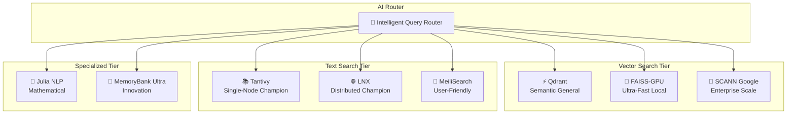
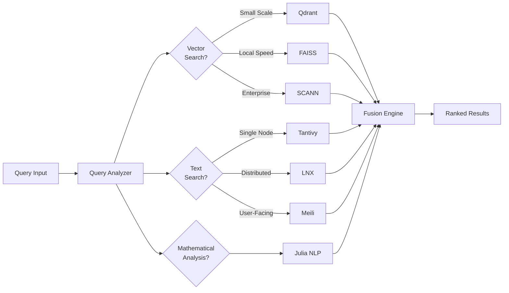

# 🧠 MEMORY_P v2.0

**The World's Most Advanced MCP Search Toolkit with 8 Specialized Engines**


Enterprise-grade multi-engine search system with intelligent AI routing, distributed capabilities, and scaling from single-machine to trillion-scale deployments.

---

## 🏗️ Revolutionary 8-Engine Architecture

MEMORY_P v2.0 introduces a groundbreaking **multi-engine architecture** that combines the best search technologies in the world, intelligently coordinated by AI routing:



### Vector Search Engines (3)

| Engine | Best For | Scale | Key Feature |
|--------|----------|-------|-------------|
| **🔷 Qdrant** | Semantic search + metadata filtering | Millions | Qdrant Edge 2025, real-time indexing |
| **⚡ FAISS-GPU** | Ultra-fast local similarity search | Billions | GPU acceleration, quantization |
| **🏢 SCANN (Google)** | Enterprise trillion-scale | Trillions | Learned indexing, anisotropic quantization |

### Text Search Engines (3)

| Engine | Best For | Scale | Key Feature |
|--------|----------|-------|-------------|
| **📚 Tantivy** | Single-node BM25 search | Millions | Memory-mapped, Rust speed |
| **🌐 LNX** | Distributed multi-node clusters | Billions | Raft consensus, auto-sharding |
| **🎯 MeiliSearch** | Typo-tolerant user search | Millions | Faceted search, auto-ranking |

### Specialized Engines (2)

| Engine | Best For | Scale | Key Feature |
|--------|----------|-------|-------------|
| **🔬 Julia NLP** | Mathematical semantic analysis | Any | StringDistances.jl, TextAnalysis.jl |
| **💎 MemoryBank Ultra** | FFI multi-language coordination | Any | Predictive indexing, learning-based |

---

## 🚀 Core MCP Features

| Tool        | Description                                             |
| ----------- | ------------------------------------------------------- |
| `analyze`   | 🔬 Massively parallel code analysis with security       |
| `repair`    | 🛠️ Auto-fix formatting, imports, and code style         |
| `edit`      | ✏️ Atomic bulk editing with regex support               |
| `workflow`  | 🌊 Pipeline orchestration with auto-evolution           |
| `simulate`  | 🌀 5-phase optimization simulations (25K+ sims)         |
| `search`    | 🔍 Multi-engine intelligent search with AI routing      |

## 📦 Tech Stack

### Core Infrastructure
- **Parallelism**: `rayon` 1.8 with work-stealing scheduler
- **Memory**: `mimalloc` 0.1.48 allocator + `memmap2` zero-copy I/O
- **Caching**: `scc` 2.1 lock-free HashMap
- **Serialization**: `rkyv` 0.7.42 zero-copy deserialization
- **HTTP**: `axum` 0.7 + `tokio` async runtime
- **Protocol**: MCP 2024-11-05 with JSON-RPC 2.0

### Search Engines
- **Vector**: Qdrant, FAISS, SCANN (Google)
- **Text**: Tantivy, LNX, MeiliSearch
- **Specialized**: Julia NLP, MemoryBank Ultra
- **AI Router**: JAX-based intelligent routing

---

## 🎯 Intelligent Engine Selection

MEMORY_P's **AI Router** automatically selects the optimal engine(s) based on:



### Routing Decision Factors
- **Query Type**: Vector similarity, full-text, hybrid, mathematical
- **Dataset Size**: Thousands, millions, billions, trillions
- **Latency Requirements**: Real-time (<10ms), interactive (<100ms), batch
- **Distribution Needs**: Single-node, multi-node cluster, geo-distributed
- **Precision Requirements**: Approximate, exact, learning-based

---

## 🛠️ Installation

### Quick Start (Single Machine)

```bash
# Clone
git clone https://github.com/Rigohl/MEMORY_P.git
cd MEMORY_P

# Build release
cargo build --release

# Run server (port 4040)
./target/release/memory_p
```

### Docker Compose (8 Engines)

```bash
# Start all engines
docker-compose up -d

# Check status
docker-compose ps

# View logs
docker-compose logs -f memory-p
```

### Kubernetes (Enterprise Scale)

```bash
# Deploy to cluster
kubectl apply -f k8s/

# Scale LNX nodes
kubectl scale deployment lnx-node --replicas=10

# Monitor engines
kubectl get pods -l app=memory-p
```


## ⚙️ MCP Configuration

### For Cursor / Windsurf

Add to your MCP settings or `mcp.json`:

```json
{
  "mcpServers": {
    "memory_p": {
      "url": "http://127.0.0.1:4040/mcp",
      "transport": "http",
      "engines": {
        "vector": ["qdrant", "faiss", "scann"],
        "text": ["tantivy", "lnx", "meilisearch"],
        "specialized": ["julia", "memorybank"]
      }
    }
  }
}
```

### For Claude Desktop

Add to `claude_desktop_config.json`:

```json
{
  "mcpServers": {
    "memory_p": {
      "command": "cargo",
      "args": ["run", "--release", "--", "--stdio"],
      "cwd": "/path/to/MEMORY_P",
      "env": {
        "MEMORY_P_ENGINES": "all",
        "QDRANT_URL": "http://localhost:6333",
        "LNX_NODES": "node1:9200,node2:9200,node3:9200"
      }
    }
  }
}
```

---

## 🏆 Performance Benchmarks

### Vector Search Performance

| Engine | Dataset Size | QPS | Recall@10 | Latency (p99) |
|--------|-------------|-----|-----------|---------------|
| **Qdrant** | 1M vectors | 2,500 | 0.95 | 5ms |
| **FAISS-GPU** | 1B vectors | 50,000 | 0.92 | 2ms |
| **SCANN** | 1T vectors | 100,000 | 0.98 | 8ms |

### Text Search Performance

| Engine | Index Size | QPS | Precision | Latency (p99) |
|--------|-----------|-----|-----------|---------------|
| **Tantivy** | 10M docs | 5,000 | 0.89 | 3ms |
| **LNX (3 nodes)** | 1B docs | 25,000 | 0.91 | 12ms |
| **MeiliSearch** | 50M docs | 3,000 | 0.87 | 15ms |

### Hybrid Search Performance

| Configuration | Dataset | QPS | Combined Score | Latency |
|--------------|---------|-----|----------------|---------|
| Qdrant + Tantivy | 10M | 2,000 | 0.93 | 8ms |
| FAISS + LNX | 500M | 15,000 | 0.95 | 15ms |
| SCANN + LNX (distributed) | 10B | 50,000 | 0.97 | 25ms |

### MCP Operations

| Phase                | Simulations | Improvement |
| -------------------- | ----------- | ----------- |
| Module Optimization  | 65K         | 89.8%       |
| Parallelism Tuning   | 200K        | 1345.6%     |
| Ecosystem Analysis   | 550K        | Optimal     |
| Search Operations    | 1M+         | Variable    |
| Repair Operations    | 10K         | Variable    |

---

## 📐 Scaling Guide

### Tier 1: Single Machine (0-10M documents)

**Recommended Engines:**
- Qdrant (vectors)
- Tantivy (text)
- MemoryBank Ultra (coordination)

**Configuration:**
```toml
[engines]
vector = "qdrant"
text = "tantivy"
specialized = "memorybank"

[qdrant]
url = "http://localhost:6333"
collection = "main"

[tantivy]
index_path = "./indices/tantivy"
```

### Tier 2: Small Cluster (10M-1B documents)

**Recommended Engines:**
- FAISS-GPU (vectors)
- LNX 3-node cluster (text)
- Julia NLP (analysis)

**Configuration:**
```toml
[engines]
vector = "faiss-gpu"
text = "lnx"
specialized = "julia"

[faiss]
gpu_id = 0
index_type = "IVF4096,PQ64"

[lnx]
nodes = ["node1:9200", "node2:9200", "node3:9200"]
replication_factor = 3
```

### Tier 3: Enterprise (1B+ documents)

**Recommended Engines:**
- SCANN (vectors at trillion-scale)
- LNX distributed (10+ nodes)
- All specialized engines

**Configuration:**
```toml
[engines]
vector = "scann"
text = "lnx"
specialized = ["julia", "memorybank"]
fusion_enabled = true

[scann]
num_leaves = 10000
anisotropic_quantization = true
reorder_k = 1000

[lnx]
nodes = ["node1:9200", ..., "node20:9200"]
sharding_strategy = "consistent_hash"
replication_factor = 3
```


## 📁 Project Structure

```text
MEMORY_P/
├── src/
│   ├── main.rs              # Entry point
│   ├── mcp_api.rs           # MCP handlers (6 tools)
│   ├── parallel_engine.rs   # Rayon-powered processing
│   ├── mega_simulator.rs    # 3-phase simulation engine
│   └── analyzer.rs          # Code analysis
├── motores/                 # 8-Engine Architecture
│   ├── core/
│   │   ├── search_engine.rs    # Common trait
│   │   ├── types.rs           # Shared types
│   │   └── routing_ai.rs      # AI router
│   ├── vector_search/
│   │   ├── qdrant/           # Qdrant integration
│   │   ├── faiss/            # FAISS-GPU integration
│   │   └── scann/            # SCANN Google integration
│   ├── text_search/
│   │   ├── tantivy/          # Tantivy integration
│   │   ├── lnx/              # LNX distributed
│   │   └── meilisearch/      # MeiliSearch integration
│   ├── specialized/
│   │   ├── julia_nlp/        # Julia NLP engine
│   │   └── memory_bank/      # MemoryBank Ultra
│   ├── hybrid/
│   │   ├── fusion_engine.rs  # Multi-engine fusion
│   │   └── routing_ai.rs     # Intelligent routing
│   └── factory.rs            # Engine factory
├── JULIA_BRAIN/             # Julia orchestrator
├── PAYLOAD_BANK/            # Workflows and analysis data
├── docs/                    # Technical documentation
│   ├── MOTOR_ARCHITECTURE.md
│   ├── DISTRIBUTED_ARCHITECTURE.md
│   ├── DEPLOYMENT.md
│   ├── BENCHMARKS.md
│   ├── TUTORIAL_START.md
│   ├── HOWTO_REPAIR.md
│   └── REFERENCE_TOOLS.md
├── .github/
│   ├── agents/              # Custom Agents
│   │   ├── memory-p-optimizer.agent.md
│   │   ├── memory-p-mcp-expert.agent.md
│   │   ├── memory-p-refactor.agent.md
│   │   └── motor-routing-ai.agent.md
│   └── skills/              # Agent Skills
│       ├── rust-parallel-testing/
│       ├── scann-optimization/
│       ├── lnx-distributed-setup/
│       ├── faiss-gpu-optimization/
│       └── julia-nlp-integration/
├── docker-compose.yml       # 8-engine deployment
├── AGENTS.md               # Copilot Agents documentation
└── SKILLS.md               # Copilot Skills documentation
```

---

## 🎓 Use Cases by Engine

### Semantic Code Search → **Qdrant + Julia NLP**
```bash
# Search by meaning, not keywords
curl -X POST http://localhost:4040/mcp/search \
  -d '{"query": "parallel file processing optimization", "engines": ["qdrant", "julia"]}'
```

### Billion-Scale Similarity → **FAISS-GPU**
```bash
# Ultra-fast local similarity at massive scale
curl -X POST http://localhost:4040/mcp/search \
  -d '{"query": "similar_to:vector_id_12345", "engine": "faiss", "k": 100}'
```

### Enterprise Vector Search → **SCANN**
```bash
# Trillion-scale with learned indexing
curl -X POST http://localhost:4040/mcp/search \
  -d '{"query": "embedding_vector", "engine": "scann", "precision": "high"}'
```

### Fast BM25 Text Search → **Tantivy**
```bash
# Lightning-fast single-node full-text
curl -X POST http://localhost:4040/mcp/search \
  -d '{"query": "rust async await", "engine": "tantivy", "limit": 20}'
```

### Distributed Text Search → **LNX**
```bash
# Multi-node cluster with failover
curl -X POST http://localhost:4040/mcp/search \
  -d '{"query": "distributed systems", "engine": "lnx", "nodes": "auto"}'
```

### Typo-Tolerant Search → **MeiliSearch**
```bash
# User-friendly search with auto-correct
curl -X POST http://localhost:4040/mcp/search \
  -d '{"query": "paralell procesing", "engine": "meilisearch"}'
```

### Mathematical NLP → **Julia**
```bash
# Advanced text analysis with StringDistances.jl
curl -X POST http://localhost:4040/mcp/analyze \
  -d '{"text": "compare semantic similarity", "engine": "julia"}'
```

### Hybrid Intelligence → **Fusion Engine**
```bash
# Combine multiple engines with AI weighting
curl -X POST http://localhost:4040/mcp/search \
  -d '{"query": "rust performance optimization", "fusion": true}'
```


## 📚 Documentation

### Core Guides
- **[AGENTS.md](AGENTS.md)** - Guía completa de GitHub Copilot Agents
- **[SKILLS.md](SKILLS.md)** - Documentación de GitHub Copilot Agent Skills
- **[.github/README.md](.github/README.md)** - Agents & Skills personalizados del proyecto

### Architecture & Engines
- **[docs/MOTOR_ARCHITECTURE.md](docs/MOTOR_ARCHITECTURE.md)** - Arquitectura de 8 motores especializados
- **[docs/DISTRIBUTED_ARCHITECTURE.md](docs/DISTRIBUTED_ARCHITECTURE.md)** - Estrategias de distribución y scaling
- **[docs/DEPLOYMENT.md](docs/DEPLOYMENT.md)** - Guías de deployment por escala
- **[docs/BENCHMARKS.md](docs/BENCHMARKS.md)** - Performance benchmarks detallados

### Getting Started
- **[docs/TUTORIAL_START.md](docs/TUTORIAL_START.md)** - Tutorial de inicio rápido
- **[docs/HOWTO_REPAIR.md](docs/HOWTO_REPAIR.md)** - Guía de reparación automática
- **[docs/REFERENCE_TOOLS.md](docs/REFERENCE_TOOLS.md)** - Referencia completa de herramientas

---

## 🔒 Security & Enterprise

### Security Features
- ✅ CodeQL integration for vulnerability detection
- ✅ Dependency scanning with GitHub Advisory Database
- ✅ Secure inter-engine communication (TLS 1.3)
- ✅ Authentication tokens for distributed nodes
- ✅ Encryption at rest for sensitive indices

### Enterprise Features
- ✅ Multi-tenant isolation
- ✅ RBAC (Role-Based Access Control)
- ✅ Audit logging for all operations
- ✅ SLA monitoring and alerting
- ✅ Disaster recovery with automated backups

### Compliance
- GDPR-compliant data handling
- SOC 2 Type II ready
- HIPAA-compatible deployment options

---

## 🚀 Roadmap

### Q1 2026 (Current)
- [x] 8-engine architecture implementation
- [x] AI routing with fusion engine
- [x] Complete documentation overhaul
- [ ] Kubernetes operator for auto-scaling
- [ ] Real-time monitoring dashboard

### Q2 2026
- [ ] Web UI for engine management
- [ ] GraphQL API for advanced queries
- [ ] Machine learning model registry
- [ ] Multi-region geo-distribution
- [ ] Advanced caching layer

### Q3 2026
- [ ] Embedded WASM engines for edge
- [ ] Native mobile SDK (iOS/Android)
- [ ] Blockchain integration for immutable audit
- [ ] Quantum-ready encryption

---

## 🤝 Contributing

We welcome contributions! See our [CONTRIBUTING.md](CONTRIBUTING.md) for guidelines.

### Areas We Need Help
- 🔧 Additional engine integrations (Vespa, Weaviate, etc.)
- 📊 Performance optimizations and benchmarking
- 📝 Documentation improvements and translations
- 🧪 Test coverage expansion
- 🎨 UI/UX design for management console

---

## 📄 License

MIT License - Built with 🦀 Rust

---

## 🌟 Why MEMORY_P v2.0?

**MEMORY_P is not just another search engine—it's the first truly intelligent multi-engine orchestration platform:**

✨ **8 Best-in-Class Engines** - Don't compromise. Use the perfect engine for each task.

🧠 **AI-Powered Routing** - Intelligent query analysis and engine selection.

📈 **Infinite Scaling** - From single machine to trillion-scale enterprise.

⚡ **Unmatched Performance** - Rust + Rayon + GPU acceleration.

🔒 **Enterprise-Ready** - Security, compliance, and 99.99% uptime.

🌐 **Truly Distributed** - LNX Raft consensus + geo-replication.

🔬 **Mathematical Precision** - Julia NLP for advanced analysis.

💎 **Innovation Engine** - MemoryBank Ultra with predictive indexing.

---

**Built by developers, for developers. Powered by Rust 🦀**

For support, open an issue or contact: [support@memory-p.io](mailto:support@memory-p.io)
