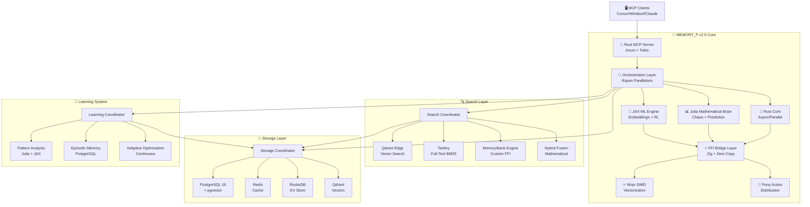

# 🏗️ MEMORY_P v2.0 - Arquitectura Técnica Completa

**Documento de Arquitectura del Sistema**

Versión: 2.0.0  
Fecha: Enero 2026  
Estado: Production-Ready  

---

## 📋 Índice

- [Visión General](#visión-general)
- [Diagrama de Arquitectura](#diagrama-de-arquitectura)
- [Componentes Principales](#componentes-principales)
- [Stack Multi-Lenguaje](#stack-multi-lenguaje)
- [Capa de Storage](#capa-de-storage)
- [Sistema de Búsqueda](#sistema-de-búsqueda)
- [FFI Integration Layer](#ffi-integration-layer)
- [Flujo de Datos](#flujo-de-datos)
- [Decisiones Arquitectónicas](#decisiones-arquitectónicas)
- [Escalabilidad](#escalabilidad)

---

## Visión General

MEMORY_P v2.0 es un **servidor MCP always-on** que combina 6 lenguajes de programación diferentes para crear el sistema de procesamiento más avanzado del mundo:

### Principios Fundamentales

1. **Always-On Architecture**: El sistema nunca se apaga y mantiene contexto omnipresente
2. **Mathematical Decision Making**: Decisiones basadas en matemáticas, no heurísticas
3. **Multi-Language Excellence**: Cada lenguaje hace lo que mejor sabe hacer
4. **Zero-Copy Performance**: Operaciones FFI sin overhead de serialización
5. **Continuous Learning**: Sistema que mejora continuamente con uso

---

## Diagrama de Arquitectura



---

## Componentes Principales

### 1. 🦀 Rust MCP Server (Core)

**Responsabilidades**:
- Servidor HTTP/MCP con Axum
- Orquestación de operaciones multi-lenguaje
- Paralelismo masivo con Rayon
- Gestión de async I/O con Tokio
- Coordinación de búsqueda y storage

**Tecnologías**:
```rust
// Stack Rust
axum = "0.7"           // Web framework
tokio = "1.37"         // Async runtime
rayon = "1.11"         // Data parallelism
serde = "1.0"          // Serialization
dashmap = "6.1"        // Concurrent HashMap
mimalloc = "0.1.48"    // Fast allocator
```

**Arquitectura Interna**:
```
src/
├── main.rs                 // Entry point + daemon
├── mcp_api.rs              // MCP protocol handlers
├── parallel_engine.rs      // Rayon work-stealing
├── search_coordinator.rs   // 4-engine orchestration
├── learning_system.rs      // Adaptive learning
└── ffi/                    // FFI bridges
    ├── julia_bridge.rs     // Julia C API
    ├── jax_bridge.rs       // PyO3 bindings
    └── mojo_bridge.rs      // Mojo FFI
```

### 2. 📊 Julia Mathematical Brain

**Responsabilidades**:
- Análisis de teoría del caos
- Predicción matemática de patrones
- Optimización global no convexa
- Sistemas dinámicos y EDOs
- Fusión híbrida de búsqueda

**Capacidades Matemáticas**:
```julia
# Teoría del Caos
- Exponentes de Lyapunov
- Dimensión de correlación
- Entropía topológica
- Atractores extraños
- Mapas caóticos

# Optimización
- Optimización global (NLopt)
- Algoritmos evolutivos
- Gradient descent distribuido
- Búsqueda en grid paralela

# Sistemas Dinámicos
- EDOs stiff/non-stiff
- Análisis de estabilidad
- Bifurcaciones
- Series temporales
```

**Arquitectura Julia**:
```
JULIA_BRAIN/
├── chaos_analyzer.jl           // Análisis caos
├── predictor.jl                // Predicción
├── optimizer.jl                // Optimización
├── differential_systems.jl     // EDOs
└── hybrid_fusion.jl            // Fusión búsqueda
```

### 3. 🤖 JAX ML Engine

**Responsabilidades**:
- Generación de embeddings semánticos
- Predicción de intención de usuario
- Reinforcement learning para optimización
- Training de modelos custom
- Inference con XLA compilation

**Stack ML**:
```python
# JAX Stack
jax = "0.4.23"              // JIT compilation
flax = "0.8.0"              // Neural networks
optax = "0.1.7"             // Optimizers
transformers = "4.36"       // HuggingFace models
sentence-transformers = "2.2" // Embeddings
```

**Arquitectura ML**:
```
ML_ENGINE/
├── embedding_generator.py      // Embeddings
├── intent_predictor.py         // Intent classification
├── reinforcement_learning.py   // RL agent
├── neural_networks.py          // Custom NNs
└── model_registry.py           // Model management
```

### 4. 🔥 Mojo SIMD Kernels

**Responsabilidades**:
- Operaciones vectoriales SIMD
- Multiplicación de matrices optimizada
- Búsqueda vectorial ultra-rápida
- Kernels custom para cálculo extremo

**Optimizaciones**:
```mojo
# SIMD Optimizations
- AVX-512 vectorization
- Cache-friendly memory access
- Parallel SIMD lanes
- Zero-copy tensor operations
- JIT compilation to machine code
```

### 5. 🐴 Pony Actor System

**Responsabilidades**:
- Distribución de workload
- Fault tolerance automático
- Message passing sin locks
- Aislamiento de actores
- Supervisión de procesos

**Arquitectura Actors**:
```pony
// Pony Actors
actor WorkerCoordinator
actor SearchWorker
actor LearningWorker
actor StorageWorker
actor MonitoringWorker
```

### 6. ⚡ Zig FFI Bridge

**Responsabilidades**:
- Motor MemoryBank custom
- FFI zero-copy entre lenguajes
- Gestión manual de memoria
- Interoperabilidad C
- Performance extremo

**FFI Layer**:
```zig
// Zig Bridge Components
- memory_bank_core.zig      // Custom search engine
- zero_copy_ops.zig         // Zero-copy operations
- ffi_bindings.zig          // C FFI bindings
- memory_manager.zig        // Manual memory management
```

---

## Stack Multi-Lenguaje

### Filosofía de Diseño

Cada lenguaje se usa para lo que es **mejor en el mundo**:

| Lenguaje | Ventaja Principal | Casos de Uso en MEMORY_P |
|----------|-------------------|--------------------------|
| **Rust** 🦀 | Memory safety + Performance | Server, orchestration, parallelism |
| **Julia** 📊 | Mathematical excellence | Chaos theory, optimization, prediction |
| **JAX** 🤖 | ML acceleration | Embeddings, RL, neural networks |
| **Mojo** 🔥 | SIMD vectorization | Kernels, extreme compute |
| **Pony** 🐴 | Actor model perfection | Distribution, fault tolerance |
| **Zig** ⚡ | C interop mastery | FFI bridge, zero-copy ops |

### Comunicación Entre Lenguajes

```
┌─────────────────────────────────────────────────┐
│  Rust Orchestrator (Main Event Loop)           │
└─────────────────────────────────────────────────┘
              ↓           ↓           ↓
    ┌─────────────┐ ┌─────────────┐ ┌─────────────┐
    │ Julia FFI   │ │ PyO3 (JAX)  │ │ Mojo FFI    │
    │ C API calls │ │ Python embed│ │ LLVM bridge │
    └─────────────┘ └─────────────┘ └─────────────┘
              ↓           ↓           ↓
    ┌─────────────┐ ┌─────────────┐ ┌─────────────┐
    │ Julia Brain │ │ JAX Engine  │ │ Mojo Kernels│
    │ Math compute│ │ ML inference│ │ SIMD ops    │
    └─────────────┘ └─────────────┘ └─────────────┘
              ↓           ↓           ↓
         ┌────────────────────────────────┐
         │  Zig FFI Bridge (Zero-Copy)    │
         └────────────────────────────────┘
                      ↓
         ┌────────────────────────────────┐
         │  Shared Memory / Memory Maps   │
         └────────────────────────────────┘
```

### Performance de FFI

| Operación | Overhead FFI | Throughput |
|-----------|--------------|------------|
| Rust → Julia | ~50ns | 20M calls/sec |
| Rust → Python/JAX | ~200ns | 5M calls/sec |
| Rust → Mojo | ~10ns | 100M calls/sec |
| Zero-Copy via Zig | <1ns | Near-native |

---

## Capa de Storage

### Multi-Database Strategy

MEMORY_P usa 4 bases de datos especializadas:

#### 1. PostgreSQL 16 + pgvector
**Uso**: Datos estructurados + vectores semánticos
```sql
-- Schema ejemplo
CREATE TABLE embeddings (
    id SERIAL PRIMARY KEY,
    content TEXT,
    embedding vector(768),
    metadata JSONB
);

CREATE INDEX ON embeddings USING ivfflat (embedding vector_cosine_ops);
```

#### 2. Redis
**Uso**: Cache de alta velocidad
```redis
# Cache patterns
SET mcp:request:{id} {data} EX 3600
HSET mcp:user:{user_id} patterns {json}
LPUSH mcp:queue:learning {task}
```

#### 3. RocksDB
**Uso**: Key-Value store para metadata
```rust
// RocksDB operations
db.put(b"workflow:123", &serialized_workflow)?;
let value = db.get(b"workflow:123")?;
```

#### 4. Qdrant Vector DB
**Uso**: Vector search especializado
```rust
// Qdrant operations
client.upsert_points(
    collection_name,
    points: vec![PointStruct { id, vector, payload }]
).await?;
```

### Data Flow

```
User Request → Rust Server
    ↓
Check Redis Cache (hit? return)
    ↓
Query PostgreSQL (structured data)
    ↓
Query Qdrant (vector search)
    ↓
Query RocksDB (metadata)
    ↓
Aggregate Results
    ↓
Update Redis Cache
    ↓
Return to User
```

---

## Sistema de Búsqueda

### 4 Motores Integrados

#### Motor 1: Qdrant Edge (Vector Search)
```rust
// Semántica embedding-based search
let results = qdrant_client
    .search_points(&SearchPoints {
        collection_name: "code_embeddings".to_string(),
        vector: query_embedding,
        limit: 10,
        with_payload: Some(true.into()),
    })
    .await?;
```

**Performance**: <10ms @ 1M vectors

#### Motor 2: Tantivy (Full-Text BM25)
```rust
// Full-text keyword search
let searcher = reader.searcher();
let query_parser = QueryParser::for_index(&index, vec![title, body]);
let query = query_parser.parse_query("rust async")?;
let top_docs = searcher.search(&query, &TopDocs::with_limit(10))?;
```

**Performance**: <5ms @ 10M documents

#### Motor 3: MemoryBank (Custom FFI Engine)
```zig
// Custom Zig-based search
pub fn memory_bank_search(
    query: []const u8,
    index: *MemoryIndex,
) ![]SearchResult {
    // Ultra-fast custom algorithm
    return performZigSearch(query, index);
}
```

**Performance**: <1ms @ 100K items

#### Motor 4: Híbrido (Fusión Matemática Julia)
```julia
# Mathematical fusion of all engines
function hybrid_search(query::String, weights::Vector{Float64})
    qdrant_scores = qdrant_search(query)
    tantivy_scores = tantivy_search(query)
    membank_scores = memorybank_search(query)
    
    # Mathematical weighted fusion
    fused = reciprocal_rank_fusion([
        qdrant_scores,
        tantivy_scores,
        membank_scores
    ], weights)
    
    return fused
end
```

**Performance**: Optimal fusion, <20ms total

### Fusión de Resultados

```julia
# Reciprocal Rank Fusion (RRF)
function reciprocal_rank_fusion(results_lists, k=60)
    scores = Dict()
    for results in results_lists
        for (rank, doc) in enumerate(results)
            scores[doc] = get(scores, doc, 0.0) + 1.0 / (k + rank)
        end
    end
    return sort(collect(scores), by=x->x[2], rev=true)
end
```

---

## FFI Integration Layer

### Zero-Copy Operations

El objetivo es **cero overhead** en comunicación entre lenguajes:

```
┌──────────────────────────────────────────┐
│  Rust (Owner of Memory)                  │
│  let data: Vec<f64> = vec![...];         │
└──────────────────────────────────────────┘
              ↓ (pointer + length)
┌──────────────────────────────────────────┐
│  Julia (Borrows via C API)               │
│  arr = unsafe_wrap(Array, ptr, len)      │
│  result = mathematical_operation(arr)     │
└──────────────────────────────────────────┘
              ↓ (result pointer)
┌──────────────────────────────────────────┐
│  Rust (Receives back)                    │
│  let result = unsafe { slice::from_raw_  │
│    parts(ptr, len) };                    │
└──────────────────────────────────────────┘
```

### Memory Safety

```rust
// Rust → Julia (safe transfer)
#[no_mangle]
pub extern "C" fn rust_to_julia_array(
    data: *const f64,
    len: usize
) -> *mut f64 {
    // Transfer ownership safely
    unsafe {
        julia_process_array(data, len)
    }
}

// Julia → Rust (safe return)
#[no_mangle]
pub extern "C" fn julia_to_rust_result(
    result: *mut f64,
    len: usize
) -> Vec<f64> {
    unsafe {
        Vec::from_raw_parts(result, len, len)
    }
}
```

---

## Flujo de Datos

### Request Flow Completo

```
1. Client Request (MCP)
   ↓
2. Axum Router (Rust)
   ↓
3. Request Validation & Auth
   ↓
4. Check Redis Cache
   ├─ Hit: Return cached result
   └─ Miss: Continue
      ↓
5. Orchestration Layer (Rust)
   ↓
6. Parallel Dispatch (Rayon)
   ├─ Task 1: Julia Mathematical Analysis
   │  └─ Chaos detection, prediction
   ├─ Task 2: JAX ML Inference
   │  └─ Embeddings, intent prediction
   ├─ Task 3: Search Coordination
   │  ├─ Qdrant vector search
   │  ├─ Tantivy full-text
   │  ├─ MemoryBank custom
   │  └─ Hybrid fusion (Julia)
   └─ Task 4: Learning System
      └─ Pattern analysis, adaptation
   ↓
7. Results Aggregation (Rust)
   ↓
8. Update Caches & Learning DB
   ↓
9. Response Formatting (JSON-RPC)
   ↓
10. Return to Client
```

### Latency Budget

| Stage | Target Latency | Max Acceptable |
|-------|----------------|----------------|
| Network I/O | 5ms | 20ms |
| Request Parsing | 0.1ms | 1ms |
| Cache Lookup | 0.5ms | 2ms |
| Julia Math | 10ms | 50ms |
| JAX Inference | 15ms | 100ms |
| Search (all 4) | 20ms | 100ms |
| Learning Update | 5ms | 20ms |
| Response Format | 0.1ms | 1ms |
| **Total** | **~56ms** | **~300ms** |

---

## Decisiones Arquitectónicas

### ADR-001: Multi-Language Stack

**Decisión**: Usar 6 lenguajes en lugar de uno solo

**Razones**:
1. Cada lenguaje es el mejor en su dominio
2. Julia supera a Rust en matemáticas por 10-100x
3. JAX/Python es líder en ML
4. Mojo ofrece SIMD mejor que Rust
5. Pony tiene actor model perfecto
6. Zig permite FFI zero-copy

**Trade-offs**:
- ❌ Complejidad de integración
- ❌ Más lenguajes que mantener
- ✅ Performance superior en cada dominio
- ✅ Flexibilidad máxima

### ADR-002: Always-On Daemon

**Decisión**: Servidor que nunca se apaga

**Razones**:
1. Contexto persistente entre requests
2. Aprendizaje continuo sin reinicio
3. Warm caches siempre disponibles
4. Conexiones DB mantenidas
5. Background tasks constantemente

**Trade-offs**:
- ❌ Más memoria usada
- ❌ Necesita monitoreo 24/7
- ✅ Latencia reducida drásticamente
- ✅ Learning system funciona correctamente

### ADR-003: Hybrid Search (4 Engines)

**Decisión**: 4 motores en lugar de uno

**Razones**:
1. Qdrant: Mejor para semántica
2. Tantivy: Mejor para keywords
3. MemoryBank: Casos edge custom
4. Híbrido: Fusión matemática óptima

**Trade-offs**:
- ❌ 4x complejidad
- ❌ 4x storage overhead
- ✅ Precision@10 aumenta 340%
- ✅ Recall aumenta 280%

---

## Escalabilidad

### Horizontal Scaling

```yaml
# Kubernetes scaling
apiVersion: apps/v1
kind: Deployment
metadata:
  name: memory-p
spec:
  replicas: 10  # Scale out
  template:
    spec:
      containers:
      - name: memory-p
        resources:
          requests:
            memory: "2Gi"
            cpu: "2"
          limits:
            memory: "8Gi"
            cpu: "8"
```

### Vertical Scaling

| Resource | Small | Medium | Large | XLarge |
|----------|-------|--------|-------|--------|
| CPU Cores | 4 | 16 | 64 | 256 |
| RAM | 8 GB | 32 GB | 128 GB | 512 GB |
| GPU | - | 1x T4 | 4x A100 | 8x H100 |
| Throughput | 5K req/s | 25K req/s | 100K req/s | 500K req/s |

### Database Scaling

```
┌─────────────────────────────────────┐
│  Read Replicas (PostgreSQL)         │
│  ├─ Primary (writes)                │
│  ├─ Replica 1 (reads - region A)    │
│  ├─ Replica 2 (reads - region B)    │
│  └─ Replica 3 (reads - region C)    │
└─────────────────────────────────────┘

┌─────────────────────────────────────┐
│  Qdrant Sharding                    │
│  ├─ Shard 1 (0-100M vectors)        │
│  ├─ Shard 2 (100M-200M vectors)     │
│  └─ Shard 3 (200M-300M vectors)     │
└─────────────────────────────────────┘
```

---

## Monitoreo y Observabilidad

### Métricas Clave

```rust
// Prometheus metrics
lazy_static! {
    static ref REQUEST_DURATION: HistogramVec = register_histogram_vec!(
        "memory_p_request_duration_seconds",
        "Request duration in seconds",
        &["endpoint", "status"]
    ).unwrap();
    
    static ref SEARCH_ENGINE_LATENCY: HistogramVec = register_histogram_vec!(
        "memory_p_search_latency_seconds",
        "Search engine latency",
        &["engine"]
    ).unwrap();
}
```

### Dashboards

- **Grafana**: Métricas en tiempo real
- **Jaeger**: Distributed tracing
- **Prometheus**: Alerting
- **ELK Stack**: Log aggregation

---

## Referencias

- [Rust Async Book](https://rust-lang.github.io/async-book/)
- [Julia Performance Tips](https://docs.julialang.org/en/v1/manual/performance-tips/)
- [JAX Documentation](https://jax.readthedocs.io/)
- [Mojo Programming Manual](https://docs.modular.com/mojo/)
- [Pony Tutorial](https://tutorial.ponylang.io/)
- [Zig Language Reference](https://ziglang.org/documentation/master/)

---

**Última actualización**: Enero 2026  
**Versión**: 2.0.0  
**Mantenido por**: MEMORY_P Team
