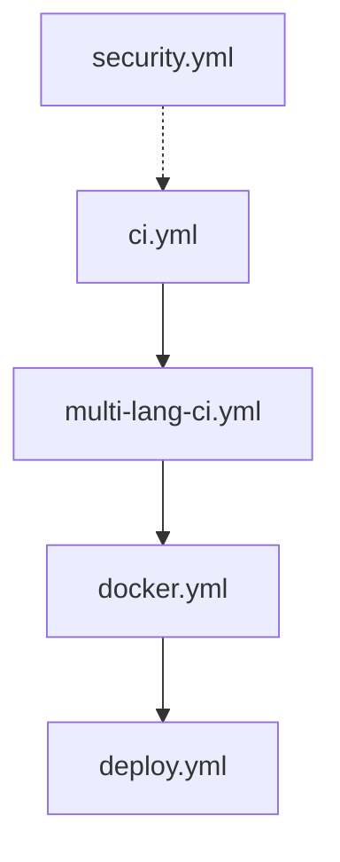

# 🚀 CI/CD Best Practices for MEMORY_P

> **Comprehensive guide for pipeline documentation, IaC automation, and reproducible AI/ML environments**

## 📋 Table of Contents

- [Pipeline Documentation](#-pipeline-documentation-standards)
- [Infrastructure as Code](#️-infrastructure-as-code-iac)
- [Reproducibility Guarantees](#-reproducibility-guarantees)
- [GitHub Actions Optimization](#-github-actions-optimization)
- [Multi-Language CI](#-multi-language-cicd)
- [AI/ML Pipeline Patterns](#-aiml-pipeline-patterns)
- [Testing Strategies](#-testing-strategies)
- [Deployment Automation](#-deployment-automation)

---

## 📝 Pipeline Documentation Standards

### Anatomy of a Well-Documented Pipeline

Every CI/CD pipeline in MEMORY_P should include:

```yaml
# .github/workflows/example.yml
name: 📦 Example Pipeline  # Use emoji for quick visual scanning

# DOCUMENTATION BLOCK - Essential for Copilot understanding
# Purpose: What this pipeline does
# Triggers: When it runs
# Dependencies: External services/tools required
# Outputs: Artifacts produced
# Estimated time: How long it takes
# Owner: @team-name or @username

on:
  push:
    branches: [main, develop]
    paths:  # Only trigger on relevant changes
      - 'src/**'
      - 'Cargo.toml'
  pull_request:
    branches: [main]

env:
  # Document environment variables
  RUST_VERSION: "1.75.0"  # Why this version? (e.g., async trait support)
  JULIA_VERSION: "1.10.0"  # Required for DifferentialEquations.jl
  
jobs:
  build:
    name: 🔨 Build and Test
    runs-on: ubuntu-latest
    
    steps:
      - name: 📥 Checkout code
        uses: actions/checkout@v4
        
      # Each step should be self-documenting
      - name: 🦀 Setup Rust toolchain
        uses: actions-rs/toolchain@v1
        with:
          toolchain: stable
          override: true
          components: rustfmt, clippy
          
      # Explain non-obvious steps
      - name: 💾 Cache dependencies
        # WHY: Reduces build time from 15min to 2min
        uses: actions/cache@v3
        with:
          path: |
            ~/.cargo/registry
            ~/.cargo/git
            target
          key: ${{ runner.os }}-cargo-${{ hashFiles('**/Cargo.lock') }}
```

### Documentation Template

Create a `docs/pipelines/README.md`:

```markdown
# MEMORY_P CI/CD Pipelines

## Overview

| Pipeline | Purpose | Trigger | Duration | Critical |
|----------|---------|---------|----------|----------|
| [ci.yml](../../.github/workflows/ci.yml) | Core Rust build/test | Push/PR | ~8min | ✅ |
| [multi-lang-ci.yml](../../.github/workflows/multi-lang-ci.yml) | Julia/JAX/Mojo tests | Push/PR | ~12min | ✅ |
| [docker.yml](../../.github/workflows/docker.yml) | Container build | Tag | ~15min | ⚠️ |
| [security.yml](../../.github/workflows/security.yml) | Security scan | Daily | ~20min | ✅ |

## Pipeline Dependencies



## Adding New Pipelines

1. Copy template from `docs/pipelines/template.yml`
2. Update documentation block
3. Add to this README
4. Test locally with `act` (see below)
5. Create PR with pipeline changes only
```

---

## ⚙️ Infrastructure as Code (IaC)

### Terraform for Oracle Cloud

**Directory structure**:
```
infrastructure/
├── terraform/
│   ├── oracle-cloud/
│   │   ├── main.tf              # Main configuration
│   │   ├── variables.tf         # Input variables
│   │   ├── outputs.tf           # Outputs for other modules
│   │   ├── versions.tf          # Provider versions
│   │   ├── modules/
│   │   │   ├── compute/         # VM instances
│   │   │   ├── network/         # VCN, subnets, security lists
│   │   │   └── database/        # Autonomous DB
│   │   └── environments/
│   │       ├── dev.tfvars
│   │       ├── staging.tfvars
│   │       └── prod.tfvars
│   └── kubernetes/
│       ├── microk8s/            # Single-node setup
│       └── k3s/                 # Multi-node cluster
```

**Example: Oracle Cloud Free Tier ARM Instance**

```hcl
# infrastructure/terraform/oracle-cloud/modules/compute/main.tf

# DOCUMENTATION: Creates ARM instance for MEMORY_P
# Resources: 4 OCPU, 24 GB RAM (always-free tier)
# OS: Ubuntu 22.04 LTS
# Purpose: Primary MEMORY_P MCP server

terraform {
  required_providers {
    oci = {
      source  = "oracle/oci"
      version = "~> 5.0"
    }
  }
}

variable "compartment_id" {
  description = "Oracle Cloud compartment ID (always-free account)"
  type        = string
}

variable "availability_domain" {
  description = "Availability domain (e.g., 'zInd:US-ASHBURN-AD-1')"
  type        = string
}

variable "ssh_public_key" {
  description = "SSH public key for instance access"
  type        = string
}

# Get latest Ubuntu 22.04 ARM image
data "oci_core_images" "ubuntu_arm" {
  compartment_id           = var.compartment_id
  operating_system         = "Canonical Ubuntu"
  operating_system_version = "22.04"
  shape                    = "VM.Standard.A1.Flex"
  sort_by                  = "TIMECREATED"
  sort_order               = "DESC"
}

# Create ARM instance (always-free tier)
resource "oci_core_instance" "memory_p_arm" {
  # Name tag for easy identification
  display_name        = "memory-p-primary-arm"
  compartment_id      = var.compartment_id
  availability_domain = var.availability_domain
  
  # ARM shape (always-free: up to 4 OCPU, 24 GB RAM)
  shape = "VM.Standard.A1.Flex"
  
  shape_config {
    ocpus         = 4   # Max for always-free
    memory_in_gbs = 24  # Max for always-free
  }
  
  # Boot volume (up to 200 GB free)
  source_details {
    source_type = "image"
    source_id   = data.oci_core_images.ubuntu_arm.images[0].id
    boot_volume_size_in_gbs = 200  # Max for always-free
  }
  
  # Network configuration
  create_vnic_details {
    subnet_id        = var.subnet_id
    display_name     = "memory-p-vnic"
    assign_public_ip = true
    hostname_label   = "memory-p"
  }
  
  # SSH access
  metadata = {
    ssh_authorized_keys = var.ssh_public_key
    
    # Cloud-init for automated setup
    user_data = base64encode(templatefile("${path.module}/cloud-init.yaml", {
      hostname = "memory-p-primary"
    }))
  }
  
  # Tags for cost tracking
  freeform_tags = {
    Project     = "MEMORY_P"
    Environment = "production"
    ManagedBy   = "Terraform"
    AlwaysFree  = "true"
  }
}

output "public_ip" {
  description = "Public IP address of MEMORY_P instance"
  value       = oci_core_instance.memory_p_arm.public_ip
}

output "private_ip" {
  description = "Private IP address for internal communication"
  value       = oci_core_instance.memory_p_arm.private_ip
}
```

**Cloud-init for automated setup**:

```yaml
# infrastructure/terraform/oracle-cloud/modules/compute/cloud-init.yaml
#cloud-config

# DOCUMENTATION: Automated MEMORY_P setup on Oracle Cloud ARM
# Purpose: Zero-touch deployment from fresh Ubuntu instance
# Duration: ~15 minutes
# Idempotent: Can be re-run safely

hostname: ${hostname}

package_update: true
package_upgrade: true

packages:
  - git
  - curl
  - build-essential
  - pkg-config
  - libssl-dev
  - postgresql-client
  - redis-tools

runcmd:
  # Install Docker
  - curl -fsSL https://get.docker.com -o /tmp/get-docker.sh
  - sh /tmp/get-docker.sh
  - usermod -aG docker ubuntu
  
  # Install Docker Compose
  - curl -L "https://github.com/docker/compose/releases/download/v2.24.0/docker-compose-$(uname -s)-$(uname -m)" -o /usr/local/bin/docker-compose
  - chmod +x /usr/local/bin/docker-compose
  
  # Install Rust (for ARM)
  - sudo -u ubuntu curl --proto '=https' --tlsv1.2 -sSf https://sh.rustup.rs | sudo -u ubuntu sh -s -- -y
  
  # Install Julia (ARM build)
  - wget https://julialang-s3.julialang.org/bin/linux/aarch64/1.10/julia-1.10.0-linux-aarch64.tar.gz -O /tmp/julia.tar.gz
  - tar -xzf /tmp/julia.tar.gz -C /opt/
  - ln -s /opt/julia-1.10.0/bin/julia /usr/local/bin/julia
  
  # Clone MEMORY_P
  - cd /home/ubuntu
  - sudo -u ubuntu git clone https://github.com/Rigohl/MEMORY_P.git
  
  # Setup firewall
  - ufw allow 22/tcp
  - ufw allow 4040/tcp
  - ufw allow 6333/tcp
  - ufw --force enable
  
  # Configure iptables for Oracle Cloud
  - iptables -I INPUT 6 -m state --state NEW -p tcp --dport 4040 -j ACCEPT
  - iptables -I INPUT 6 -m state --state NEW -p tcp --dport 6333 -j ACCEPT
  - netfilter-persistent save
  
  # Create systemd service for MEMORY_P
  - |
    cat > /etc/systemd/system/memory-p.service <<'EOF'
    [Unit]
    Description=MEMORY_P MCP Server
    After=docker.service
    Requires=docker.service
    
    [Service]
    Type=simple
    User=ubuntu
    WorkingDirectory=/home/ubuntu/MEMORY_P
    ExecStart=/usr/local/bin/docker-compose up
    ExecStop=/usr/local/bin/docker-compose down
    Restart=always
    RestartSec=10
    
    [Install]
    WantedBy=multi-user.target
    EOF
  - systemctl daemon-reload
  - systemctl enable memory-p.service
  
  # Start MEMORY_P (after first boot)
  - cd /home/ubuntu/MEMORY_P && sudo -u ubuntu docker-compose up -d

write_files:
  - path: /etc/profile.d/memory_p_env.sh
    content: |
      export MEMORY_P_HOME=/home/ubuntu/MEMORY_P
      export PATH=$PATH:/home/ubuntu/.cargo/bin
    permissions: '0644'

final_message: "MEMORY_P setup complete! Access at http://$(hostname -I | awk '{print $1}'):4040"
```

### Ansible for Configuration Management

```yaml
# infrastructure/ansible/playbooks/memory_p_deploy.yml

---
# DOCUMENTATION: Deploy MEMORY_P to Rocky Linux cluster
# Target: 3-node K3s cluster (1 master, 2 workers)
# Requirements: Ansible 2.14+, passwordless SSH
# Duration: ~10 minutes for full deployment
# Idempotent: Safe to run multiple times

- name: 🚀 Deploy MEMORY_P to K3s Cluster
  hosts: k3s_cluster
  become: yes
  
  vars:
    memory_p_version: "v2.0.1"
    k3s_version: "v1.29.0+k3s1"
    docker_compose_version: "2.24.0"
    
  tasks:
    - name: 📦 Install prerequisites
      dnf:
        name:
          - git
          - curl
          - tar
          - container-selinux
        state: present
        
    - name: 🐳 Install Docker
      shell: curl -fsSL https://get.docker.com | sh
      args:
        creates: /usr/bin/docker
        
    - name: 🔧 Install Docker Compose
      get_url:
        url: "https://github.com/docker/compose/releases/download/v{{ docker_compose_version }}/docker-compose-Linux-x86_64"
        dest: /usr/local/bin/docker-compose
        mode: '0755'

- name: 🎯 Setup K3s Master
  hosts: k3s_master
  become: yes
  
  tasks:
    - name: ⚙️ Install K3s server
      shell: |
        curl -sfL https://get.k3s.io | INSTALL_K3S_VERSION={{ k3s_version }} sh -
      args:
        creates: /usr/local/bin/k3s
        
    - name: 🔑 Get node token
      slurp:
        src: /var/lib/rancher/k3s/server/node-token
      register: k3s_token
      
    - name: 💾 Save token for workers
      set_fact:
        k3s_node_token: "{{ k3s_token.content | b64decode }}"

- name: 🔗 Join K3s Workers
  hosts: k3s_workers
  become: yes
  
  tasks:
    - name: ⚙️ Install K3s agent
      shell: |
        curl -sfL https://get.k3s.io | \
          K3S_URL=https://{{ hostvars[groups['k3s_master'][0]]['ansible_default_ipv4']['address'] }}:6443 \
          K3S_TOKEN={{ hostvars[groups['k3s_master'][0]]['k3s_node_token'] }} \
          INSTALL_K3S_VERSION={{ k3s_version }} sh -
      args:
        creates: /usr/local/bin/k3s

- name: 🚀 Deploy MEMORY_P Application
  hosts: k3s_master
  become: yes
  
  tasks:
    - name: 📥 Clone MEMORY_P repository
      git:
        repo: https://github.com/Rigohl/MEMORY_P.git
        dest: /opt/memory-p
        version: "{{ memory_p_version }}"
        
    - name: 📝 Apply K8s manifests
      shell: |
        kubectl apply -f /opt/memory-p/kubernetes/
      environment:
        KUBECONFIG: /etc/rancher/k3s/k3s.yaml
        
    - name: ⏳ Wait for deployment
      shell: |
        kubectl wait --for=condition=available --timeout=300s deployment/memory-p
      environment:
        KUBECONFIG: /etc/rancher/k3s/k3s.yaml
        
    - name: ✅ Verify deployment
      shell: |
        kubectl get pods -l app=memory-p
      environment:
        KUBECONFIG: /etc/rancher/k3s/k3s.yaml
      register: pods_status
      
    - name: 📊 Display status
      debug:
        msg: "{{ pods_status.stdout_lines }}"
```

---

## 🔁 Reproducibility Guarantees

### Version Pinning Strategy

**Cargo.toml** (Rust dependencies):
```toml
# Lock exact versions for reproducibility
[dependencies]
# WHY: tokio 1.36.0 introduced async trait improvements
tokio = { version = "=1.36.0", features = ["full"] }

# WHY: axum 0.7.4 is the last stable before breaking changes
axum = "=0.7.4"

# WHY: sqlx 0.7.3 fixes PostgreSQL connection pool leak
sqlx = { version = "=0.7.3", features = ["postgres", "runtime-tokio-native-tls"] }

# Lock transitive dependencies too (via Cargo.lock)
# IMPORTANT: Commit Cargo.lock to git!
```

**Julia Project.toml**:
```toml
# FFI/JULIA_BRAIN/Project.toml

# Pin all Julia dependencies
[deps]
DifferentialEquations = "0.71.1"
Optim = "1.9.0"
DynamicalSystems = "3.3.1"
ChaosTools = "3.1.2"

# Compatibility constraints
[compat]
julia = "1.10"
DifferentialEquations = "0.71"
Optim = "1.9"
```

**Python requirements.txt** (JAX):
```txt
# FFI/requirements.txt

# WHY: jax 0.4.23 has critical GPU memory leak fix
jax==0.4.23
jaxlib==0.4.23

# WHY: numpy 1.26.3 is last version before breaking changes
numpy==1.26.3

# Lock transitive dependencies
dm-haiku==0.0.10
optax==0.1.9

# Generate with: pip freeze > requirements.lock
```

### Docker Multi-Stage Builds for Reproducibility

```dockerfile
# Dockerfile.reproducible

# DOCUMENTATION: Reproducible multi-stage build
# Purpose: Guarantee exact versions of all tools/libs
# Build time: ~20 min (cold), ~2 min (cached)
# Image size: ~800 MB (production)

# ============================================
# Stage 1: Build environment (exact versions)
# ============================================
FROM rust:1.75.0-slim-bookworm AS rust-builder

# Document system packages
RUN apt-get update && apt-get install -y \
    pkg-config=1.8.1-1 \
    libssl-dev=3.0.11-1~deb12u2 \
    postgresql-client=15+248 \
    && rm -rf /var/lib/apt/lists/*

WORKDIR /build

# Cache dependencies separately
COPY Cargo.toml Cargo.lock ./
RUN mkdir src && echo "fn main() {}" > src/main.rs \
    && cargo build --release \
    && rm -rf src

# Build actual application
COPY . .
RUN cargo build --release

# ============================================
# Stage 2: Julia mathematical brain
# ============================================
FROM julia:1.10.0-bookworm AS julia-builder

WORKDIR /julia

# Install exact Julia packages
COPY FFI/JULIA_BRAIN/Project.toml FFI/JULIA_BRAIN/Manifest.toml ./
RUN julia --project=. -e 'using Pkg; Pkg.instantiate()'

# Precompile for faster startup
RUN julia --project=. -e 'using Pkg; Pkg.precompile()'

# ============================================
# Stage 3: Production runtime
# ============================================
FROM debian:bookworm-slim

# Install only runtime dependencies (pinned versions)
RUN apt-get update && apt-get install -y \
    ca-certificates=20230311 \
    libssl3=3.0.11-1~deb12u2 \
    postgresql-client=15+248 \
    && rm -rf /var/lib/apt/lists/*

# Copy compiled artifacts
COPY --from=rust-builder /build/target/release/memory_p /usr/local/bin/
COPY --from=julia-builder /usr/local/julia /usr/local/julia
COPY --from=julia-builder /julia /app/julia

# Non-root user for security
RUN useradd -m -u 1000 memory_p
USER memory_p

WORKDIR /app

# Health check
HEALTHCHECK --interval=30s --timeout=5s --start-period=10s --retries=3 \
  CMD curl -f http://localhost:4040/health || exit 1

# Document environment
ENV RUST_LOG=info \
    JULIA_PROJECT=/app/julia \
    PATH="/usr/local/julia/bin:${PATH}"

EXPOSE 4040 9091

ENTRYPOINT ["/usr/local/bin/memory_p"]
```

### Build Metadata Injection

```rust
// build.rs - Inject build metadata for traceability
// Note: BUILD_TIMESTAMP uses SOURCE_DATE_EPOCH for reproducible builds when set

use std::env;
use std::process::Command;
use std::time::{SystemTime, UNIX_EPOCH};

fn main() {
    // Git commit hash (optional, for traceability)
    let git_hash = Command::new("git")
        .args(&["rev-parse", "HEAD"])
        .output()
        .ok()
        .and_then(|output| String::from_utf8(output.stdout).ok())
        .map(|s| s.trim().to_string())
        .unwrap_or_else(|| "unknown".to_string());
    println!("cargo:rustc-env=GIT_HASH={}", git_hash);
    
    // Build timestamp:
    // - Prefer SOURCE_DATE_EPOCH for reproducible builds.
    // - Fall back to current Unix time for additional traceability (non-reproducible).
    let build_timestamp = match env::var("SOURCE_DATE_EPOCH") {
        Ok(epoch) => epoch,
        Err(_) => SystemTime::now()
            .duration_since(UNIX_EPOCH)
            .map(|d| d.as_secs().to_string())
            .unwrap_or_else(|_| "0".to_string()),
    };
    println!("cargo:rustc-env=BUILD_TIMESTAMP={}", build_timestamp);
    
    // Rust version (optional, for traceability)
    let rust_version = Command::new("rustc")
        .args(&["--version"])
        .output()
        .ok()
        .and_then(|output| String::from_utf8(output.stdout).ok())
        .map(|s| s.trim().to_string())
        .unwrap_or_else(|| "unknown".to_string());
    println!("cargo:rustc-env=RUST_VERSION={}", rust_version);
}
```

```rust
// src/version.rs - Expose build metadata

pub struct BuildInfo {
    pub version: &'static str,
    pub git_hash: &'static str,
    pub build_timestamp: &'static str,
    pub rust_version: &'static str,
}

pub const BUILD_INFO: BuildInfo = BuildInfo {
    version: env!("CARGO_PKG_VERSION"),
    git_hash: env!("GIT_HASH"),
    build_timestamp: env!("BUILD_TIMESTAMP"),
    rust_version: env!("RUST_VERSION"),
};

// MCP tool to expose build info
pub async fn get_build_info() -> BuildInfo {
    BUILD_INFO
}
```

---

## ⚡ GitHub Actions Optimization

### Cache Strategy

```yaml
# .github/workflows/optimized-ci.yml

name: ⚡ Optimized CI

# DOCUMENTATION: Heavily optimized CI with aggressive caching
# Speed: ~2 min (cached) vs ~15 min (cold)
# Cost: ~50% reduction in Actions minutes

on:
  push:
    branches: [main, develop]

# Cancel redundant runs
concurrency:
  group: ${{ github.workflow }}-${{ github.ref }}
  cancel-in-progress: true

jobs:
  build:
    name: 🔨 Build and Test
    runs-on: ubuntu-latest
    
    steps:
      - uses: actions/checkout@v4
      
      # Rust cache (most important!)
      - name: 💾 Cache Rust
        uses: actions/cache@v3
        with:
          path: |
            ~/.cargo/registry/index
            ~/.cargo/registry/cache
            ~/.cargo/git/db
            target
          key: ${{ runner.os }}-cargo-${{ hashFiles('**/Cargo.lock') }}
          restore-keys: |
            ${{ runner.os }}-cargo-
            
      # Julia packages cache
      - name: 💾 Cache Julia
        uses: actions/cache@v3
        with:
          path: ~/.julia
          key: ${{ runner.os }}-julia-${{ hashFiles('**/Manifest.toml') }}
          restore-keys: |
            ${{ runner.os }}-julia-
            
      # Docker layer cache
      - name: 🐳 Setup Docker Buildx
        uses: docker/setup-buildx-action@v3
        
      - name: 💾 Cache Docker layers
        uses: actions/cache@v3
        with:
          path: /tmp/.buildx-cache
          key: ${{ runner.os }}-buildx-${{ github.sha }}
          restore-keys: |
            ${{ runner.os }}-buildx-
            
      # Build (with cache)
      - name: 🦀 Build Rust
        run: |
          # Use sccache for distributed build cache
          cargo install --locked sccache
          export RUSTC_WRAPPER=sccache
          cargo build --release
          
      # Test (parallel execution)
      - name: 🧪 Run tests
        run: |
          # Run tests in parallel (4x faster)
          cargo test --release --all-features --jobs 4
          
      # Benchmarks (only on main)
      - name: 📊 Run benchmarks
        if: github.ref == 'refs/heads/main'
        run: |
          cargo bench --no-fail-fast
```

### Matrix Strategy for Multi-Platform

```yaml
name: 🌍 Multi-Platform CI

on: [push, pull_request]

jobs:
  test:
    name: Test on ${{ matrix.os }}
    runs-on: ${{ matrix.os }}
    
    strategy:
      fail-fast: false  # Don't cancel other jobs
      matrix:
        os: [ubuntu-latest, macos-latest]
        rust: [stable, nightly]
        include:
          # ARM testing (for Oracle Cloud compatibility)
          - os: ubuntu-latest
            arch: aarch64
            rust: stable
        exclude:
          # Skip nightly on macOS (faster CI)
          - os: macos-latest
            rust: nightly
            
    steps:
      - uses: actions/checkout@v4
      
      - name: Setup Rust ${{ matrix.rust }}
        uses: actions-rs/toolchain@v1
        with:
          toolchain: ${{ matrix.rust }}
          override: true
          
      - name: Run tests
        run: cargo test --all-features
```

---

## 🔬 Multi-Language CI/CD

### Unified Multi-Language Pipeline

```yaml
# .github/workflows/multi-lang-comprehensive.yml

name: 🌈 Multi-Language CI

# DOCUMENTATION: Complete test coverage for all 6 languages
# Languages: Rust, Julia, Python/JAX, Mojo, Pony, Zig
# Purpose: Ensure FFI compatibility across language boundaries

on:
  push:
    paths:
      - 'src/**'
      - 'FFI/**'
      - 'JULIA_BRAIN/**'

jobs:
  # ==========================================
  # Rust Core
  # ==========================================
  rust:
    name: 🦀 Rust Tests
    runs-on: ubuntu-latest
    steps:
      - uses: actions/checkout@v4
      
      - name: Setup Rust
        uses: actions-rs/toolchain@v1
        with:
          toolchain: stable
          components: clippy, rustfmt
          
      - name: Format check
        run: cargo fmt --all -- --check
        
      - name: Clippy
        run: cargo clippy --all-features -- -D warnings
        
      - name: Tests
        run: cargo test --all-features
        
      - name: Doc tests
        run: cargo test --doc
  
  # ==========================================
  # Julia Mathematical Brain
  # ==========================================
  julia:
    name: 🔬 Julia Tests
    runs-on: ubuntu-latest
    steps:
      - uses: actions/checkout@v4
      
      - name: Setup Julia
        uses: julia-actions/setup-julia@v1
        with:
          version: '1.10'
          
      - name: Install dependencies
        run: |
          julia --project=FFI/JULIA_BRAIN -e 'using Pkg; Pkg.instantiate()'
          
      - name: Run tests
        run: |
          julia --project=FFI/JULIA_BRAIN -e 'using Pkg; Pkg.test()'
          
      - name: Chaos analysis tests
        run: |
          julia FFI/JULIA_BRAIN/tests/chaos_tests.jl
  
  # ==========================================
  # JAX/Python ML Inference
  # ==========================================
  jax:
    name: 🧠 JAX Tests
    runs-on: ubuntu-latest
    steps:
      - uses: actions/checkout@v4
      
      - name: Setup Python
        uses: actions/setup-python@v4
        with:
          python-version: '3.11'
          
      - name: Install dependencies
        run: |
          pip install -r FFI/requirements.txt
          pip install pytest pytest-cov
          
      - name: Run tests
        run: |
          pytest FFI/tests/ -v --cov=FFI
          
      - name: GPU simulation test
        run: |
          python FFI/tests/test_jax_inference.py
  
  # ==========================================
  # Mojo SIMD Kernels
  # ==========================================
  mojo:
    name: 🔥 Mojo Tests
    runs-on: ubuntu-latest
    steps:
      - uses: actions/checkout@v4
      
      # NOTE: Mojo is still in early access
      # Use Docker container with Mojo installed
      - name: Run Mojo tests in container
        run: |
          docker run --rm \
            -v $PWD:/workspace \
            modular/mojo:latest \
            mojo test /workspace/FFI/src/mojo_*.mojo
  
  # ==========================================
  # Pony Actor System
  # ==========================================
  pony:
    name: 🐴 Pony Tests
    runs-on: ubuntu-latest
    steps:
      - uses: actions/checkout@v4
      
      - name: Install Pony
        run: |
          sudo apt-get update
          sudo apt-get install -y ponyc
          
      - name: Compile Pony code
        run: |
          cd FFI/src/pony
          ponyc .
          
      - name: Run tests
        run: |
          cd FFI/src/pony
          ./pony_tests
  
  # ==========================================
  # Zig FFI Bridge
  # ==========================================
  zig:
    name: ⚡ Zig Tests
    runs-on: ubuntu-latest
    steps:
      - uses: actions/checkout@v4
      
      - name: Setup Zig
        uses: goto-bus-stop/setup-zig@v2
        with:
          version: '0.12.0'
          
      - name: Build
        run: |
          cd FFI/src
          zig build -Doptimize=ReleaseSafe
          
      - name: Test
        run: |
          cd FFI/src
          zig build test
  
  # ==========================================
  # FFI Integration Tests (All Languages)
  # ==========================================
  ffi-integration:
    name: 🔗 FFI Integration
    needs: [rust, julia, jax, zig]  # Wait for individual tests
    runs-on: ubuntu-latest
    steps:
      - uses: actions/checkout@v4
      
      - name: Setup all environments
        run: |
          # Rust
          curl --proto '=https' --tlsv1.2 -sSf https://sh.rustup.rs | sh -s -- -y
          
          # Julia
          wget https://julialang-s3.julialang.org/bin/linux/x64/1.10/julia-1.10.0-linux-x86_64.tar.gz
          tar xzf julia-1.10.0-linux-x86_64.tar.gz
          export PATH="$PWD/julia-1.10.0/bin:$PATH"
          
          # Python/JAX
          pip install -r FFI/requirements.txt
          
          # Zig
          wget https://ziglang.org/download/0.12.0/zig-linux-x86_64-0.12.0.tar.xz
          tar xf zig-linux-x86_64-0.12.0.tar.xz
          export PATH="$PWD/zig-linux-x86_64-0.12.0:$PATH"
          
      - name: Build unified FFI library
        run: |
          cd FFI
          ./build_all.sh
          
      - name: Run cross-language tests
        run: |
          cargo test --features ffi-integration --test ffi_tests
```

---

## 🤖 AI/ML Pipeline Patterns

### Model Training Pipeline

```yaml
# .github/workflows/train-embeddings.yml

name: 🧠 Train Embedding Models

# DOCUMENTATION: Automated model training and registry
# Trigger: Weekly + manual dispatch
# GPU: Requires runners with CUDA
# Duration: ~2 hours
# Cost: ~$10-20 per run (GPU time)

on:
  schedule:
    - cron: '0 2 * * 0'  # Every Sunday at 2 AM UTC
  workflow_dispatch:
    inputs:
      model_type:
        description: 'Model to train'
        required: true
        type: choice
        options:
          - minilm-l6
          - bge-base
          - e5-large

jobs:
  train:
    name: 🎓 Train ${{ github.event.inputs.model_type }}
    runs-on: [self-hosted, gpu]  # Custom GPU runner
    
    steps:
      - uses: actions/checkout@v4
      
      - name: 🐍 Setup Python with CUDA
        uses: actions/setup-python@v4
        with:
          python-version: '3.11'
          
      - name: 📦 Install training dependencies
        run: |
          pip install torch --index-url https://download.pytorch.org/whl/cu121
          pip install transformers sentence-transformers wandb
          
      - name: 📊 Login to Weights & Biases
        run: |
          wandb login ${{ secrets.WANDB_API_KEY }}
          
      - name: 🎓 Train model
        run: |
          python scripts/train_embeddings.py \
            --model ${{ github.event.inputs.model_type }} \
            --epochs 10 \
            --batch-size 64 \
            --output models/${{ github.event.inputs.model_type }}
            
      - name: 📤 Upload model to registry
        run: |
          aws s3 cp models/${{ github.event.inputs.model_type }} \
            s3://memory-p-models/${{ github.event.inputs.model_type }}-$(date +%Y%m%d)/ \
            --recursive
            
      - name: 🏷️ Tag release
        run: |
          git tag models/${{ github.event.inputs.model_type }}-$(date +%Y%m%d)
          git push origin models/${{ github.event.inputs.model_type }}-$(date +%Y%m%d)
```

---

## 🧪 Testing Strategies

### Test Pyramid for MEMORY_P

```
        /\        E2E Tests (5%)
       /  \       - Full system integration
      /    \      - User scenarios
     /______\     
    /        \    Integration Tests (15%)
   /          \   - Multi-component
  /            \  - Database + Redis
 /______________\ 
/                \ Unit Tests (80%)
                  - Pure functions
                  - Single modules
```

**Implementation**:

```rust
// tests/unit/vector_search_test.rs
#[cfg(test)]
mod unit_tests {
    use super::*;
    
    #[test]
    fn test_cosine_similarity() {
        let v1 = vec![1.0, 0.0, 0.0];
        let v2 = vec![1.0, 0.0, 0.0];
        assert_eq!(cosine_similarity(&v1, &v2), 1.0);
    }
}

// tests/integration/search_engine_test.rs
#[tokio::test]
async fn test_qdrant_tantivy_hybrid_search() {
    let config = test_config();
    let qdrant = QdrantEngine::new(config.qdrant).await.unwrap();
    let tantivy = TantivyEngine::new(config.tantivy).unwrap();
    
    // Insert test document
    let doc = test_document();
    qdrant.index(&[doc.clone()]).await.unwrap();
    tantivy.index(&[doc.clone()]).await.unwrap();
    
    // Search
    let results = hybrid_search(&qdrant, &tantivy, "test query").await.unwrap();
    assert!(!results.is_empty());
}

// tests/e2e/mcp_workflow_test.rs
#[tokio::test]
async fn test_complete_search_workflow() {
    // Start server
    let server = start_test_server().await;
    
    // Index documents
    let client = MCP::Client::new("http://localhost:4040");
    client.call("index_documents", json!({
        "documents": [test_document()]
    })).await.unwrap();
    
    // Search
    let results = client.call("hybrid_search", json!({
        "query": "test query",
        "limit": 10
    })).await.unwrap();
    
    assert_eq!(results["total"], 1);
}
```

---

## 🚀 Deployment Automation

### GitOps with Kubernetes

```yaml
# kubernetes/kustomization.yaml

# DOCUMENTATION: GitOps deployment with Kustomize
# Environments: dev, staging, prod
# Tool: Flux CD or ArgoCD
# Promotion: Manual approval required for prod

apiVersion: kustomize.config.k8s.io/v1beta1
kind: Kustomization

namespace: memory-p

resources:
  - deployment.yaml
  - service.yaml
  - ingress.yaml
  - configmap.yaml
  - secrets-sealed.yaml  # Use sealed-secrets

images:
  - name: memory-p
    newTag: v2.0.1  # Auto-updated by CI

configMapGenerator:
  - name: memory-p-config
    files:
      - config/production.toml
      
commonLabels:
  app: memory-p
  managed-by: kustomize
  
patches:
  - target:
      kind: Deployment
      name: memory-p
    patch: |-
      - op: replace
        path: /spec/replicas
        value: 3  # Production replicas
```

### Blue-Green Deployment

```bash
#!/bin/bash
# scripts/deploy_blue_green.sh

# DOCUMENTATION: Zero-downtime blue-green deployment
# Purpose: Switch traffic from current (blue) to new (green) version
# Rollback: Instant (just switch back)
# Requirements: K8s cluster with load balancer

set -euo pipefail

VERSION=$1
ENVIRONMENT=${2:-production}

echo "🚀 Deploying version $VERSION to $ENVIRONMENT (blue-green)"

# Deploy green version
kubectl apply -f kubernetes/overlays/$ENVIRONMENT/deployment-green.yaml
kubectl set image deployment/memory-p-green memory-p=memory-p:$VERSION

# Wait for green to be ready
kubectl rollout status deployment/memory-p-green

# Health check green version
echo "🏥 Running health checks on green..."
GREEN_IP=$(kubectl get svc memory-p-green -o jsonpath='{.status.loadBalancer.ingress[0].ip}')
curl -f http://$GREEN_IP:4040/health || exit 1

# Smoke tests
echo "🧪 Running smoke tests on green..."
./tests/smoke_tests.sh $GREEN_IP

# Switch traffic to green
echo "🔀 Switching traffic to green..."
kubectl patch svc memory-p -p '{"spec":{"selector":{"version":"green"}}}'

# Monitor for 5 minutes
echo "👀 Monitoring for 5 minutes..."
sleep 300

# Check error rate
ERROR_RATE=$(kubectl logs -l app=memory-p,version=green --since=5m | grep ERROR | wc -l)
if [ $ERROR_RATE -gt 10 ]; then
    echo "❌ High error rate detected! Rolling back..."
    kubectl patch svc memory-p -p '{"spec":{"selector":{"version":"blue"}}}'
    exit 1
fi

echo "✅ Deployment successful! Green is now active."

# Cleanup old blue version (optional, keep for quick rollback)
# kubectl delete deployment memory-p-blue
```

---

## 📚 Additional Resources

- [GitHub Actions Documentation](https://docs.github.com/en/actions)
- [Terraform Oracle Cloud Provider](https://registry.terraform.io/providers/oracle/oci/latest/docs)
- [Ansible Best Practices](https://docs.ansible.com/ansible/latest/user_guide/playbooks_best_practices.html)
- [Kubernetes GitOps with Flux](https://fluxcd.io/docs/)

**Related MEMORY_P Docs**:
- [Infrastructure Guide](./INFRASTRUCTURE.md) - OS and cloud setup
- [Copilot Infrastructure](./COPILOT_INFRASTRUCTURE.md) - AI-assisted DevOps
- [Docker Optimization](./DISTRIBUTED_ARCHITECTURE.md) - Container tuning

---

**Questions?** Open an issue: https://github.com/Rigohl/MEMORY_P/issues/new
