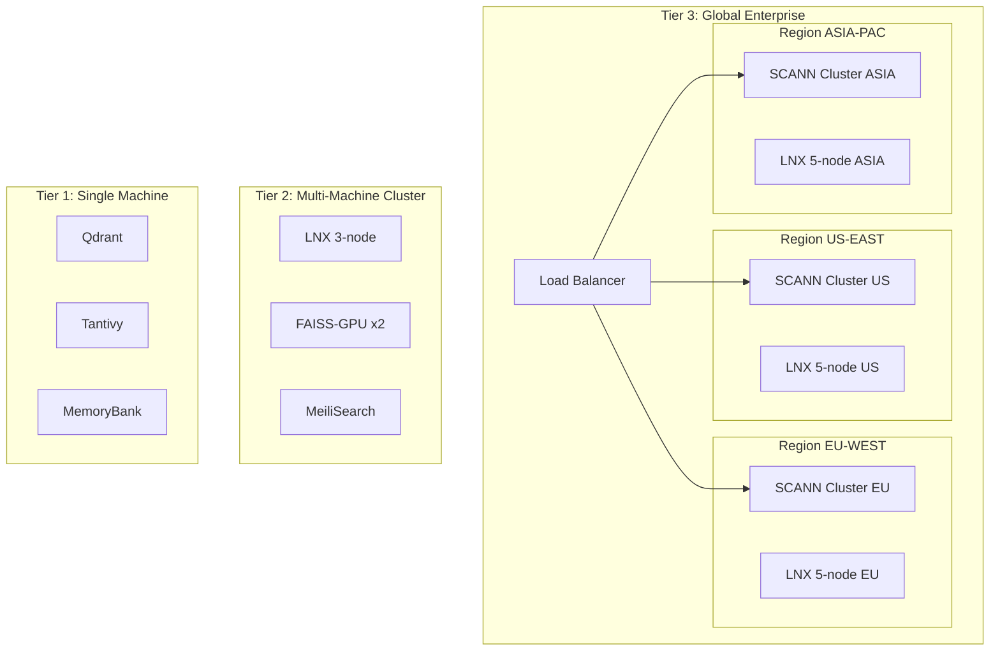
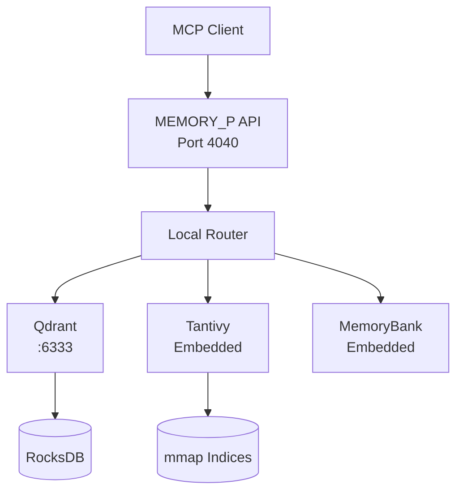
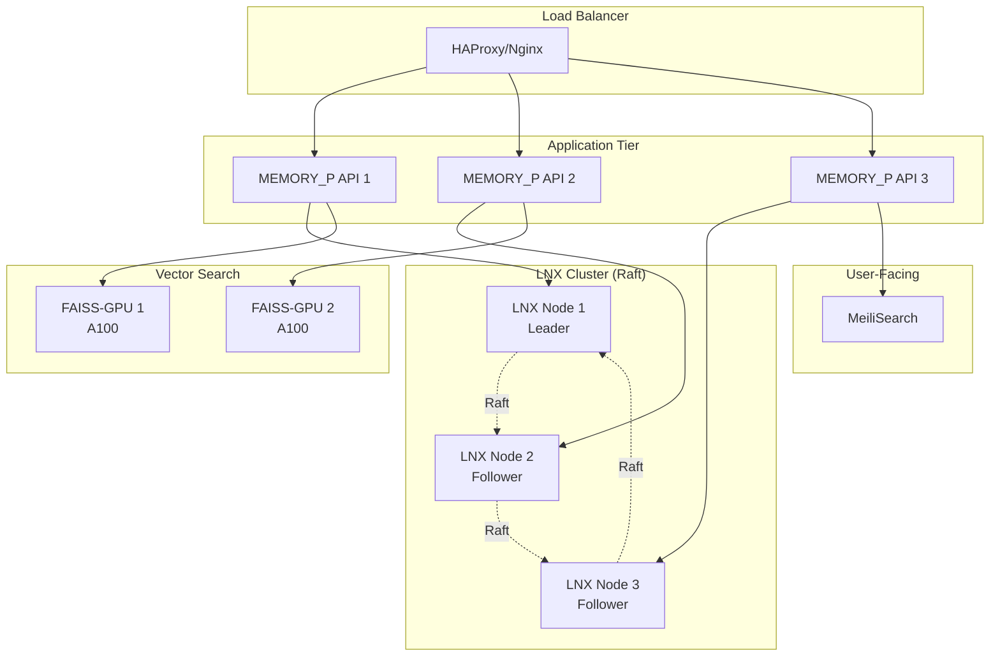
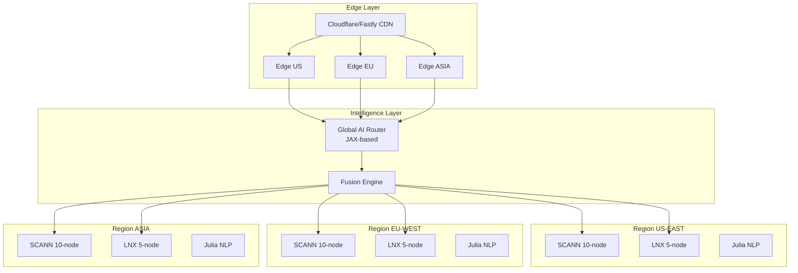
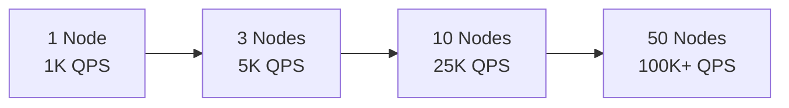
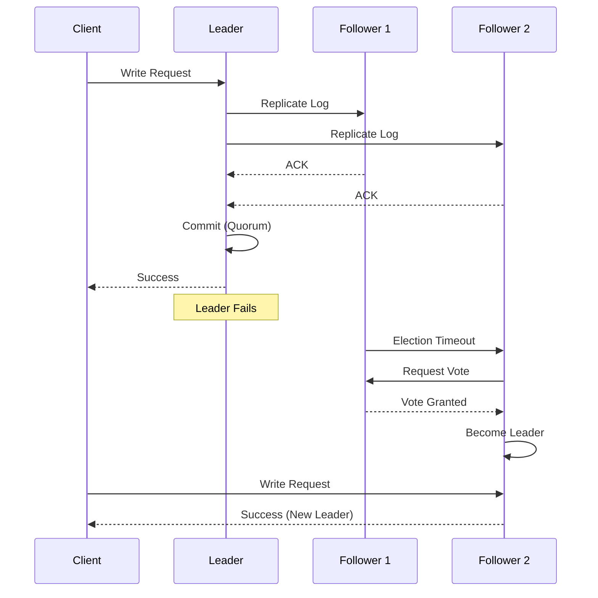

# 🌐 Arquitectura Distribuida con LNX + SCANN

> **MEMORY_P v2.0** - Estrategias de distribución y escalado horizontal

---

## 📋 Índice

- [Visión General](#visión-general)
- [Multi-Tier Distribution Strategy](#multi-tier-distribution-strategy)
- [Tier 1: Local (Single Machine)](#tier-1-local-single-machine)
- [Tier 2: Cluster (Multi-Machine)](#tier-2-cluster-multi-machine)
- [Tier 3: Hybrid Intelligence](#tier-3-hybrid-intelligence)
- [Scaling Patterns](#scaling-patterns)
- [Failover Strategies](#failover-strategies)
- [Network Architecture](#network-architecture)
- [Security & Authentication](#security--authentication)

---

## Visión General

MEMORY_P v2.0 soporta **3 tiers de distribución** que escalan desde una máquina hasta despliegues enterprise globales:



---

## Multi-Tier Distribution Strategy

### Architecture Decision Matrix

| Requirement | Tier 1 | Tier 2 | Tier 3 |
|-------------|--------|--------|--------|
| **Dataset Size** | <10M docs | 10M-1B docs | >1B docs |
| **QPS** | <1,000 | 1K-50K | >50K |
| **Machines** | 1 | 3-10 | 10+ |
| **Availability** | 95% | 99.9% | 99.99% |
| **Geo-Distribution** | No | Optional | Yes |
| **Cost/month** | $50-200 | $500-5K | $10K+ |

---

## Tier 1: Local (Single Machine)

### Optimal Configuration

**Hardware Requirements:**
- CPU: 8+ cores
- RAM: 32GB+
- Storage: 500GB SSD
- GPU: Optional (NVIDIA RTX 3060+)

**Selected Engines:**
```yaml
engines:
  vector: qdrant
  text: tantivy
  specialized: memorybank
  gpu_acceleration: faiss  # Optional with GPU
```

### Deployment Architecture



### Configuration File

```toml
# config/tier1-local.toml

[server]
host = "127.0.0.1"
port = 4040
workers = 8

[engines]
vector = "qdrant"
text = "tantivy"
specialized = "memorybank"

[qdrant]
url = "http://localhost:6333"
collection = "memory_p"
dimension = 768
distance = "Cosine"
on_disk = true  # For large datasets

[tantivy]
index_path = "./indices/tantivy"
heap_size_mb = 2048
num_threads = 4

[memorybank]
enabled = true
cache_size_mb = 1024
```

### Docker Compose (Tier 1)

```yaml
version: '3.8'

services:
  memory-p:
    build: .
    ports:
      - "4040:4040"
    volumes:
      - ./indices:/app/indices
      - ./config:/app/config
    environment:
      - RUST_LOG=info
      - MEMORY_P_CONFIG=/app/config/tier1-local.toml
    depends_on:
      - qdrant
      - postgres

  qdrant:
    image: qdrant/qdrant:v1.7.4
    ports:
      - "6333:6333"
    volumes:
      - qdrant_data:/qdrant/storage

  postgres:
    image: pgvector/pgvector:pg16
    environment:
      POSTGRES_PASSWORD: password
    volumes:
      - postgres_data:/var/lib/postgresql/data

volumes:
  qdrant_data:
  postgres_data:
```

### Performance Characteristics

- **Throughput:** 500-1,000 QPS
- **Latency:** <10ms (p99)
- **Capacity:** 10M documents
- **Uptime:** 95-99%

---

## Tier 2: Cluster (Multi-Machine)

### Optimal Configuration

**Hardware Requirements:**
- **3-5 Nodes:**
  - CPU: 16+ cores per node
  - RAM: 64GB+ per node
  - Storage: 1TB NVMe per node
  - GPU: NVIDIA A100 (1-2 nodes)

**Selected Engines:**
```yaml
engines:
  vector: faiss-gpu
  text: lnx  # 3-node cluster
  specialized: [julia, memorybank]
  user_facing: meilisearch
```

### Deployment Architecture



### LNX Cluster Configuration

```toml
# config/lnx-cluster.toml

[cluster]
node_id = "node1"  # Different per node
nodes = ["node1:9200", "node2:9200", "node3:9200"]
bind_address = "0.0.0.0:9200"

[raft]
election_timeout_ms = 300
heartbeat_interval_ms = 100
snapshot_interval = 1000
log_retention_count = 10000

[sharding]
strategy = "consistent_hash"
num_shards = 12
replication_factor = 3

[indices]
default_analyzer = "standard"
max_index_size_gb = 100

[performance]
search_threads = 8
indexing_threads = 4
cache_size_mb = 8192
```

### Docker Compose (Tier 2)

```yaml
version: '3.8'

services:
  # Load Balancer
  haproxy:
    image: haproxy:2.8
    ports:
      - "4040:4040"
      - "8080:8080"  # Stats
    volumes:
      - ./haproxy.cfg:/usr/local/etc/haproxy/haproxy.cfg
    depends_on:
      - memory-p-1
      - memory-p-2
      - memory-p-3

  # MEMORY_P Instances
  memory-p-1:
    build: .
    environment:
      - NODE_ID=1
      - LNX_NODES=lnx-1:9200,lnx-2:9200,lnx-3:9200
    depends_on:
      - lnx-1
      - lnx-2
      - lnx-3

  memory-p-2:
    build: .
    environment:
      - NODE_ID=2
      - LNX_NODES=lnx-1:9200,lnx-2:9200,lnx-3:9200

  memory-p-3:
    build: .
    environment:
      - NODE_ID=3
      - LNX_NODES=lnx-1:9200,lnx-2:9200,lnx-3:9200

  # LNX Distributed Cluster
  lnx-1:
    image: lnx/lnx:latest
    ports:
      - "9201:9200"
    environment:
      - NODE_ID=node1
      - CLUSTER_NODES=node1,node2,node3
      - BIND_ADDRESS=0.0.0.0:9200
    volumes:
      - lnx1_data:/data
    command: ["--config", "/etc/lnx/config.toml"]

  lnx-2:
    image: lnx/lnx:latest
    ports:
      - "9202:9200"
    environment:
      - NODE_ID=node2
      - CLUSTER_NODES=node1,node2,node3
    volumes:
      - lnx2_data:/data

  lnx-3:
    image: lnx/lnx:latest
    ports:
      - "9203:9200"
    environment:
      - NODE_ID=node3
      - CLUSTER_NODES=node1,node2,node3
    volumes:
      - lnx3_data:/data

  # FAISS-GPU Instances
  faiss-gpu-1:
    build:
      context: ./motores/vector_search/faiss
      dockerfile: Dockerfile.gpu
    runtime: nvidia
    environment:
      - CUDA_VISIBLE_DEVICES=0
    volumes:
      - faiss1_indices:/indices

  faiss-gpu-2:
    build:
      context: ./motores/vector_search/faiss
      dockerfile: Dockerfile.gpu
    runtime: nvidia
    environment:
      - CUDA_VISIBLE_DEVICES=0
    volumes:
      - faiss2_indices:/indices

  # MeiliSearch
  meilisearch:
    image: getmeili/meilisearch:v1.5
    ports:
      - "7700:7700"
    environment:
      - MEILI_MASTER_KEY=masterKey123
    volumes:
      - meili_data:/meili_data

volumes:
  lnx1_data:
  lnx2_data:
  lnx3_data:
  faiss1_indices:
  faiss2_indices:
  meili_data:
```

### Kubernetes Deployment (Tier 2)

```yaml
# k8s/tier2-deployment.yaml

apiVersion: apps/v1
kind: Deployment
metadata:
  name: memory-p-api
spec:
  replicas: 3
  selector:
    matchLabels:
      app: memory-p
  template:
    metadata:
      labels:
        app: memory-p
    spec:
      containers:
      - name: memory-p
        image: rigohl/memory-p:v2.0
        ports:
        - containerPort: 4040
        env:
        - name: LNX_ENDPOINTS
          value: "lnx-0.lnx-service:9200,lnx-1.lnx-service:9200,lnx-2.lnx-service:9200"
        resources:
          requests:
            memory: "4Gi"
            cpu: "2000m"
          limits:
            memory: "8Gi"
            cpu: "4000m"

---
# LNX StatefulSet for Cluster
apiVersion: apps/v1
kind: StatefulSet
metadata:
  name: lnx
spec:
  serviceName: lnx-service
  replicas: 3
  selector:
    matchLabels:
      app: lnx
  template:
    metadata:
      labels:
        app: lnx
    spec:
      containers:
      - name: lnx
        image: lnx/lnx:latest
        ports:
        - containerPort: 9200
        env:
        - name: NODE_ID
          valueFrom:
            fieldRef:
              fieldPath: metadata.name
        volumeMounts:
        - name: data
          mountPath: /data
  volumeClaimTemplates:
  - metadata:
      name: data
    spec:
      accessModes: ["ReadWriteOnce"]
      resources:
        requests:
          storage: 100Gi

---
# Service for LNX
apiVersion: v1
kind: Service
metadata:
  name: lnx-service
spec:
  clusterIP: None
  selector:
    app: lnx
  ports:
  - port: 9200
    name: api
```

### Performance Characteristics

- **Throughput:** 10K-50K QPS
- **Latency:** <20ms (p99)
- **Capacity:** 1B documents
- **Uptime:** 99.9%
- **Failover Time:** <5 seconds

---

## Tier 3: Hybrid Intelligence

### Global Enterprise Configuration

**Infrastructure:**
- **20+ Nodes** across 3+ regions
- **SCANN clusters** for trillion-scale vectors
- **Multi-region LNX** with geo-replication
- **Edge nodes** for low-latency

### Global Architecture



### Motor Routing AI (JAX-based)

```python
# motores/hybrid/routing_ai.py
import jax
import jax.numpy as jnp
from jax import jit, grad
import optax

class MotorRoutingAI:
    """AI-based intelligent routing between 8 engines"""

    def __init__(self, num_engines=8):
        self.num_engines = num_engines
        self.model = self._build_model()
        self.optimizer = optax.adam(learning_rate=0.001)

    def _build_model(self):
        """Neural network for engine selection"""
        def forward(params, features):
            # Input: query features
            x = features

            # Hidden layers
            x = jnp.dot(x, params['w1']) + params['b1']
            x = jax.nn.relu(x)

            x = jnp.dot(x, params['w2']) + params['b2']
            x = jax.nn.relu(x)

            # Output: engine scores
            logits = jnp.dot(x, params['w3']) + params['b3']
            return jax.nn.softmax(logits)

        return forward

    @jit
    def predict_engine(self, query_features):
        """Predict optimal engine(s) for query"""
        scores = self.model(self.params, query_features)

        # Select top-3 engines
        top_engines = jnp.argsort(scores)[-3:]

        return {
            'primary': int(top_engines[-1]),
            'fallbacks': [int(e) for e in top_engines[:-1]],
            'scores': scores,
            'confidence': float(scores[top_engines[-1]])
        }

    def extract_features(self, query):
        """Extract ML features from query"""
        return jnp.array([
            len(query),  # Length
            self.has_vector(query),  # Has embedding
            self.estimate_complexity(query),  # Complexity
            self.detect_language(query),  # Language ID
            self.is_distributed(query),  # Needs distribution
        ], dtype=jnp.float32)

    def load_balance(self, engine_loads):
        """Dynamic load balancing across engines"""
        # Prefer less-loaded engines
        adjusted_scores = self.base_scores / (1 + engine_loads)
        return jnp.argmax(adjusted_scores)
```

### Fusion Engine Implementation

```rust
// motores/hybrid/fusion_engine.rs
use std::sync::Arc;
use tokio::sync::RwLock;
use rayon::prelude::*;

pub struct FusionEngine {
    engines: Vec<Arc<dyn SearchEngine>>,
    ranker: HybridRanker,
    router: AIQueryRouter,
}

impl FusionEngine {
    pub async fn fusion_search(
        &self,
        query: &SearchQuery,
        strategy: FusionStrategy
    ) -> Result<Vec<SearchResult>> {
        match strategy {
            FusionStrategy::Parallel => self.parallel_fusion(query).await,
            FusionStrategy::Cascade => self.cascade_fusion(query).await,
            FusionStrategy::Adaptive => self.adaptive_fusion(query).await,
        }
    }

    async fn parallel_fusion(
        &self,
        query: &SearchQuery
    ) -> Result<Vec<SearchResult>> {
        // Select engines via AI router
        let routing = self.router.analyze_query(&query.text);

        // Parallel search across selected engines
        let futures: Vec<_> = routing.engines
            .iter()
            .map(|engine_id| {
                let engine = &self.engines[*engine_id];
                engine.search(query)
            })
            .collect();

        let results = futures::future::join_all(futures).await;

        // Hybrid ranking fusion
        // Combines scores from different engines
        let fused = self.ranker.reciprocal_rank_fusion(results)?;

        Ok(fused)
    }

    async fn cascade_fusion(
        &self,
        query: &SearchQuery
    ) -> Result<Vec<SearchResult>> {
        // Try engines in order until threshold
        for engine in &self.engines {
            let results = engine.search(query).await?;

            if results.len() >= query.min_results {
                return Ok(results);
            }
        }

        Ok(vec![])
    }

    async fn adaptive_fusion(
        &self,
        query: &SearchQuery
    ) -> Result<Vec<SearchResult>> {
        // Dynamically adjust based on performance
        let routing = self.router.predict_optimal(query);

        if routing.confidence > 0.9 {
            // High confidence: single engine
            self.engines[routing.primary].search(query).await
        } else {
            // Low confidence: multi-engine fusion
            self.parallel_fusion(query).await
        }
    }
}

pub struct HybridRanker {
    weights: Vec<f32>,
}

impl HybridRanker {
    pub fn reciprocal_rank_fusion(
        &self,
        results: Vec<Vec<SearchResult>>
    ) -> Result<Vec<SearchResult>> {
        // Reciprocal Rank Fusion (RRF)
        // score(d) = Σ 1 / (k + rank_i(d))
        const K: f32 = 60.0;

        let mut scores: HashMap<DocumentId, f32> = HashMap::new();

        for (engine_idx, engine_results) in results.iter().enumerate() {
            let weight = self.weights[engine_idx];

            for (rank, result) in engine_results.iter().enumerate() {
                let rrf_score = weight / (K + rank as f32 + 1.0);
                *scores.entry(result.doc_id).or_insert(0.0) += rrf_score;
            }
        }

        // Sort by fused score
        let mut fused: Vec<_> = scores
            .into_iter()
            .map(|(doc_id, score)| (doc_id, score))
            .collect();

        fused.sort_by(|a, b| b.1.partial_cmp(&a.1).unwrap());

        Ok(self.hydrate_results(fused))
    }
}
```

### Performance Characteristics

- **Throughput:** 100K+ QPS globally
- **Latency:** <50ms (p99) with edge
- **Capacity:** Trillion-scale
- **Uptime:** 99.99%
- **Global Failover:** <1 second

---

## Scaling Patterns

### Horizontal Scaling



### Vertical Scaling

| Component | Small | Medium | Large | XLarge |
|-----------|-------|--------|-------|--------|
| **CPU** | 4 cores | 16 cores | 32 cores | 64 cores |
| **RAM** | 16GB | 64GB | 128GB | 256GB |
| **GPU** | None | RTX 3060 | A100 40GB | A100 80GB x2 |
| **Storage** | 100GB | 500GB | 2TB | 10TB |
| **Cost/mo** | $100 | $500 | $2000 | $8000 |

---

## Failover Strategies

### LNX Raft Consensus



### Automatic Recovery

```rust
pub struct FailoverManager {
    health_checker: HealthChecker,
    recovery_strategy: RecoveryStrategy,
}

impl FailoverManager {
    pub async fn monitor_and_recover(&self) {
        loop {
            // Health check every 5s
            tokio::time::sleep(Duration::from_secs(5)).await;

            let health = self.health_checker.check_all_engines().await;

            for (engine_id, status) in health {
                if status.is_unhealthy() {
                    self.trigger_failover(engine_id).await;
                }
            }
        }
    }

    async fn trigger_failover(&self, failed_engine: EngineId) {
        // 1. Mark engine as unavailable
        self.mark_unavailable(failed_engine).await;

        // 2. Redirect traffic to healthy engines
        self.update_routing_table(failed_engine).await;

        // 3. Attempt automatic recovery
        match self.recovery_strategy {
            RecoveryStrategy::Restart => {
                self.restart_engine(failed_engine).await;
            }
            RecoveryStrategy::Failover => {
                self.promote_replica(failed_engine).await;
            }
        }
    }
}
```

---

## Network Architecture

### Inter-Engine Communication

```yaml
# Network topology
networks:
  frontend:
    driver: bridge
    ipam:
      config:
        - subnet: 172.20.0.0/16

  backend:
    driver: bridge
    internal: true
    ipam:
      config:
        - subnet: 172.21.0.0/16

  storage:
    driver: bridge
    internal: true
    ipam:
      config:
        - subnet: 172.22.0.0/16
```

### Service Mesh (Istio)

```yaml
# istio-config.yaml
apiVersion: networking.istio.io/v1beta1
kind: VirtualService
metadata:
  name: memory-p-routing
spec:
  hosts:
  - memory-p.example.com
  http:
  - match:
    - uri:
        prefix: /mcp/search
    route:
    - destination:
        host: memory-p-api
        subset: v2
      weight: 90
    - destination:
        host: memory-p-api
        subset: v1
      weight: 10
    retries:
      attempts: 3
      perTryTimeout: 2s
```

---

## Security & Authentication

### Inter-Node Authentication

```rust
use tokio_rustls::{TlsAcceptor, TlsConnector};

pub struct SecureCluster {
    tls_acceptor: TlsAcceptor,
    node_certificates: HashMap<NodeId, Certificate>,
}

impl SecureCluster {
    pub async fn authenticate_node(&self, node_id: &NodeId) -> Result<bool> {
        // Mutual TLS authentication
        let cert = self.node_certificates.get(node_id)
            .ok_or(Error::UnknownNode)?;

        // Verify certificate
        self.verify_certificate(cert).await
    }
}
```

### Encryption

- **In-Transit:** TLS 1.3 for all inter-node communication
- **At-Rest:** AES-256 for sensitive indices
- **Keys:** Vault/KMS integration for key management

---

**Última actualización:** Enero 2026
**Proyecto:** MEMORY_P v2.0 - Nuclear MCP Toolkit
**Autor:** Rigohl
