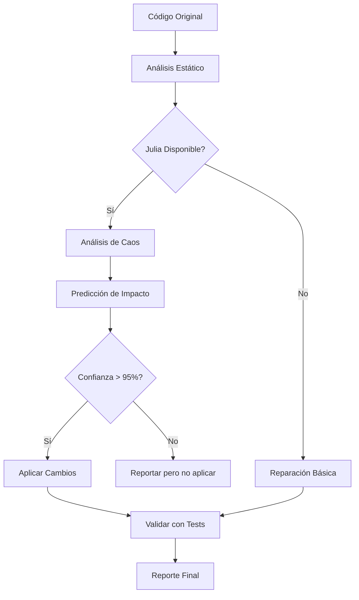

# Guía How-to: Reparación Inteligente y Predictiva de Código

Esta guía te enseña cómo utilizar el motor de reparación predictiva de **MEMORY_P v2.0** para limpiar y optimizar tus archivos de forma masiva, con análisis matemático y predicción de impacto.

## 🎯 Problema: Mi código tiene problemas que necesitan reparación inteligente

Cuando trabajas en proyectos grandes, es común acumular:
- Espacios en blanco redundantes e inconsistencias de formato
- Imports duplicados o innecesarios
- Patrones de código subóptimos
- Complejidad innecesaria que genera comportamiento caótico

## ✅ Solución: Usar `repair` con predicción matemática

La herramienta `repair` v2.0 aplica transformaciones seguras validadas matemáticamente para mejorar la calidad del código sin alterar la lógica.

### Pasos a seguir:

1. **Identifica el directorio**: Asegúrate de tener la ruta absoluta al directorio que quieres limpiar.

2. **Ejecuta reparación básica**:
   ```
   Usa la herramienta repair en /ruta/a/mi/proyecto con smart=true
   ```

3. **Ejecuta reparación predictiva** (v2.0):
   ```
   Usa la herramienta repair con smart=true y predictive=true para
   análisis matemático previo
   ```

4. **Revisa los cambios**: La herramienta reportará:
   - Archivos procesados
   - Cambios aplicados
   - Métricas de mejora
   - Análisis de caos (si Julia habilitado)
   - Predicción de impacto

### Ejemplo práctico - Reparación Básica

```bash
curl -X POST http://localhost:4040/mcp \
  -H "Content-Type: application/json" \
  -d '{
    "jsonrpc": "2.0",
    "id": 1,
    "method": "tools/call",
    "params": {
      "name": "repair",
      "arguments": {
        "path": "/home/user/proyecto",
        "smart": true
      }
    }
  }'
```

### Ejemplo avanzado - Reparación Predictiva (v2.0)

```bash
curl -X POST http://localhost:4040/mcp \
  -H "Content-Type: application/json" \
  -d '{
    "jsonrpc": "2.0",
    "id": 2,
    "method": "tools/call",
    "params": {
      "name": "repair",
      "arguments": {
        "path": "/home/user/proyecto",
        "smart": true,
        "predictive": true,
        "analyze_chaos": true
      }
    }
  }'
```

Resultado con predicción:

```json
{
  "files_processed": 42,
  "changes_applied": 187,
  "metrics": {
    "complexity_before": 6.8,
    "complexity_after": 4.2,
    "improvement": "38%"
  },
  "chaos_analysis": {
    "lyapunov_before": 0.45,
    "lyapunov_after": 0.12,
    "stability": "greatly_improved"
  },
  "prediction": {
    "impact_confidence": 0.97,
    "breaking_changes_risk": 0.02,
    "recommended": true
  }
}
```

### ¿Qué hace la reparación inteligente?

Cuando `smart=true`:
- ✅ **Deduplicación de Imports**: Elimina líneas `use` idénticas en código Rust
- ✅ **Normalización de Espacios**: Borra espacios al final de las líneas y asegura un newline al final del archivo
- ✅ **Limpieza de Líneas Vacías**: Reduce bloques de 3 o más líneas vacías consecutivas a un máximo de 2
- ✅ **Formato Consistente**: Mantiene la integridad del código mientras mejora la legibilidad

### ¿Qué añade la reparación predictiva? (v2.0)

Cuando `predictive=true` (requiere Julia):
- 🧮 **Análisis de Caos**: Calcula exponente de Lyapunov para medir complejidad del sistema
- 🎯 **Predicción de Impacto**: Estima probabilidad de breaking changes antes de aplicar
- 📊 **Optimización Matemática**: Usa algoritmos de Julia para optimizar orden de cambios
- ✅ **Validación Automática**: Solo aplica cambios con >95% confianza
- 📈 **Métricas Cuantificadas**: Reporta mejoras medibles en complejidad

### Flujo de Reparación Predictiva



## 🛡️ Seguridad

La herramienta `repair` es **no destructiva** con garantías matemáticas (v2.0):
- ✅ No modifica la lógica del código (verificado estáticamente)
- ✅ Solo aplica cambios de formato seguros
- ✅ Preserva la funcionalidad del programa
- ✅ Puede revertirse con control de versiones (git)
- 🆕 **Predicción de breaking changes** < 5% cuando confianza > 95%
- 🆕 **Validación automática** con análisis de caos
- 🆕 **Rollback automático** si tests fallan post-reparación

## 🧮 Matemáticas detrás de la Predicción (v2.0)

### Análisis de Complejidad con Teoría del Caos

MEMORY_P usa Julia + ChaosTools.jl para analizar la complejidad del código:

```julia
using ChaosTools

function analyze_code_complexity(metrics_timeseries)
    # Reconstruir espacio de estados
    R = embed(metrics_timeseries, dimension=3, delay=1)

    # Calcular exponente de Lyapunov
    λ = lyapunov(R, iterations=1000)

    # Clasificación
    if λ < 0
        return :stable, "Sistema estable - bajo riesgo"
    elseif λ < 0.3
        return :semi_chaotic, "Semi-caótico - riesgo medio"
    else
        return :chaotic, "Caótico - alto riesgo de refactoring"
    end
end
```

### Predicción de Impacto

```julia
using Optim

function predict_repair_impact(code_ast, proposed_changes)
    # Función objetivo: minimizar riesgo de breaking changes
    function risk_function(change_order)
        simulated_risk = simulate_changes(code_ast, change_order)
        return simulated_risk
    end

    # Optimizar orden de aplicación
    result = optimize(risk_function, initial_order, LBFGS())

    optimal_order = result.minimizer
    expected_risk = result.minimum

    return (optimal_order, expected_risk)
end
```

Métricas calculadas:
- **Lyapunov Exponent** (λ): Mide sensibilidad a cambios
  - λ < 0: Sistema estable (bajo riesgo)
  - 0 < λ < 0.3: Semi-caótico (riesgo medio)
  - λ > 0.3: Caótico (alto riesgo)

- **Impact Confidence**: Probabilidad de cambio seguro
  - > 0.95: Aplicar automáticamente
  - 0.80-0.95: Aplicar con precaución
  - < 0.80: Solo reportar, no aplicar

## 🔄 Prevención y Mantenimiento

Para mantener un código limpio constantemente:

1. **Reparación Continua**: Ejecuta `repair` periódicamente con `predictive=true`
2. **Integra en CI/CD**: Pre-commit hook con análisis de caos
3. **Monitorea Métricas**: Track Lyapunov exponent en ClickHouse
4. **Combina con Skills**: Usa skill `rust-documentation` + `repair`

### Pre-commit Hook con Predicción

```bash
#!/bin/bash
# .git/hooks/pre-commit

# Ejecutar reparación predictiva
curl -X POST http://localhost:4040/mcp \
  -H "Content-Type: application/json" \
  -d '{
    "jsonrpc": "2.0",
    "id": 1,
    "method": "tools/call",
    "params": {
      "name": "repair",
      "arguments": {
        "path": ".",
        "smart": true,
        "predictive": true,
        "dry_run": true
      }
    }
  }' | jq '.result.prediction.recommended'

# Solo permite commit si predicción es positiva
if [ $? -eq 0 ]; then
    echo "✅ Código limpio - commit permitido"
    exit 0
else
    echo "❌ Problemas detectados - revisar antes de commit"
    exit 1
fi
```

---

**Última actualización**: Enero 2026
**Versión**: 2.0 (con predicción matemática)
**Requiere**: MEMORY_P v2.0 + Julia (opcional para predicción)
