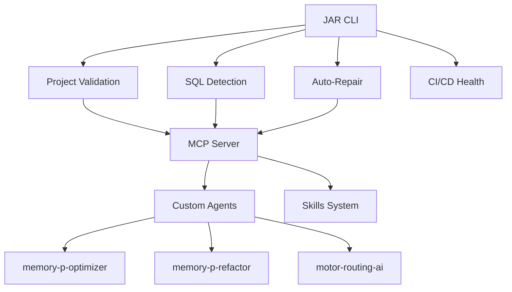
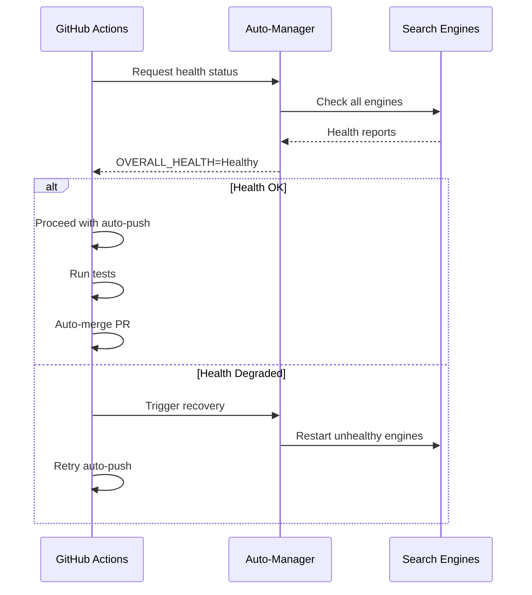
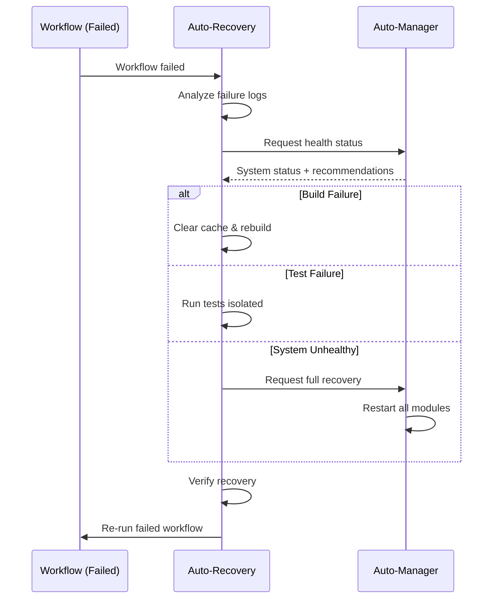
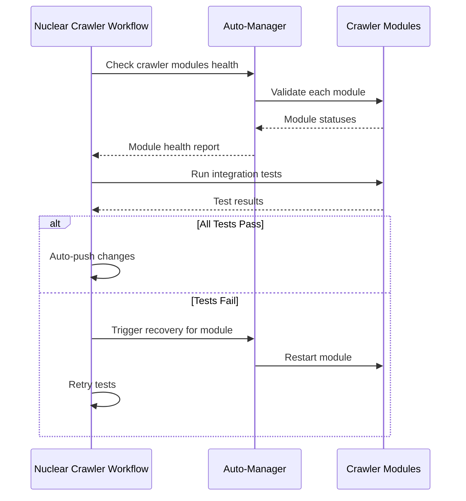

# JAR CLI Integration Guide

## Overview

This guide explains how the JAR CLI integrates with the MEMORY_P ecosystem and CI/CD workflows.

## Architecture Integration

### With MEMORY_P Core



### File Structure

```
MEMORY_P/
├── src/
│   ├── cli/                    # ← JAR CLI modules
│   │   ├── mod.rs
│   │   ├── commands.rs
│   │   ├── validators.rs
│   │   ├── sql_detector.rs
│   │   └── auto_repair.rs
│   ├── bin/
│   │   └── jar.rs             # ← JAR binary
│   └── ...                    # Other MEMORY_P modules
├── .github/
│   ├── workflows/             # ← CI/CD automation
│   │   ├── ci.yml
│   │   ├── auto-repair.yml
│   │   └── sql-check.yml
│   └── agents/
│       └── jar-cli-specialist.agent.md  # ← JAR specialist
└── docs/
    └── JAR_CLI.md            # ← User documentation
```

## Workflow Integration

### 1. Development Workflow

```bash
# Developer makes changes
git checkout -b feature/my-feature

# Run JAR validation before commit
jar validate --scan-todos --check-dead-code

# If issues found, auto-repair
jar repair --format --fix-deps

# Check SQL if modified database code
jar detect-sql --path . --validate-syntax --detect-issues

# Commit and push
git add .
git commit -m "feat: add new feature"
git push origin feature/my-feature
```

### 2. CI Pipeline (Automatic)

When you push or open a PR:

1. **CI Workflow** (`.github/workflows/ci.yml`) runs:
   ```yaml
   - JAR Validate (structure, TODOs, MCP)
   - JAR SQL Check (syntax, issues)
   - Build & Test
   - Security Audit
   ```

2. **Auto-Repair Workflow** (`.github/workflows/auto-repair.yml`) runs on PR:
   ```yaml
   - JAR Repair (format + deps)
   - Auto-commit fixes if any
   - Comment on PR with results
   ```

3. **SQL Check Workflow** (`.github/workflows/sql-check.yml`) runs on SQL changes:
   ```yaml
   - JAR SQL Detection
   - Upload analysis report
   ```

## Integration with Custom Agents

### memory-p-optimizer

```bash
# Before optimization
jar validate --check-dead-code > /tmp/pre-optimize.txt

# Run optimizer
@memory-p-optimizer optimize parallel_engine.rs

# After optimization - verify no regressions
jar validate --check-dead-code > /tmp/post-optimize.txt
diff /tmp/pre-optimize.txt /tmp/post-optimize.txt
```

### memory-p-refactor

```bash
# Refactor with validation
@memory-p-refactor refactor src/mcp_api.rs

# Validate refactored code
jar validate --validate-mcp
jar detect-sql --path src/mcp_api.rs --validate-syntax
```

### motor-routing-ai

```bash
# Check for SQL queries in routing logic
jar detect-sql --path src/motores/ --detect-issues

# Optimize routing based on findings
@motor-routing-ai optimize-routes
```

## Integration with Skills

### rust-parallel-testing

```bash
# Generate tests with skill
skill rust-parallel-testing generate src/cli/

# Validate generated tests
jar validate --path tests/
```

### performance-benchmark

```bash
# Create benchmarks
skill performance-benchmark create jar_cli

# Validate benchmark code
jar validate --path benches/
```

## Environment Variables

JAR respects these environment variables:

```bash
# Enable verbose output
export JAR_VERBOSE=1

# Custom TODO patterns
export JAR_TODO_PATTERNS="TODO,FIXME,HACK,XXX,NOTE,BUG"

# Skip patterns
export JAR_SKIP_PATTERNS="target,node_modules,.git"

# SQL dialect
export JAR_SQL_DIALECT="PostgreSQL"
```

## Docker Integration

### Dockerfile

```dockerfile
FROM rust:1.75 as builder

WORKDIR /app
COPY . .

# Build JAR CLI
RUN cargo build --release --bin jar

FROM debian:bookworm-slim
COPY --from=builder /app/target/release/jar /usr/local/bin/jar

# Health check using JAR
HEALTHCHECK --interval=30s --timeout=3s \
  CMD jar validate --path /app || exit 1

ENTRYPOINT ["jar"]
```

### Docker Compose

```yaml
version: '3.8'

services:
  jar-validator:
    build: .
    command: validate --scan-todos
    volumes:
      - .:/app
    environment:
      - JAR_VERBOSE=1
```

## Kubernetes Integration

### CronJob for periodic validation

```yaml
apiVersion: batch/v1
kind: CronJob
metadata:
  name: jar-validator
spec:
  schedule: "0 */6 * * *"  # Every 6 hours
  jobTemplate:
    spec:
      template:
        spec:
          containers:
          - name: jar
            image: memory-p/jar:latest
            command:
            - jar
            - validate
            - --scan-todos
            - --check-dead-code
            volumeMounts:
            - name: source
              mountPath: /app
          volumes:
          - name: source
            hostPath:
              path: /path/to/memory-p
          restartPolicy: OnFailure
```

## Pre-commit Hook

Create `.git/hooks/pre-commit`:

```bash
#!/bin/bash

echo "🔍 Running JAR validation..."

# Build JAR if not exists
if [ ! -f "./target/release/jar" ]; then
    echo "Building JAR CLI..."
    cargo build --release --bin jar
fi

# Run validation
./target/release/jar validate --scan-todos

if [ $? -ne 0 ]; then
    echo "❌ Validation failed. Run 'jar repair' to fix issues."
    exit 1
fi

echo "✅ Validation passed!"
exit 0
```

Make it executable:

```bash
chmod +x .git/hooks/pre-commit
```

## VS Code Integration

### tasks.json

```json
{
  "version": "2.0.0",
  "tasks": [
    {
      "label": "JAR: Validate",
      "type": "shell",
      "command": "cargo run --bin jar -- validate --scan-todos",
      "group": "test",
      "presentation": {
        "reveal": "always",
        "panel": "new"
      }
    },
    {
      "label": "JAR: Auto-Repair",
      "type": "shell",
      "command": "cargo run --bin jar -- repair --format --fix-deps",
      "group": "build",
      "presentation": {
        "reveal": "always",
        "panel": "new"
      }
    },
    {
      "label": "JAR: SQL Check",
      "type": "shell",
      "command": "cargo run --bin jar -- detect-sql --path . --validate-syntax",
      "group": "test"
    }
  ]
}
```

### settings.json

```json
{
  "rust-analyzer.checkOnSave.command": "clippy",
  "emeraldwalk.runonsave": {
    "commands": [
      {
        "match": "\\.rs$",
        "cmd": "cargo run --bin jar -- validate --path ${file}"
      }
    ]
  }
}
```

## Continuous Deployment

### On successful CI

```yaml
# .github/workflows/cd.yml
name: Continuous Deployment

on:
  push:
    branches: [main]
    tags: ['v*']

jobs:
  deploy:
    runs-on: ubuntu-latest
    needs: [validate, build]  # After CI passes

    steps:
      - uses: actions/checkout@v4

      - name: Build release
        run: cargo build --release --bin jar

      - name: Package
        run: |
          tar -czf jar-${{ github.ref_name }}.tar.gz \
            -C target/release jar

      - name: Upload to release
        uses: softprops/action-gh-release@v1
        if: startsWith(github.ref, 'refs/tags/')
        with:
          files: jar-*.tar.gz
```

## Monitoring & Alerting

### Prometheus metrics (future)

```rust
// src/cli/metrics.rs
use prometheus::{Counter, Histogram, Registry};

lazy_static! {
    static ref VALIDATION_COUNTER: Counter =
        Counter::new("jar_validations_total", "Total validations").unwrap();

    static ref REPAIR_DURATION: Histogram =
        Histogram::new("jar_repair_duration_seconds", "Repair duration").unwrap();
}
```

### Slack notifications

```bash
# In CI workflow
- name: Notify on failure
  if: failure()
  run: |
    curl -X POST ${{ secrets.SLACK_WEBHOOK }} \
      -H 'Content-Type: application/json' \
      -d '{"text":"🚨 JAR validation failed in ${{ github.repository }}"}'
```

## Database Schema Management

### PostgreSQL Integration

```bash
# Detect SQL migrations
jar detect-sql --path migrations/ --validate-syntax

# Before applying migration
psql -h localhost -U user -d db < migration.sql

# After migration, verify
jar validate --validate-mcp
```

### SQLx Integration

```bash
# Create migration
sqlx migrate add create_users_table

# Edit migration SQL
# migrations/YYYYMMDDHHMMSS_create_users_table.sql

# Validate before applying
jar detect-sql --path migrations/ --validate-syntax --detect-issues

# Apply if valid
sqlx migrate run
```

## Testing Integration

### Run before tests

```rust
// tests/integration_test.rs
#[test]
fn test_with_validation() {
    // Run JAR validation first
    let output = std::process::Command::new("cargo")
        .args(["run", "--bin", "jar", "--", "validate"])
        .output()
        .expect("Failed to run JAR");

    assert!(output.status.success(), "Validation failed");

    // Continue with actual test
    // ...
}
```

## Troubleshooting

### Common Issues

1. **JAR not found**
   ```bash
   cargo build --release --bin jar
   export PATH="$PATH:$(pwd)/target/release"
   ```

2. **Permission denied**
   ```bash
   chmod +x target/release/jar
   ```

3. **Workflow fails on CI**
   - Check GitHub Actions logs
   - Run locally: `jar ci-check`
   - Verify workflow syntax: `yamllint .github/workflows/`

4. **SQL detection false positives**
   - Adjust patterns in `src/cli/sql_detector.rs`
   - Use `--path` to scan specific directories

## Best Practices

1. ✅ Run `jar validate` before every commit
2. ✅ Use `--dry-run` for repair commands first
3. ✅ Check `jar ci-check` for workflow health
4. ✅ Review auto-repair changes before merging PRs
5. ✅ Keep JAR CLI updated with main branch

## Future Enhancements

- [ ] Real-time file watcher mode
- [ ] Web dashboard for reports
- [ ] Integration with external tools (SonarQube, etc.)
- [ ] Custom rule engine with TOML config
- [ ] Machine learning for issue prediction

---

**Last Updated**: 2026-02-03
**Version**: 0.1.0
**Maintained By**: JAR CLI Team
# Workflow Integration Guide - MEMORY_P

## 📖 Overview

Esta guía describe cómo los workflows de GitHub Actions están integrados con el sistema `auto_manager.rs` de MEMORY_P para proporcionar auto-gestión completa y capacidades always-on.

## 🔗 Integración Sistema-Workflows

### Arquitectura de Integración

```
┌─────────────────────────────────────────────────────────────┐
│                    GitHub Actions Layer                      │
├─────────────────────────────────────────────────────────────┤
│  Auto-Push │ Auto-Recovery │ Nuclear │ Dynamic │ Recurring  │
│  Pipeline  │ & Self-Heal   │ Crawler │  Tests  │   Scan    │
└──────┬──────────────┬──────────┬──────────┬──────────┬──────┘
       │              │          │          │          │
       └──────────────┴──────────┴──────────┴──────────┘
                              │
              ┌───────────────┴────────────────┐
              │   Auto-Manager (auto_manager.rs) │
              │   - Health Monitoring            │
              │   - Auto-Recovery Logic          │
              │   - Metrics Export               │
              │   - CI/CD Integration            │
              └──────────────┬──────────────────┘
                            │
        ┌───────────────────┼────────────────────┐
        │                   │                    │
   ┌────▼────┐      ┌──────▼──────┐      ┌─────▼─────┐
   │ Engines │      │ FFI Modules │      │   MCP     │
   │ (9)     │      │ (Julia/JAX/ │      │  Server   │
   │         │      │  Mojo/etc)  │      │           │
   └─────────┘      └─────────────┘      └───────────┘
```

## 🔧 Auto-Manager API para Workflows

### 1. Health Status Export

El `auto_manager.rs` exporta métricas para GitHub Actions:

```rust
// En auto_manager.rs
pub fn export_github_metrics(&self) -> String {
    // Formato compatible con GitHub Actions
    "OVERALL_HEALTH=Healthy\n
     UNHEALTHY_ENGINES=0\n
     UNHEALTHY_FFI=0\n
     AUTO_MANAGED=true\n"
}
```

**Uso en Workflow**:
```yaml
- name: Check Auto-Manager Health
  run: |
    # Obtener métricas del auto-manager
    cargo run --release -- --export-metrics > metrics.txt

    # Cargar en environment
    cat metrics.txt >> $GITHUB_ENV

    # Verificar salud
    if [ "$OVERALL_HEALTH" != "Healthy" ]; then
      echo "::warning::System health is $OVERALL_HEALTH"
    fi
```

### 2. Auto-Push Readiness Check

```rust
pub fn is_ready_for_auto_push(&self) -> bool {
    let overall = self.get_overall_health();
    matches!(overall, HealthStatus::Healthy | HealthStatus::Degraded)
}
```

**Integración en auto-push.yml**:
```yaml
- name: Verify System Ready for Push
  run: |
    # Verificar que el sistema esté listo
    if cargo run -- --check-autopush-ready; then
      echo "✅ System ready for auto-push"
      echo "READY_FOR_PUSH=true" >> $GITHUB_ENV
    else
      echo "❌ System not ready - aborting auto-push"
      exit 1
    fi
```

### 3. Recovery Report Generation

```rust
pub fn generate_recovery_report(&self) -> String {
    // Genera markdown para GitHub Issues/PRs
    format!("## Auto-Manager Health Report\n...")
}
```

**Uso en auto-recovery.yml**:
```yaml
- name: Generate Recovery Report
  run: |
    # Generar reporte del auto-manager
    cargo run -- --recovery-report > report.md

    # Publicar como comentario en PR
    gh pr comment ${{ github.event.pull_request.number }} \
      --body-file report.md
```

## 📊 Métricas Compartidas

### Métricas del Auto-Manager

| Métrica | Descripción | Valor | Workflow que la usa |
|---------|-------------|-------|---------------------|
| `OVERALL_HEALTH` | Estado general del sistema | Healthy/Degraded/Unhealthy | Todos |
| `UNHEALTHY_ENGINES` | Motores no saludables | 0-9 | auto-push, auto-recovery |
| `UNHEALTHY_FFI` | Módulos FFI con problemas | 0-5 | nuclear-crawler |
| `AUTO_MANAGED` | Sistema auto-gestionado | true/false | Todos |
| `READY_FOR_PUSH` | Listo para auto-push | true/false | auto-push |

### Métricas de Workflows

Los workflows exportan métricas que el auto-manager puede consumir:

```yaml
# En cualquier workflow
- name: Export Workflow Metrics
  run: |
    echo "WORKFLOW_STATUS=${{ job.status }}" >> workflow_metrics.txt
    echo "BUILD_DURATION=${{ job.duration }}" >> workflow_metrics.txt
    echo "TEST_PASSED=${{ steps.test.outcome == 'success' }}" >> workflow_metrics.txt
```

El auto-manager puede leer estas métricas para ajustar comportamiento:

```rust
pub fn adjust_from_ci_metrics(&mut self, metrics_file: &Path) -> Result<()> {
    // Leer métricas de CI
    let metrics = fs::read_to_string(metrics_file)?;

    // Ajustar configuración basado en métricas
    if metrics.contains("TEST_PASSED=false") {
        self.config.max_errors += 1; // Ser más permisivo
    }

    Ok(())
}
```

## 🔄 Flujos de Integración

### Flujo 1: Auto-Push con Validación de Salud



### Flujo 2: Auto-Recovery Triggered por Fallo



### Flujo 3: Nuclear Crawler Validation



## 🎯 Casos de Uso Específicos

### Caso 1: Build Falla Repetidamente

**Problema**: El workflow de auto-push falla 3 veces seguidas en el build.

**Solución Automatizada**:

1. **Auto-Recovery detecta patrón**:
```yaml
# En auto-recovery.yml
- name: Detect Repeated Build Failures
  run: |
    FAIL_COUNT=$(gh run list --workflow=auto-push.yml --limit=10 --json conclusion | jq '[.[] | select(.conclusion=="failure")] | length')

    if [ $FAIL_COUNT -ge 3 ]; then
      echo "REPEATED_FAILURE=true" >> $GITHUB_ENV
      echo "FAILURE_TYPE=build" >> $GITHUB_ENV
    fi
```

2. **Auto-Manager ajusta configuración**:
```rust
if repeated_build_failures {
    // Incrementar timeout
    self.config.recovery_timeout = Duration::from_secs(60);

    // Reducir paralelismo
    env::set_var("CARGO_BUILD_JOBS", "1");

    // Limpiar cache
    self.clear_build_cache()?;
}
```

3. **Workflow re-intenta con nueva configuración**:
```yaml
- name: Rebuild with Adjusted Settings
  run: |
    cargo clean
    cargo build --release --jobs 1 --verbose
```

### Caso 2: FFI Module Fails

**Problema**: Módulo FFI de Julia no se inicializa correctamente.

**Solución Automatizada**:

1. **Auto-Manager detecta fallo**:
```rust
async fn auto_init_ffi(&self) -> Result<()> {
    for module in ffi_modules {
        match self.init_ffi_module(module).await {
            Err(e) => {
                // Marcar como unhealthy
                self.ffi_health.insert(
                    module.to_string(),
                    HealthInfo {
                        status: HealthStatus::Unhealthy,
                        last_error: Some(e.to_string()),
                        ..Default::default()
                    }
                );

                // Notificar a workflows
                self.notify_workflow_failure(module, &e)?;
            }
            _ => {}
        }
    }
    Ok(())
}
```

2. **Workflow nuclear-crawler intenta recovery**:
```yaml
- name: Recover FFI Module
  if: env.FFI_UNHEALTHY == 'true'
  run: |
    # Reinstalar dependencias Julia
    julia --project -e 'using Pkg; Pkg.instantiate()'

    # Recompilar FFI bridge
    cd FFI && make clean && make

    # Verificar recovery
    cargo test --test ffi_tests
```

### Caso 3: Tests Intermitentes

**Problema**: Tests pasan localmente pero fallan en CI aleatoriamente.

**Solución Automatizada**:

1. **Dynamic Tests detecta intermitencia**:
```yaml
- name: Detect Flaky Tests
  run: |
    # Ejecutar tests 3 veces
    for i in {1..3}; do
      cargo test > test_run_$i.txt 2>&1 || true
    done

    # Analizar resultados
    FLAKY=$(diff test_run_1.txt test_run_2.txt | wc -l)

    if [ $FLAKY -gt 0 ]; then
      echo "FLAKY_TESTS=true" >> $GITHUB_ENV
    fi
```

2. **Auto-Manager ajusta estrategia**:
```rust
if flaky_tests_detected {
    // Ejecutar tests en modo aislado
    self.config.test_isolation = true;

    // Aumentar timeout
    self.config.test_timeout = Duration::from_secs(300);

    // Deshabilitar paralelización de tests
    env::set_var("RUST_TEST_THREADS", "1");
}
```

3. **Workflow re-ejecuta con ajustes**:
```yaml
- name: Rerun Tests Isolated
  if: env.FLAKY_TESTS == 'true'
  run: |
    cargo test -- --test-threads=1 --nocapture
```

## 🔐 Seguridad en Integración

### Validación de Permisos

El auto-manager valida que los workflows tengan permisos apropiados:

```rust
pub fn validate_workflow_permissions(&self, workflow: &str) -> Result<()> {
    let required_perms = match workflow {
        "auto-push" => vec!["contents:write", "pull-requests:write"],
        "auto-recovery" => vec!["actions:write", "issues:write"],
        "nuclear-crawler" => vec!["contents:read", "checks:write"],
        _ => vec!["contents:read"],
    };

    // Verificar permisos
    for perm in required_perms {
        if !self.has_permission(perm) {
            return Err(MemoryPError::PermissionDenied(perm.into()));
        }
    }

    Ok(())
}
```

### Secrets Management

Los workflows nunca exponen secrets al auto-manager:

```yaml
# ✅ CORRECTO: Secret usado solo en workflow
- name: Safe Secret Usage
  env:
    API_KEY: ${{ secrets.API_KEY }}
  run: |
    # Usar secret aquí directamente
    curl -H "Authorization: Bearer $API_KEY" ...

# ❌ INCORRECTO: Secret pasado a binario
- name: Unsafe Secret Usage
  run: |
    # NO HACER ESTO
    cargo run -- --api-key="${{ secrets.API_KEY }}"
```

## 📈 Monitoreo y Telemetría

### Métricas Exportadas

El sistema exporta métricas en formato compatible con GitHub Actions:

```rust
pub fn export_telemetry(&self) -> Telemetry {
    Telemetry {
        timestamp: Instant::now(),
        overall_health: self.get_overall_health(),
        engines: self.engine_health.len(),
        ffi_modules: self.ffi_health.len(),
        uptime: self.get_uptime(),
        recovery_count: self.get_recovery_count(),
        auto_push_ready: self.is_ready_for_auto_push(),
    }
}
```

### Visualización en Actions

```yaml
- name: Display System Telemetry
  run: |
    cat << EOF
    📊 MEMORY_P System Telemetry
    ============================
    Health: $OVERALL_HEALTH
    Engines: $UNHEALTHY_ENGINES/$TOTAL_ENGINES unhealthy
    FFI: $UNHEALTHY_FFI/$TOTAL_FFI unhealthy
    Uptime: $SYSTEM_UPTIME seconds
    Recovery Count: $RECOVERY_COUNT
    Auto-Push Ready: $READY_FOR_PUSH
    ============================
    EOF
```

## 🚀 Mejores Prácticas

### 1. Coordinación Workflow-Manager

✅ **DO**: Dejar que el auto-manager tome decisiones de recuperación
```rust
// Auto-manager decide estrategia
let strategy = self.determine_recovery_strategy(&failure);
self.apply_recovery(strategy).await?;
```

❌ **DON'T**: Hardcodear estrategias en workflows
```yaml
# Evitar lógica de recovery compleja en YAML
- name: Hard-coded Recovery
  run: |
    if [ "$ERROR" == "build" ]; then
      cargo clean && cargo build
    elif [ "$ERROR" == "test" ]; then
      cargo test --jobs 1
    fi
```

### 2. Estado Compartido

✅ **DO**: Usar archivos de estado o artifacts
```yaml
- name: Save Manager State
  run: |
    cargo run -- --export-state > manager_state.json

- name: Upload State
  uses: actions/upload-artifact@v4
  with:
    name: manager-state
    path: manager_state.json
```

❌ **DON'T**: Mantener estado solo en environment variables
```yaml
# Estado se pierde entre jobs
- name: Set State
  run: echo "STATE=active" >> $GITHUB_ENV
```

### 3. Timeouts y Reintentos

✅ **DO**: Configurar timeouts razonables
```yaml
- name: Health Check
  timeout-minutes: 5
  run: cargo run -- --health-check
```

✅ **DO**: Usar reintentos con backoff
```yaml
- name: Retry with Backoff
  uses: nick-invision/retry@v2
  with:
    timeout_minutes: 10
    max_attempts: 3
    retry_wait_seconds: 30
    command: cargo test
```

## 📚 Referencias

- [Auto-Manager Source](../src/auto_manager.rs)
- [Workflow Documentation](.github/workflows/README.md)
- [GitHub Actions API](https://docs.github.com/en/rest/actions)
- [MEMORY_P Architecture](../BLUEPRINT.md)

---

**Última actualización**: Febrero 2026
**Mantenedor**: MEMORY_P Team

# Nuclear Crawler Hybrid System

Sistema avanzado de crawling con auto-gestión, validación continua y monitoreo constante integrado en MEMORY_P v2.0.

## 🚀 Características Principales

### 1. **Auto-Gestión (FORCED_REBUILDS)**
- ✅ Ajuste automático de módulos sin intervención manual
- ✅ Sistema de prioridades para reconstrucciones
- ✅ Monitoreo continuo de estado de componentes
- ✅ Auto-activación/desactivación basada en métricas

### 2. **Auto-Push y Validación**
- ✅ Workflows de GitHub Actions para validación automática
- ✅ Auto-merge seguro en ramas autorizadas
- ✅ Verificación de unidades críticas antes de merge
- ✅ Detección de cambios sensibles a seguridad

### 3. **Extensión Funcional**

#### DeepWeb Tor
- Navegación segura a través de Tor (SOCKS5)
- Rotación automática de circuitos
- Acceso en tiempo real a contenido deep web
- Timeout y manejo de errores robusto

#### Intelligent Storage
- Almacenamiento con expansión dinámica
- Sistema de prioridades (Low, Medium, High, Critical)
- Auto-limpieza de items de baja prioridad
- Monitoreo de uso en tiempo real

#### Predictive Nodes
- Auto-corrección de búsquedas fallidas
- Aprendizaje continuo de predicciones exitosas
- Múltiples estrategias de corrección
- Tasa de éxito medible

#### Deep Storage Tunnels
- Procesamiento paralelo con Rayon
- Buffers dinámicos adaptativos
- Túneles multi-profundidad
- Optimización automática

### 4. **Monitoreo y Diagnóstico**

#### Prometheus + Grafana
- Métricas en tiempo real exportadas
- Dashboards para visualización
- Alertas configurables
- Histórico de métricas

#### Métricas Exportadas
- `nuclear_crawler_state`: Estado actual del crawler
- `nuclear_crawler_tor_connected`: Estado de conexión Tor
- `nuclear_crawler_storage_size_mb`: Tamaño de almacenamiento
- `nuclear_crawler_predictions_total`: Total de predicciones

## 📦 Arquitectura

```
nuclear_crawler/
├── mod.rs                     # Coordinador principal
├── auto_rebuild.rs            # Sistema FORCED_REBUILDS
├── deepweb_tor.rs            # Cliente Tor para DeepWeb
├── intelligent_storage.rs     # Almacenamiento inteligente
├── predictive_nodes.rs        # Nodos predictivos
├── deep_storage_tunnels.rs    # Túneles de almacenamiento
└── metrics_exporter.rs        # Exportador Prometheus
```

## 🔧 Configuración

### Básica

```rust
use memory_p::nuclear_crawler::{NuclearCrawler, CrawlerConfig};

let config = CrawlerConfig {
    enable_tor: true,                    // Habilitar Tor
    enable_intelligent_storage: true,     // Storage inteligente
    enable_predictive_nodes: true,        // Nodos predictivos
    auto_rebuild_interval: 300,           // Rebuild cada 5 min
    parallel_buffer_size: 1024,           // Buffer de 1024 items
    security_level: 3,                    // Nivel de seguridad (1-5)
};

let crawler = NuclearCrawler::new(config);
```

### Avanzada

```rust
// Iniciar crawler
crawler.start().await?;

// Realizar búsqueda con auto-corrección
let results = crawler.search("query ejemplo").await?;

// Obtener estadísticas
let stats = crawler.get_stats();
println!("{}", serde_json::to_string_pretty(&stats)?);

// Exportar métricas Prometheus
let metrics = crawler.export_prometheus_metrics();
println!("{}", metrics);

// Detener crawler
crawler.stop().await?;
```

## 🔐 Niveles de Seguridad

El sistema soporta 5 niveles de seguridad:

| Nivel | Descripción | Características |
|-------|-------------|-----------------|
| 1     | Básico      | Sin Tor, sin cifrado extra |
| 2     | Estándar    | Cifrado básico, logs limitados |
| 3     | **Medio**   | Tor opcional, almacenamiento seguro |
| 4     | Alto        | Tor requerido, cifrado fuerte |
| 5     | **Máximo**  | ROOT-only, auditoría completa |

## 🚦 CI/CD Workflows

### Validación Automática

**Archivo**: `.github/workflows/nuclear-crawler-validation.yml`

Ejecuta en cada push/PR:
- ✅ Verificación de formato (rustfmt)
- ✅ Linting (clippy)
- ✅ Compilación release
- ✅ Tests unitarios
- ✅ Verificación de seguridad

### Auto-Merge Seguro

**Archivo**: `.github/workflows/nuclear-crawler-automerge.yml`

Condiciones para auto-merge:
- ✅ PR de rama autorizada (`feature/nuclear-crawler-*`)
- ✅ Sin cambios críticos detectados
- ✅ Todas las validaciones pasadas
- ✅ Autor es el owner del repositorio

## 📊 Monitoreo

### Docker Compose

Ya está configurado en `docker-compose.yml`:

```bash
# Iniciar todos los servicios
docker-compose up -d

# Ver logs del crawler
docker-compose logs -f memory-p

# Acceder a servicios
# - Grafana: http://localhost:3000 (admin/admin)
# - Prometheus: http://localhost:9090
# - MEMORY_P API: http://localhost:4040
```

### Métricas en Prometheus

```bash
# Ver métricas del crawler
curl http://localhost:4040/metrics/nuclear-crawler

# Query en Prometheus
nuclear_crawler_state{state="Running"}
nuclear_crawler_storage_size_mb
rate(nuclear_crawler_predictions_total[5m])
```

### Dashboards en Grafana

1. Abrir Grafana: http://localhost:3000
2. Login: admin/admin
3. Agregar Data Source: Prometheus (http://prometheus:9090)
4. Importar dashboards de `config/grafana-dashboards/`

## 🧪 Testing

```bash
# Tests unitarios del módulo
cargo test --package memory_p --lib nuclear_crawler

# Test específico
cargo test --package memory_p --lib nuclear_crawler::tests::test_crawler_lifecycle

# Con output
cargo test --package memory_p --lib nuclear_crawler -- --nocapture
```

## 📝 Ejemplo Completo

```rust
use memory_p::nuclear_crawler::{NuclearCrawler, CrawlerConfig};

#[tokio::main]
async fn main() -> Result<(), Box<dyn std::error::Error>> {
    // 1. Configurar
    let config = CrawlerConfig {
        enable_tor: true,
        enable_intelligent_storage: true,
        enable_predictive_nodes: true,
        auto_rebuild_interval: 300,
        parallel_buffer_size: 1024,
        security_level: 4,
    };

    // 2. Crear crawler
    let crawler = NuclearCrawler::new(config);

    // 3. Iniciar (auto-gestión activa)
    crawler.start().await?;
    println!("✅ Nuclear Crawler iniciado");

    // 4. Realizar búsquedas con auto-corrección
    match crawler.search("rust async programming").await {
        Ok(results) => {
            println!("📦 Resultados: {} encontrados", results.len());
            for result in results {
                println!("  - {}", result);
            }
        }
        Err(e) => println!("❌ Error: {}", e),
    }

    // 5. Monitorear estado
    let stats = crawler.get_stats();
    println!("📊 Stats: {}", serde_json::to_string_pretty(&stats)?);

    // 6. Exportar métricas
    let metrics = crawler.export_prometheus_metrics();
    println!("📈 Métricas Prometheus:\n{}", metrics);

    // 7. Detener
    crawler.stop().await?;
    println!("🛑 Nuclear Crawler detenido");

    Ok(())
}
```

## 🔄 FORCED_REBUILDS

El sistema de auto-rebuild se ejecuta en background:

```rust
// En lib.rs ya está configurado:
// pub mod nuclear_crawler;

// FORCED_REBUILDS: Sistema de auto-ajuste de módulos
// Los módulos se activan/desactivan automáticamente según métricas
// Ver: nuclear_crawler::auto_rebuild para configuración dinámica
```

Los módulos se reconstruyen automáticamente cada `auto_rebuild_interval` segundos, ajustando su estado basado en:
- Uso de recursos
- Tasa de errores
- Prioridad asignada
- Métricas de rendimiento

## 🚀 Roadmap

### Fase 1 (✅ Completada)
- [x] Módulo nuclear_crawler base
- [x] FORCED_REBUILDS system
- [x] DeepWeb Tor integration
- [x] Intelligent Storage
- [x] Predictive Nodes
- [x] Deep Storage Tunnels
- [x] Metrics Exporter

### Fase 2 (✅ Completada)
- [x] GitHub Actions workflows
- [x] Auto-merge seguro
- [x] Prometheus configuration
- [x] Grafana dashboards setup

### Fase 3 (Futuro)
- [ ] Machine learning para predicciones
- [ ] Distributed crawler nodes
- [ ] Advanced anomaly detection
- [ ] GraphQL API para métricas
- [ ] Real-time alerting system

## 📚 Referencias

- [MCP Protocol 2024-11-05](https://modelcontextprotocol.io)
- [Prometheus Best Practices](https://prometheus.io/docs/practices/)
- [Tor Project](https://www.torproject.org/)
- [Rayon Parallel Processing](https://github.com/rayon-rs/rayon)

## 🤝 Contribución

Ver [CONTRIBUTING.md](../CONTRIBUTING.md) para guías de contribución.

## 📄 Licencia

MIT License - Ver [LICENSE](../LICENSE)

---

**MEMORY_P v2.0** - Always-On MCP Server with Nuclear Crawler Hybrid System
