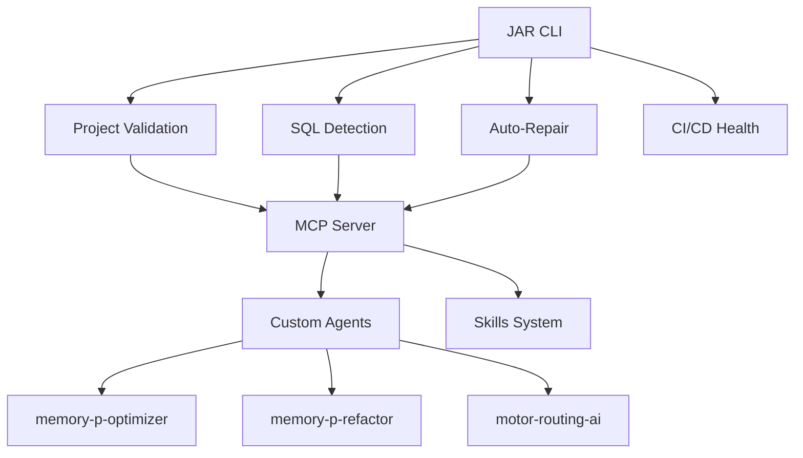

# JAR CLI Integration Guide

## Overview

This guide explains how the JAR CLI integrates with the MEMORY_P ecosystem and CI/CD workflows.

## Architecture Integration

### With MEMORY_P Core



### File Structure

```
MEMORY_P/
├── src/
│   ├── cli/                    # ← JAR CLI modules
│   │   ├── mod.rs
│   │   ├── commands.rs
│   │   ├── validators.rs
│   │   ├── sql_detector.rs
│   │   └── auto_repair.rs
│   ├── bin/
│   │   └── jar.rs             # ← JAR binary
│   └── ...                    # Other MEMORY_P modules
├── .github/
│   ├── workflows/             # ← CI/CD automation
│   │   ├── ci.yml
│   │   ├── auto-repair.yml
│   │   └── sql-check.yml
│   └── agents/
│       └── jar-cli-specialist.agent.md  # ← JAR specialist
└── docs/
    └── JAR_CLI.md            # ← User documentation
```

## Workflow Integration

### 1. Development Workflow

```bash
# Developer makes changes
git checkout -b feature/my-feature

# Run JAR validation before commit
jar validate --scan-todos --check-dead-code

# If issues found, auto-repair
jar repair --format --fix-deps

# Check SQL if modified database code
jar detect-sql --path . --validate-syntax --detect-issues

# Commit and push
git add .
git commit -m "feat: add new feature"
git push origin feature/my-feature
```

### 2. CI Pipeline (Automatic)

When you push or open a PR:

1. **CI Workflow** (`.github/workflows/ci.yml`) runs:
   ```yaml
   - JAR Validate (structure, TODOs, MCP)
   - JAR SQL Check (syntax, issues)
   - Build & Test
   - Security Audit
   ```

2. **Auto-Repair Workflow** (`.github/workflows/auto-repair.yml`) runs on PR:
   ```yaml
   - JAR Repair (format + deps)
   - Auto-commit fixes if any
   - Comment on PR with results
   ```

3. **SQL Check Workflow** (`.github/workflows/sql-check.yml`) runs on SQL changes:
   ```yaml
   - JAR SQL Detection
   - Upload analysis report
   ```

## Integration with Custom Agents

### memory-p-optimizer

```bash
# Before optimization
jar validate --check-dead-code > /tmp/pre-optimize.txt

# Run optimizer
@memory-p-optimizer optimize parallel_engine.rs

# After optimization - verify no regressions
jar validate --check-dead-code > /tmp/post-optimize.txt
diff /tmp/pre-optimize.txt /tmp/post-optimize.txt
```

### memory-p-refactor

```bash
# Refactor with validation
@memory-p-refactor refactor src/mcp_api.rs

# Validate refactored code
jar validate --validate-mcp
jar detect-sql --path src/mcp_api.rs --validate-syntax
```

### motor-routing-ai

```bash
# Check for SQL queries in routing logic
jar detect-sql --path src/motores/ --detect-issues

# Optimize routing based on findings
@motor-routing-ai optimize-routes
```

## Integration with Skills

### rust-parallel-testing

```bash
# Generate tests with skill
skill rust-parallel-testing generate src/cli/

# Validate generated tests
jar validate --path tests/
```

### performance-benchmark

```bash
# Create benchmarks
skill performance-benchmark create jar_cli

# Validate benchmark code
jar validate --path benches/
```

## Environment Variables

JAR respects these environment variables:

```bash
# Enable verbose output
export JAR_VERBOSE=1

# Custom TODO patterns
export JAR_TODO_PATTERNS="TODO,FIXME,HACK,XXX,NOTE,BUG"

# Skip patterns
export JAR_SKIP_PATTERNS="target,node_modules,.git"

# SQL dialect
export JAR_SQL_DIALECT="PostgreSQL"
```

## Docker Integration

### Dockerfile

```dockerfile
FROM rust:1.75 as builder

WORKDIR /app
COPY . .

# Build JAR CLI
RUN cargo build --release --bin jar

FROM debian:bookworm-slim
COPY --from=builder /app/target/release/jar /usr/local/bin/jar

# Health check using JAR
HEALTHCHECK --interval=30s --timeout=3s \
  CMD jar validate --path /app || exit 1

ENTRYPOINT ["jar"]
```

### Docker Compose

```yaml
version: '3.8'

services:
  jar-validator:
    build: .
    command: validate --scan-todos
    volumes:
      - .:/app
    environment:
      - JAR_VERBOSE=1
```

## Kubernetes Integration

### CronJob for periodic validation

```yaml
apiVersion: batch/v1
kind: CronJob
metadata:
  name: jar-validator
spec:
  schedule: "0 */6 * * *"  # Every 6 hours
  jobTemplate:
    spec:
      template:
        spec:
          containers:
          - name: jar
            image: memory-p/jar:latest
            command:
            - jar
            - validate
            - --scan-todos
            - --check-dead-code
            volumeMounts:
            - name: source
              mountPath: /app
          volumes:
          - name: source
            hostPath:
              path: /path/to/memory-p
          restartPolicy: OnFailure
```

## Pre-commit Hook

Create `.git/hooks/pre-commit`:

```bash
#!/bin/bash

echo "🔍 Running JAR validation..."

# Build JAR if not exists
if [ ! -f "./target/release/jar" ]; then
    echo "Building JAR CLI..."
    cargo build --release --bin jar
fi

# Run validation
./target/release/jar validate --scan-todos

if [ $? -ne 0 ]; then
    echo "❌ Validation failed. Run 'jar repair' to fix issues."
    exit 1
fi

echo "✅ Validation passed!"
exit 0
```

Make it executable:

```bash
chmod +x .git/hooks/pre-commit
```

## VS Code Integration

### tasks.json

```json
{
  "version": "2.0.0",
  "tasks": [
    {
      "label": "JAR: Validate",
      "type": "shell",
      "command": "cargo run --bin jar -- validate --scan-todos",
      "group": "test",
      "presentation": {
        "reveal": "always",
        "panel": "new"
      }
    },
    {
      "label": "JAR: Auto-Repair",
      "type": "shell",
      "command": "cargo run --bin jar -- repair --format --fix-deps",
      "group": "build",
      "presentation": {
        "reveal": "always",
        "panel": "new"
      }
    },
    {
      "label": "JAR: SQL Check",
      "type": "shell",
      "command": "cargo run --bin jar -- detect-sql --path . --validate-syntax",
      "group": "test"
    }
  ]
}
```

### settings.json

```json
{
  "rust-analyzer.checkOnSave.command": "clippy",
  "emeraldwalk.runonsave": {
    "commands": [
      {
        "match": "\\.rs$",
        "cmd": "cargo run --bin jar -- validate --path ${file}"
      }
    ]
  }
}
```

## Continuous Deployment

### On successful CI

```yaml
# .github/workflows/cd.yml
name: Continuous Deployment

on:
  push:
    branches: [main]
    tags: ['v*']

jobs:
  deploy:
    runs-on: ubuntu-latest
    needs: [validate, build]  # After CI passes
    
    steps:
      - uses: actions/checkout@v4
      
      - name: Build release
        run: cargo build --release --bin jar
      
      - name: Package
        run: |
          tar -czf jar-${{ github.ref_name }}.tar.gz \
            -C target/release jar
      
      - name: Upload to release
        uses: softprops/action-gh-release@v1
        if: startsWith(github.ref, 'refs/tags/')
        with:
          files: jar-*.tar.gz
```

## Monitoring & Alerting

### Prometheus metrics (future)

```rust
// src/cli/metrics.rs
use prometheus::{Counter, Histogram, Registry};

lazy_static! {
    static ref VALIDATION_COUNTER: Counter = 
        Counter::new("jar_validations_total", "Total validations").unwrap();
    
    static ref REPAIR_DURATION: Histogram =
        Histogram::new("jar_repair_duration_seconds", "Repair duration").unwrap();
}
```

### Slack notifications

```bash
# In CI workflow
- name: Notify on failure
  if: failure()
  run: |
    curl -X POST ${{ secrets.SLACK_WEBHOOK }} \
      -H 'Content-Type: application/json' \
      -d '{"text":"🚨 JAR validation failed in ${{ github.repository }}"}'
```

## Database Schema Management

### PostgreSQL Integration

```bash
# Detect SQL migrations
jar detect-sql --path migrations/ --validate-syntax

# Before applying migration
psql -h localhost -U user -d db < migration.sql

# After migration, verify
jar validate --validate-mcp
```

### SQLx Integration

```bash
# Create migration
sqlx migrate add create_users_table

# Edit migration SQL
# migrations/YYYYMMDDHHMMSS_create_users_table.sql

# Validate before applying
jar detect-sql --path migrations/ --validate-syntax --detect-issues

# Apply if valid
sqlx migrate run
```

## Testing Integration

### Run before tests

```rust
// tests/integration_test.rs
#[test]
fn test_with_validation() {
    // Run JAR validation first
    let output = std::process::Command::new("cargo")
        .args(["run", "--bin", "jar", "--", "validate"])
        .output()
        .expect("Failed to run JAR");
    
    assert!(output.status.success(), "Validation failed");
    
    // Continue with actual test
    // ...
}
```

## Troubleshooting

### Common Issues

1. **JAR not found**
   ```bash
   cargo build --release --bin jar
   export PATH="$PATH:$(pwd)/target/release"
   ```

2. **Permission denied**
   ```bash
   chmod +x target/release/jar
   ```

3. **Workflow fails on CI**
   - Check GitHub Actions logs
   - Run locally: `jar ci-check`
   - Verify workflow syntax: `yamllint .github/workflows/`

4. **SQL detection false positives**
   - Adjust patterns in `src/cli/sql_detector.rs`
   - Use `--path` to scan specific directories

## Best Practices

1. ✅ Run `jar validate` before every commit
2. ✅ Use `--dry-run` for repair commands first
3. ✅ Check `jar ci-check` for workflow health
4. ✅ Review auto-repair changes before merging PRs
5. ✅ Keep JAR CLI updated with main branch

## Future Enhancements

- [ ] Real-time file watcher mode
- [ ] Web dashboard for reports
- [ ] Integration with external tools (SonarQube, etc.)
- [ ] Custom rule engine with TOML config
- [ ] Machine learning for issue prediction

---

**Last Updated**: 2026-02-03  
**Version**: 0.1.0  
**Maintained By**: JAR CLI Team
