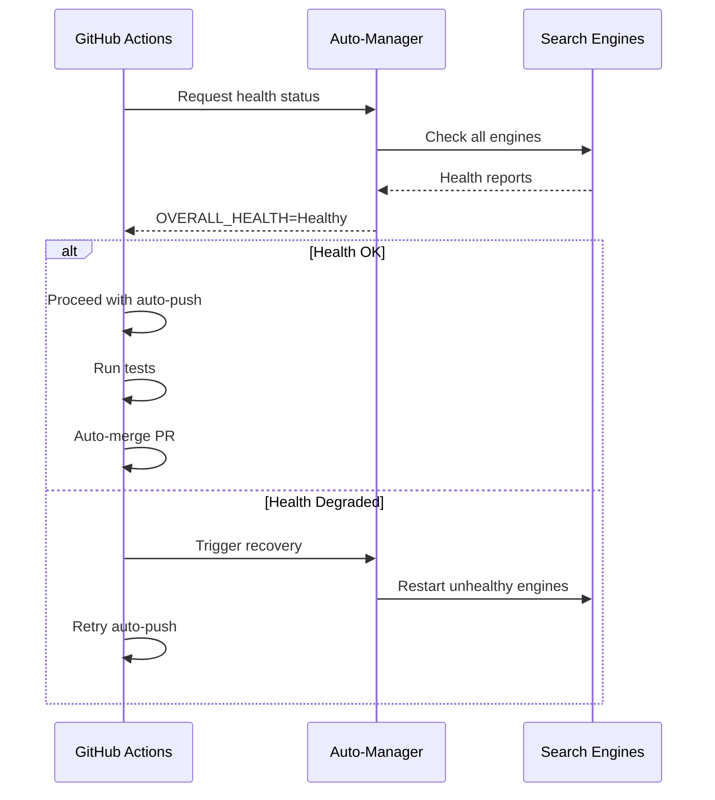
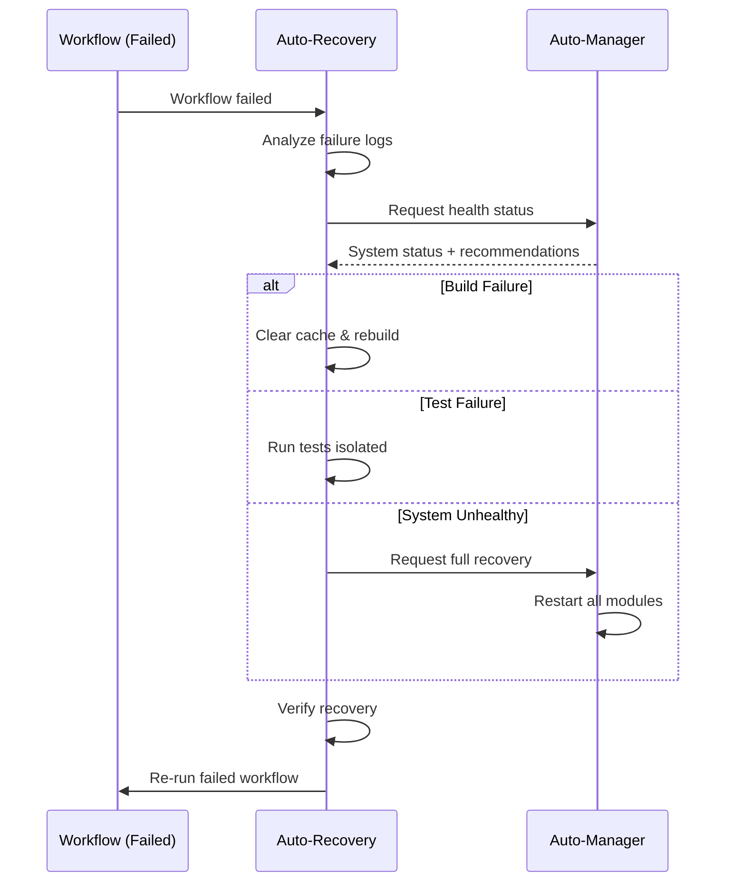
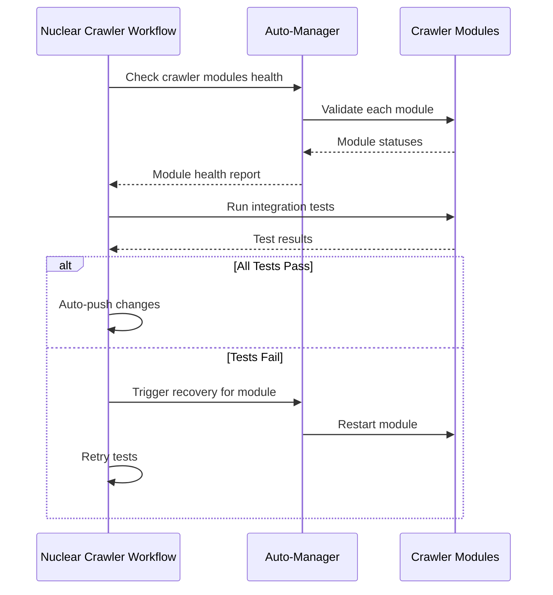

# Workflow Integration Guide - MEMORY_P

## 📖 Overview

Esta guía describe cómo los workflows de GitHub Actions están integrados con el sistema `auto_manager.rs` de MEMORY_P para proporcionar auto-gestión completa y capacidades always-on.

## 🔗 Integración Sistema-Workflows

### Arquitectura de Integración

```
┌─────────────────────────────────────────────────────────────┐
│                    GitHub Actions Layer                      │
├─────────────────────────────────────────────────────────────┤
│  Auto-Push │ Auto-Recovery │ Nuclear │ Dynamic │ Recurring  │
│  Pipeline  │ & Self-Heal   │ Crawler │  Tests  │   Scan    │
└──────┬──────────────┬──────────┬──────────┬──────────┬──────┘
       │              │          │          │          │
       └──────────────┴──────────┴──────────┴──────────┘
                              │
              ┌───────────────┴────────────────┐
              │   Auto-Manager (auto_manager.rs) │
              │   - Health Monitoring            │
              │   - Auto-Recovery Logic          │
              │   - Metrics Export               │
              │   - CI/CD Integration            │
              └──────────────┬──────────────────┘
                            │
        ┌───────────────────┼────────────────────┐
        │                   │                    │
   ┌────▼────┐      ┌──────▼──────┐      ┌─────▼─────┐
   │ Engines │      │ FFI Modules │      │   MCP     │
   │ (9)     │      │ (Julia/JAX/ │      │  Server   │
   │         │      │  Mojo/etc)  │      │           │
   └─────────┘      └─────────────┘      └───────────┘
```

## 🔧 Auto-Manager API para Workflows

### 1. Health Status Export

El `auto_manager.rs` exporta métricas para GitHub Actions:

```rust
// En auto_manager.rs
pub fn export_github_metrics(&self) -> String {
    // Formato compatible con GitHub Actions
    "OVERALL_HEALTH=Healthy\n
     UNHEALTHY_ENGINES=0\n
     UNHEALTHY_FFI=0\n
     AUTO_MANAGED=true\n"
}
```

**Uso en Workflow**:
```yaml
- name: Check Auto-Manager Health
  run: |
    # Obtener métricas del auto-manager
    cargo run --release -- --export-metrics > metrics.txt
    
    # Cargar en environment
    cat metrics.txt >> $GITHUB_ENV
    
    # Verificar salud
    if [ "$OVERALL_HEALTH" != "Healthy" ]; then
      echo "::warning::System health is $OVERALL_HEALTH"
    fi
```

### 2. Auto-Push Readiness Check

```rust
pub fn is_ready_for_auto_push(&self) -> bool {
    let overall = self.get_overall_health();
    matches!(overall, HealthStatus::Healthy | HealthStatus::Degraded)
}
```

**Integración en auto-push.yml**:
```yaml
- name: Verify System Ready for Push
  run: |
    # Verificar que el sistema esté listo
    if cargo run -- --check-autopush-ready; then
      echo "✅ System ready for auto-push"
      echo "READY_FOR_PUSH=true" >> $GITHUB_ENV
    else
      echo "❌ System not ready - aborting auto-push"
      exit 1
    fi
```

### 3. Recovery Report Generation

```rust
pub fn generate_recovery_report(&self) -> String {
    // Genera markdown para GitHub Issues/PRs
    format!("## Auto-Manager Health Report\n...")
}
```

**Uso en auto-recovery.yml**:
```yaml
- name: Generate Recovery Report
  run: |
    # Generar reporte del auto-manager
    cargo run -- --recovery-report > report.md
    
    # Publicar como comentario en PR
    gh pr comment ${{ github.event.pull_request.number }} \
      --body-file report.md
```

## 📊 Métricas Compartidas

### Métricas del Auto-Manager

| Métrica | Descripción | Valor | Workflow que la usa |
|---------|-------------|-------|---------------------|
| `OVERALL_HEALTH` | Estado general del sistema | Healthy/Degraded/Unhealthy | Todos |
| `UNHEALTHY_ENGINES` | Motores no saludables | 0-9 | auto-push, auto-recovery |
| `UNHEALTHY_FFI` | Módulos FFI con problemas | 0-5 | nuclear-crawler |
| `AUTO_MANAGED` | Sistema auto-gestionado | true/false | Todos |
| `READY_FOR_PUSH` | Listo para auto-push | true/false | auto-push |

### Métricas de Workflows

Los workflows exportan métricas que el auto-manager puede consumir:

```yaml
# En cualquier workflow
- name: Export Workflow Metrics
  run: |
    echo "WORKFLOW_STATUS=${{ job.status }}" >> workflow_metrics.txt
    echo "BUILD_DURATION=${{ job.duration }}" >> workflow_metrics.txt
    echo "TEST_PASSED=${{ steps.test.outcome == 'success' }}" >> workflow_metrics.txt
```

El auto-manager puede leer estas métricas para ajustar comportamiento:

```rust
pub fn adjust_from_ci_metrics(&mut self, metrics_file: &Path) -> Result<()> {
    // Leer métricas de CI
    let metrics = fs::read_to_string(metrics_file)?;
    
    // Ajustar configuración basado en métricas
    if metrics.contains("TEST_PASSED=false") {
        self.config.max_errors += 1; // Ser más permisivo
    }
    
    Ok(())
}
```

## 🔄 Flujos de Integración

### Flujo 1: Auto-Push con Validación de Salud



### Flujo 2: Auto-Recovery Triggered por Fallo



### Flujo 3: Nuclear Crawler Validation



## 🎯 Casos de Uso Específicos

### Caso 1: Build Falla Repetidamente

**Problema**: El workflow de auto-push falla 3 veces seguidas en el build.

**Solución Automatizada**:

1. **Auto-Recovery detecta patrón**:
```yaml
# En auto-recovery.yml
- name: Detect Repeated Build Failures
  run: |
    FAIL_COUNT=$(gh run list --workflow=auto-push.yml --limit=10 --json conclusion | jq '[.[] | select(.conclusion=="failure")] | length')
    
    if [ $FAIL_COUNT -ge 3 ]; then
      echo "REPEATED_FAILURE=true" >> $GITHUB_ENV
      echo "FAILURE_TYPE=build" >> $GITHUB_ENV
    fi
```

2. **Auto-Manager ajusta configuración**:
```rust
if repeated_build_failures {
    // Incrementar timeout
    self.config.recovery_timeout = Duration::from_secs(60);
    
    // Reducir paralelismo
    env::set_var("CARGO_BUILD_JOBS", "1");
    
    // Limpiar cache
    self.clear_build_cache()?;
}
```

3. **Workflow re-intenta con nueva configuración**:
```yaml
- name: Rebuild with Adjusted Settings
  run: |
    cargo clean
    cargo build --release --jobs 1 --verbose
```

### Caso 2: FFI Module Fails

**Problema**: Módulo FFI de Julia no se inicializa correctamente.

**Solución Automatizada**:

1. **Auto-Manager detecta fallo**:
```rust
async fn auto_init_ffi(&self) -> Result<()> {
    for module in ffi_modules {
        match self.init_ffi_module(module).await {
            Err(e) => {
                // Marcar como unhealthy
                self.ffi_health.insert(
                    module.to_string(),
                    HealthInfo {
                        status: HealthStatus::Unhealthy,
                        last_error: Some(e.to_string()),
                        ..Default::default()
                    }
                );
                
                // Notificar a workflows
                self.notify_workflow_failure(module, &e)?;
            }
            _ => {}
        }
    }
    Ok(())
}
```

2. **Workflow nuclear-crawler intenta recovery**:
```yaml
- name: Recover FFI Module
  if: env.FFI_UNHEALTHY == 'true'
  run: |
    # Reinstalar dependencias Julia
    julia --project -e 'using Pkg; Pkg.instantiate()'
    
    # Recompilar FFI bridge
    cd FFI && make clean && make
    
    # Verificar recovery
    cargo test --test ffi_tests
```

### Caso 3: Tests Intermitentes

**Problema**: Tests pasan localmente pero fallan en CI aleatoriamente.

**Solución Automatizada**:

1. **Dynamic Tests detecta intermitencia**:
```yaml
- name: Detect Flaky Tests
  run: |
    # Ejecutar tests 3 veces
    for i in {1..3}; do
      cargo test > test_run_$i.txt 2>&1 || true
    done
    
    # Analizar resultados
    FLAKY=$(diff test_run_1.txt test_run_2.txt | wc -l)
    
    if [ $FLAKY -gt 0 ]; then
      echo "FLAKY_TESTS=true" >> $GITHUB_ENV
    fi
```

2. **Auto-Manager ajusta estrategia**:
```rust
if flaky_tests_detected {
    // Ejecutar tests en modo aislado
    self.config.test_isolation = true;
    
    // Aumentar timeout
    self.config.test_timeout = Duration::from_secs(300);
    
    // Deshabilitar paralelización de tests
    env::set_var("RUST_TEST_THREADS", "1");
}
```

3. **Workflow re-ejecuta con ajustes**:
```yaml
- name: Rerun Tests Isolated
  if: env.FLAKY_TESTS == 'true'
  run: |
    cargo test -- --test-threads=1 --nocapture
```

## 🔐 Seguridad en Integración

### Validación de Permisos

El auto-manager valida que los workflows tengan permisos apropiados:

```rust
pub fn validate_workflow_permissions(&self, workflow: &str) -> Result<()> {
    let required_perms = match workflow {
        "auto-push" => vec!["contents:write", "pull-requests:write"],
        "auto-recovery" => vec!["actions:write", "issues:write"],
        "nuclear-crawler" => vec!["contents:read", "checks:write"],
        _ => vec!["contents:read"],
    };
    
    // Verificar permisos
    for perm in required_perms {
        if !self.has_permission(perm) {
            return Err(MemoryPError::PermissionDenied(perm.into()));
        }
    }
    
    Ok(())
}
```

### Secrets Management

Los workflows nunca exponen secrets al auto-manager:

```yaml
# ✅ CORRECTO: Secret usado solo en workflow
- name: Safe Secret Usage
  env:
    API_KEY: ${{ secrets.API_KEY }}
  run: |
    # Usar secret aquí directamente
    curl -H "Authorization: Bearer $API_KEY" ...

# ❌ INCORRECTO: Secret pasado a binario
- name: Unsafe Secret Usage
  run: |
    # NO HACER ESTO
    cargo run -- --api-key="${{ secrets.API_KEY }}"
```

## 📈 Monitoreo y Telemetría

### Métricas Exportadas

El sistema exporta métricas en formato compatible con GitHub Actions:

```rust
pub fn export_telemetry(&self) -> Telemetry {
    Telemetry {
        timestamp: Instant::now(),
        overall_health: self.get_overall_health(),
        engines: self.engine_health.len(),
        ffi_modules: self.ffi_health.len(),
        uptime: self.get_uptime(),
        recovery_count: self.get_recovery_count(),
        auto_push_ready: self.is_ready_for_auto_push(),
    }
}
```

### Visualización en Actions

```yaml
- name: Display System Telemetry
  run: |
    cat << EOF
    📊 MEMORY_P System Telemetry
    ============================
    Health: $OVERALL_HEALTH
    Engines: $UNHEALTHY_ENGINES/$TOTAL_ENGINES unhealthy
    FFI: $UNHEALTHY_FFI/$TOTAL_FFI unhealthy
    Uptime: $SYSTEM_UPTIME seconds
    Recovery Count: $RECOVERY_COUNT
    Auto-Push Ready: $READY_FOR_PUSH
    ============================
    EOF
```

## 🚀 Mejores Prácticas

### 1. Coordinación Workflow-Manager

✅ **DO**: Dejar que el auto-manager tome decisiones de recuperación
```rust
// Auto-manager decide estrategia
let strategy = self.determine_recovery_strategy(&failure);
self.apply_recovery(strategy).await?;
```

❌ **DON'T**: Hardcodear estrategias en workflows
```yaml
# Evitar lógica de recovery compleja en YAML
- name: Hard-coded Recovery
  run: |
    if [ "$ERROR" == "build" ]; then
      cargo clean && cargo build
    elif [ "$ERROR" == "test" ]; then
      cargo test --jobs 1
    fi
```

### 2. Estado Compartido

✅ **DO**: Usar archivos de estado o artifacts
```yaml
- name: Save Manager State
  run: |
    cargo run -- --export-state > manager_state.json
    
- name: Upload State
  uses: actions/upload-artifact@v4
  with:
    name: manager-state
    path: manager_state.json
```

❌ **DON'T**: Mantener estado solo en environment variables
```yaml
# Estado se pierde entre jobs
- name: Set State
  run: echo "STATE=active" >> $GITHUB_ENV
```

### 3. Timeouts y Reintentos

✅ **DO**: Configurar timeouts razonables
```yaml
- name: Health Check
  timeout-minutes: 5
  run: cargo run -- --health-check
```

✅ **DO**: Usar reintentos con backoff
```yaml
- name: Retry with Backoff
  uses: nick-invision/retry@v2
  with:
    timeout_minutes: 10
    max_attempts: 3
    retry_wait_seconds: 30
    command: cargo test
```

## 📚 Referencias

- [Auto-Manager Source](../src/auto_manager.rs)
- [Workflow Documentation](.github/workflows/README.md)
- [GitHub Actions API](https://docs.github.com/en/rest/actions)
- [MEMORY_P Architecture](../BLUEPRINT.md)

---

**Última actualización**: Febrero 2026  
**Mantenedor**: MEMORY_P Team

